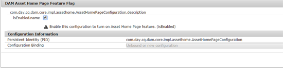
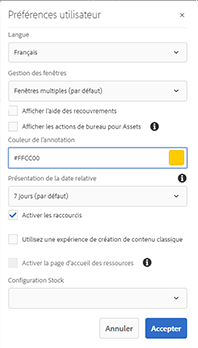
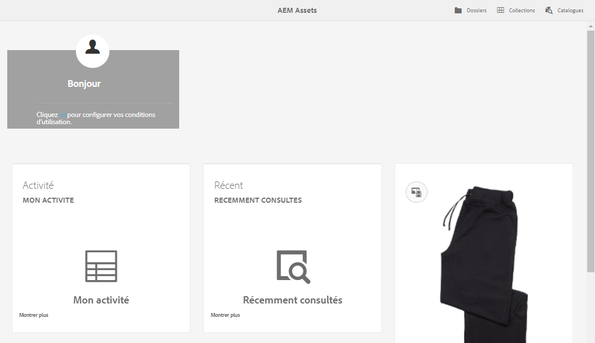

# Expérience de page d’accueil d’[!DNL Adobe Experience Manager Assets] {#aem-assets-home-page-experience}

Personnalisez la page d’accueil d’[!DNL Adobe Experience Manager Assets] afin d’enrichir l’expérience de l’écran de bienvenue, avec notamment un instantané des activités récentes concernant les ressources.

La page d’accueil d’[!DNL Assets] offre une expérience d’écran de bienvenue riche et personnalisée, qui inclut un instantané des activités récentes, comme les ressources récemment consultées ou téléchargées.

La page d’accueil d’[!DNL Assets] est désactivée par défaut. Pour l’activer, procédez comme suit :

1. Ouvrez Configuration Manager [!DNL Experience Manager] `https://[aem_server]:[port]/system/console/configMgr`.
1. Ouvrez le service **[!UICONTROL Enregistreur d’événement de gestion des ressources numériques Day CQ]**.
1. Sélectionnez l’option **[!UICONTROL Activer ce service]** pour activer l’enregistrement des activités.

   

1. Dans la liste **[!UICONTROL Types d’événement]**, sélectionnez les événements à enregistrer et enregistrez les modifications.

   >[!CAUTION]
   >
   >Activer les options Ressource affichée, Projets affichés et Collections affichées augmente significativement le nombre d’événements enregistrés.

1. Ouvrez l’**[!UICONTROL Indicateur de fonctionnalité de la page d’accueil des ressources de gestion des ressources numériques]** à partir de Configuration Manager `https://[aem_server]:[port]/system/console/configMgr`.
1. Sélectionnez l’option `isEnabled.name` pour activer la fonctionnalité de page d’accueil d’[!DNL Assets]. Enregistrez les modifications.

   

1. Ouvrez la boîte de dialogue **[!UICONTROL Préférences utilisateur]** et sélectionnez **[!UICONTROL Activer la page d’accueil des ressources]**. Enregistrez les modifications.

   

Après avoir activé la page d’accueil [!DNL Assets], accédez à la l’interface utilisateur [!DNL Assets] soit à partir de la page Navigation, soit à partir de l’URL `https://[aem_server]:[port]/aem/assetshome.html/content/dam`.

Cliquez sur le lien **[!UICONTROL Cliquez ici pour configurer votre expérience]** afin d’ajouter votre nom d’utilisateur, votre image d’arrière-plan et votre image de profil.

La page d’accueil [!DNL Assets] inclut les sections suivantes :

* Section Bievenue
* Section Widget

**Section Bienvenue**

Si votre profil existe, la section Bienvenue affiche un message de bienvenue à votre intention. Elle affiche également votre image de profil et une image de bienvenue (si celle-ci est déjà configurée).

Si votre profil est incomplet, la section Bienvenue affiche un message de bienvenue générique et un espace réservé pour votre image de profil.

**Section Widget**

Cette section apparaît sous la section Bienvenue et affiche des widgets prêts à l’emploi sous les sections suivantes :

* Activité
* Récent
* Découvrir

**Activité** : dans cette section, le widget **[!UICONTROL Mon activité]** affiche les activités récentes effectuées avec les ressources (y compris les ressources sans rendu) par la personne connectée (par exemple, les chargements de ressources, les téléchargements, la création de ressources, les modifications, les commentaires, les annotations et les partages).

**Récent** : le widget **[!UICONTROL Récemment consultés]** de cette section affiche les entités auxquelles l’utilisateur connecté a récemment accédé, y compris les dossiers, les collections et les projets.

**Découvrir** : le widget **[!UICONTROL Nouveau]** de cette section affiche les ressources et les rendus récemment chargés vers le déploiement [!DNL Assets].

Pour permettre la purge des données d’activité d’utilisateur, activez le **[!UICONTROL service de purge d’événement de gestion des ressources numériques]** dans le gestionnaire de configuration. Une fois ce service activé, les activités de la personne connectée dépassant un nombre spécifié sont supprimées par le système.

L’écran de bienvenue fournit des aides à la navigation, par exemple des icônes dans la barre d’outils pour accéder aux dossiers, aux collections et aux catalogues.

>[!NOTE]
>
>Activer les services [!UICONTROL Enregistreur d’événement de gestion des ressources numériques Day CQ] et de [!UICONTROL purge d’événement de gestion des ressources numériques] augmente les opérations d’écriture vers JCR et l’indexation des recherches, ce qui accroît significativement la charge sur le serveur [!DNL Experience Manager]. La charge supplémentaire sur le serveur [!DNL Experience Manager] peut en affecter les performances.

>[!CAUTION]
>
>Les activités de collecte, de filtrage et de purge effectuées par l’utilisateur, requises pour la page d’accueil [!DNL Assets], génèrent une charge qui peut affecter les performances. Par conséquent, les administrateurs et administratrices doivent configurer efficacement la page d’accueil pour les utilisateurs et utilisatrices cibles.
>
>Adobe recommande aux administrateurs et administratrices et aux utilisateurs et utilisatrices qui effectuent des opérations en bloc d’éviter d’utiliser la fonction Page d’accueil des ressources pour éviter d’augmenter les activités des utilisateurs et utilisatrices. De plus, les administrateurs peuvent exclure les activités d’enregistrement de certains utilisateurs en configurant l’[!UICONTROL Enregistreur d’événement de gestion des ressources numériques Day CQ] à partir du [!UICONTROL gestionnaire de configuration].
>
>Si vous utilisez la fonction, Adobe recommande de planifier la fréquence de purge par rapport à la charge du serveur.
