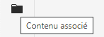
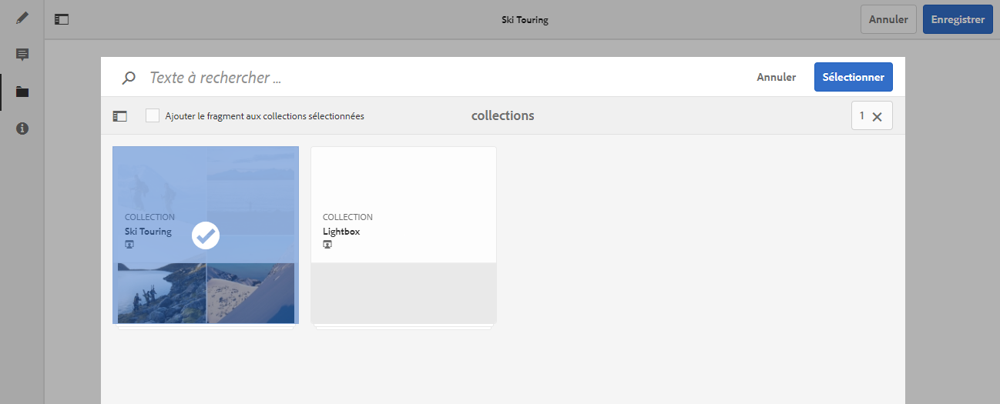
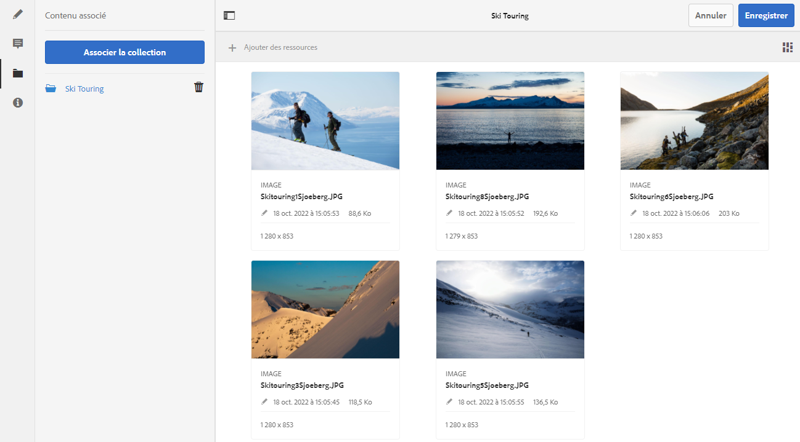

# Contenu associé{#associated-content}

La fonctionnalité de contenu associé d’AEM assure la connexion afin que les ressources puissent éventuellement être utilisées avec le fragment lorsqu’il est ajouté à une page de contenu. Vous bénéficiez ainsi d’une certaine souplesse pour la diffusion de votre contenu découplé, [car vous disposez d’une gamme de ressources auxquelles accéder lors de l’utilisation du fragment de contenu sur une page.](/help/sites-authoring/content-fragments.md#using-associated-content) Cela permet aussi de réduire le temps nécessaire pour rechercher la ressource appropriée. Tout contenu associé peut être configuré à l’aide de l’éditeur de fragment de contenu.

## Ajout de contenu associé {#adding-associated-content}

>[!NOTE]
>
>Vous pouvez ajouter des [ressources visuelles (des images, par exemple)](/help/assets/content-fragments/content-fragments.md#fragments-with-visual-assets) au fragment et/ou à la page de plusieurs manières différentes.

Pour effectuer l’association, vous devez d’abord [ajouter les ressources multimédias à une collection](/help/assets/manage-collections.md). Une fois l’ajout effectué, vous pouvez réaliser les étapes suivantes :

1. Ouvrez votre fragment et sélectionnez ensuite **Contenu associé** dans le panneau latéral.

   

1. Selon que des collections ont déjà été associées ou non, sélectionnez l’une des options suivantes :

   * **Associer le contenu** : il s’agira de la première collection associée
   * **Associer la collection** : les collections associées qui sont déjà configurées.

1. Sélectionnez la collection requise.

   Si vous le souhaitez, vous pouvez ajouter le fragment à la collection sélectionnée, car cela facilite le suivi.

   

1. Confirmez (avec **Sélectionner**). La collection sera répertoriée comme associée.

   

## Modification du contenu associé {#editing-associated-content}

Une fois que vous avez associé une collection, vous pouvez :

* **Supprimer** l’association.
* **Ajouter des ressources** à la collection.
* Sélectionner une ressource pour effectuer d’autres actions.
* Modifier la ressource.
