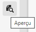
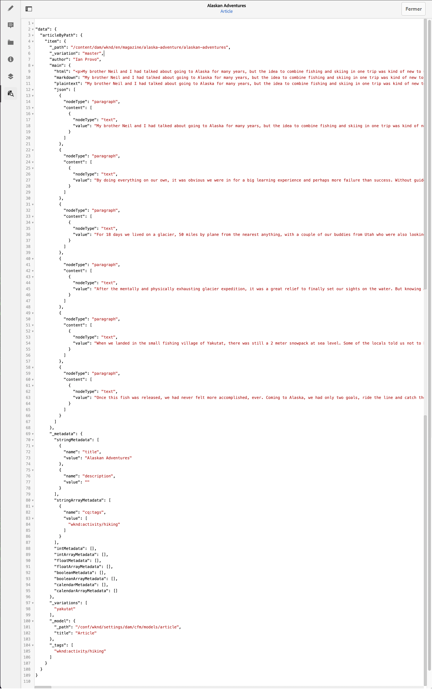

# Prévisualisation – Représentation JSON {#preview-json-representation}

Lors du développement de modèles pour les fragments de contenu dans le cadre de votre mise en œuvre AEM découplée, vous pouvez utiliser l’éditeur de fragment de contenu pour afficher l’exemple de sortie JSON d’un fragment de contenu basé sur un modèle. Vous pourrez ainsi, par exemple, avoir une idée de l’aspect du résultat final. Cela peut s’avérer utile lors de la validation de la structure JSON du modèle, avec peut-être un exemple de contenu par type de données.

Utilisation de l’icône **Aperçu** :

Vous pouvez afficher la représentation JSON du fragment actif. Par exemple :

<!--
**Copy URL** lets you copy to clipboard the URL for either author or publish.
-->
