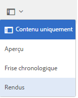
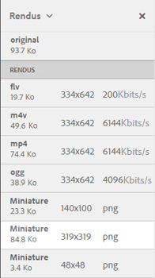

# Rendus vidéo {#video-renditions}

Adobe Experience Manager Assets génère des rendus vidéo pour les ressources vidéo de différents formats, dont OGG, FLV, etc.

Experience Manager Assets prend en charge les rendus statiques et dynamiques (rendus avec codage DM) pour les ressources multimédias.

Les rendus statiques sont générés en mode natif à l’aide de FFMPEG (installé et disponible sur le chemin système) et stockés dans le référentiel de contenu.

Les rendus avec codage DM sont stockés dans le serveur proxy et diffusés au moment de l’exécution.

Experience Manager Assets fournit une prise en charge de lecture pour ces rendus du côté client.

Pour afficher les rendus d’une ressource vidéo spécifique, ouvrez sa page de ressource, puis sélectionnez l’icône de navigation globale. Choisissez ensuite **[!UICONTROL Rendus]** dans la liste.

La liste des rendus vidéo s’affiche dans le panneau **[!UICONTROL Rendus.]**

Pour configurer le serveur proxy des rendus codés DM, [configurez les services cloud Dynamic Media](config-dynamic.md).

Pour générer des rendus vidéo avec les paramètres souhaités, [créez un profil vidéo correspondant ;](video-profiles.md).

Une fois que vous avez configuré le serveur proxy et créé les profils vidéo, vous pouvez inclure ce paramètre vidéo prédéfini dans un profil de traitement et appliquer le profil de traitement à un dossier.

>[!NOTE]
>
>La lecture audio ne fonctionne pas pour les fichiers OGG et WAV sur Microsoft® Internet Explorer 11. Une erreur `Invalid Source` apparaît sur la page des détails des ressources présentant l’extension OGG ou WAV.
>
>Sous MS® Edge et iPad, les fichiers OGG ne s’exécutent pas et génèrent une erreur de format non pris en charge.
