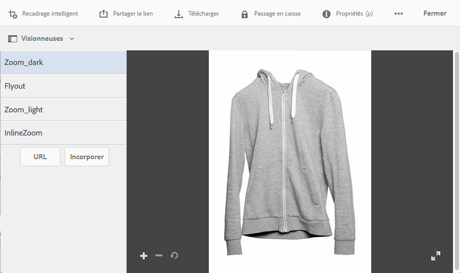

# Application de paramètres prédéfinis de la visionneuse Dynamic Media {#applying-viewer-presets}

Un paramètre prédéfini de visionneuse est un ensemble de paramètres qui déterminent la manière dont les utilisateurs voient les ressources multimédias enrichies sur leurs écrans d’ordinateur et appareils mobiles. Vous pouvez appliquer à une ressource n’importe quel paramètre prédéfini de visionneuse créé par votre administrateur.

Si, en tant qu’administrateur, vous devez gérer, créer, trier et supprimer des paramètres prédéfinis de visionneuse, consultez [Gestion des paramètres prédéfinis de visionneuse](managing-viewer-presets.md).

Voir également [Publication de paramètres de visionneuse prédéfinis](managing-viewer-presets.md#publishing-viewer-presets).

Il n’est pas nécessaire de publier les paramètres prédéfinis de la visionneuse en fonction du mode de publication que vous utilisez.
Pour tout problème lié aux paramètres prédéfinis de visionneuse, consultez la section [Dépannage de Dynamic Media en mode Scene7](troubleshoot-dms7.md#viewers).

## Application d’un paramètre prédéfini de visionneuse Dynamic Media à une ressource {#applying-a-viewer-preset-to-an-asset}

1. Ouvrez la ressource et, sur le rail gauche, sélectionnez **[!UICONTROL Visionneuses]**.

   

   * Les boutons **[!UICONTROL URL]** et **[!UICONTROL Incorporer]** s’affichent lorsque vous avez sélectionné un paramètre de visionneuse prédéfini.
   * Le système affiche plusieurs paramètres de visionneuse prédéfinis lorsque vous sélectionnez Visionneuses dans l’affichage des **[!UICONTROL détails d’une ressource]**. Vous pouvez augmenter le nombre de paramètres prédéfinis visibles. Voir [Augmentation du nombre de paramètres prédéfinis de visionneuse qui s’affichent](managing-viewer-presets.md).

1. Sélectionnez une visionneuse dans le volet gauche pour pouvoir l’appliquer à la ressource telle qu’elle figure dans le volet de droite. Vous pouvez également [copier l’URL à partager](linking-urls-to-yourwebapplication.md) avec d’autres utilisateurs.

## Obtention des URL de paramètre prédéfini de visionneuse {#obtaining-viewer-preset-urls}

Pour obtenir les URL des paramètres prédéfinis de visionneuse, consultez [Lier des URL à votre application web](linking-urls-to-yourwebapplication.md).
