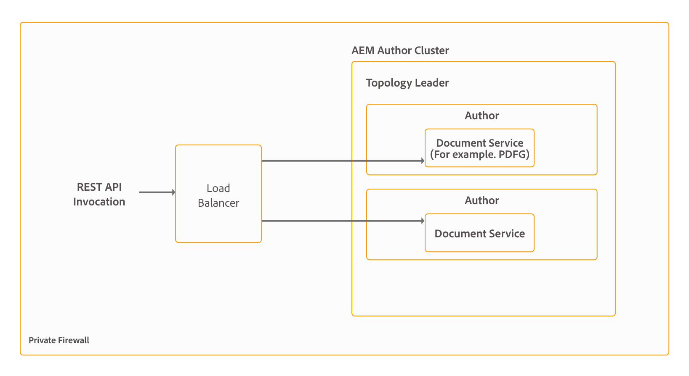

# Topologies d’architecture et de déploiement pour AEM Forms {#architecture-and-deployment-topologies-for-aem-forms}

| Version | Lien de l’article |
| -------- | ---------------------------- |
| AEM as a Cloud Service | [Cliquez ici](https://experienceleague.adobe.com/docs/experience-manager-cloud-service/content/forms/forms-overview/aem-forms-cloud-service-architecture.html?lang=fr) |
| AEM 6.5 | Cet article |

## Architecture {#architecture}

AEM Forms est une application déployée dans AEM sous forme de package AEM. Le package est appelé comme suit : package de modules complémentaires AEM Forms. Le package de modules complémentaires AEM Forms contiennent des services (fournisseurs d’API), qui sont déployés dans le conteneur AEM OSGi, et les servlets ou JSP (octroi de fonctionnalités front-end et API REST) gérés par le framework Sling AEM. Le diagramme suivant illustre cette configuration:

L’architecture d’AEM Forms comprend les composants suivants :

* **Services AEM principaux :** services de base fournis par AEM à une application déployée. Ces services comprennent un référentiel de contenu compatible JCR, un conteneur de service OSGi, un moteur de workflow, un trust store, un magasin de clés, etc. Ces services sont accessibles par l’application AEM Forms mais ne sont pas fournis par les packages AEM Forms. Ces services font partie intégrante de la pile AEM globale et divers composants AEM Forms utilisent ces services.
* **Services Forms :** fournissez des fonctionnalités liées aux formulaires, telles que la création, l’assemblage, la distribution et l’archivage de documents PDF, l’ajout de signatures numériques pour limiter l’accès aux documents et le décodage de formulaires à codes-barres. Ces services sont disponibles publiquement à des fins d’utilisation par le code personnalisé co-déployé dans AEM.
* **Couche Web :** JSP ou servlets, reposant sur les services communs et de formulaires, qui fournissent les fonctionnalités suivantes :

   * **Interface utilisateur front-end de création** : interface utilisateur de création et de gestion de formulaires pour créer et gérer des formulaires.
   * **Interface utilisateur frontale de rendu et de publication de formulaire** : interface utilisateur destinée à être utilisée par les utilisatrices et utilisateurs finaux d’AEM Forms (par exemple, des citoyennes et citoyens accédant à un site web d’administration). Cette interface fournit des fonctionnalités de rendu de formulaire (affichage du formulaire dans un navigateur web) et d’envoi.
   * **API REST** : les JSP et servlets exportent un sous-ensemble de services de formulaires à des fins d’utilisation distante par des clients HTTP appropriés, comme le kit SDK mobile des formulaires.

**AEM Forms sur OSGi :** un environnement AEM Forms sur OSGi est un environnement dʼauteur ou de publication AEM standard sur lequel est déployé le package AEM Forms. Vous pouvez exécuter AEM Forms sur OSGi dans des [configurations à serveur unique, en batterie et en grappes](/help/sites-deploying/recommended-deploys.md). La mise en grappe n’est disponible que pour les instances dʼauteur AEM.

<!--

**AEM Forms on JEE:** AEM Forms on JEE is AEM Forms server running on JEE stack. It has AEM Author with AEM Forms add-on packages and additional AEM Forms JEE capabilities co-deployed on a single JEE stack running on an application server. You can run AEM Forms on JEE in single-server and clustered setups. AEM Forms on JEE is required only to run document security, process management, and for LiveCycle customers upgrading to AEM Forms. Here are a few additional scenarios to use AEM Forms on JEE:

* **HTML workspace support (for customers using HTML workspace):** AEM Forms on JEE enables single sign-on with Processing instances, serves certain assets rendered on Processing instances, and handles submission of forms rendered within the HTML workspace.
* **Advanced additional form/interactive communication data processing**: AEM Forms on JEE can be utilized for additionally processing form/interactive communication data (and saving the results to a suitable data store) in complex use-cases where advanced process-management capabilities are required.

AEM Forms on JEE also includes provides following supporting services to the AEM components:

* **Integrated user management:** Allows users of AEM Forms on JEE to be recognized as AEM forms on OSGi users and helps enable SSO for both OSGi and JEE users. This is required for scenarios where single sign-on between AEM forms on OSGi and AEM Forms on JEE is required (for example, HTML workspace).
* **Asset hosting:** AEM Forms on JEE can serve assets (for example, HTML5 forms) rendered on AEM Forms on OSGi.

-->

L’interface utilisateur dʼauteur AEM Forms ne prend pas en charge la création de documents d’enregistrement (DOR) et de formulaires PDF et HTML5. Ces ressources sont conçues à l’aide de l’application autonome Forms Designer et téléchargées individuellement vers AEM Forms Manager. <!--Alternatively, for AEM Forms on JEE, forms can be designed as application (in AEM Forms Workbench) assets and deployed into AEM Forms on JEE server.-->

AEM Forms sur OSGi <!--and AEM Forms on JEE both--> des fonctionnalités de workflow. Vous pouvez rapidement créer et déployer des workflows de base pour différentes tâches dans AEM Forms sur OSGi.<!--, without having to install the full-fledged Process Management capability of AEM Forms on JEE. There is some difference in the [features of Form-centric workflow on AEM Forms on OSGi and Process Management capability of AEM Forms on JEE](capabilities-osgi-jee-workflows.md). The development and management of Form-centric workflows on AEM Forms on OSGi uses the familiar AEM Workflow and AEM Inbox capabilities.-->

## Terminologies {#terminologies}

L’image suivante affiche diverses configurations de serveur AEM Forms et leurs composants utilisés dans un déploiement AEM Forms classique :

**Création :** une instance de création est un serveur AEM Forms exécuté en mode d’exécution de création standard. <!--It can be AEM Forms on JEE or AEM Forms on OSGi environment.--> Il est destiné aux utilisateurs internes, aux concepteurs de formulaires et de communications interactives, ainsi qu’aux développeurs. Il active les fonctionnalités suivantes :

* **Création et gestion de formulaires et de communications interactives :** les équipes de conception et de développement peuvent créer et modifier des formulaires adaptatifs et des communications interactives, charger d’autres types de formulaires créés en externe, par exemple des formulaires créés dans Adobe Forms Designer, et gérer ces ressources à l’aide de la console de Gestionnaire de formulaires.
* **Publication de formulaires et de communications interactives :** les ressources hébergées sur une instance de création peuvent être publiées sur une instance de publication pour effectuer des opérations d’exécution. La publication des ressources utilise les fonctionnalités de réplication d’AEM. Adobe recommande qu’un agent de réplication soit configuré sur toutes les instances d’auteur pour transférer manuellement les formulaires publiés vers les instances de traitement, et qu’un autre agent de réplication soit configuré sur les instances de traitement avec le déclencheur *A réception* activé pour répliquer automatiquement les formulaires reçus afin de publier les instances.

**Publier :** une instance de publication est un serveur AEM Forms fonctionnant en mode d’exécution de publication standard. Les instances de publication sont destinées aux utilisateurs finaux des applications de formulaires (par exemple, les utilisateurs accédant à un site Web public et envoyant des formulaires). L’élément Publier active les fonctionnalités suivantes :

* Rendu et envoi de formulaires pour les utilisatrices et utilisateurs finaux.
* Transmission des données de formulaire brutes envoyées aux instances de traitement pour un traitement supplémentaire et stockage dans le système d’enregistrements final. L’implémentation par défaut fournie dans AEM Forms effectue cette opération à l’aide des fonctionnalités de réplication inverse d’AEM. Un autre type d’implémentation est également disponible pour transférer directement les données du formulaire aux serveurs de traitement au lieu de les enregistrer localement d’abord (cette dernière étape constituant un prérequis pour l’activation de la réplication inverse). Les clients rencontrant des problèmes de stockage des données potentiellement sensibles sur les instances de publication peuvent utiliser cette [alternative d’implémentation](/help/forms/using/configuring-draft-submission-storage.md), car les instances de traitement se trouvent généralement dans une zone plus sécurisée.
* Rendu et envoi de lettres et de communications interactives : une lettre et une communication interactive sont rendues sur les instances de publication et les données correspondantes sont envoyées aux instances de traitement pour le stockage et le post-traitement. Les données peuvent être sauvegardées localement sur une instance de publication et traitées par réplication inverse vers une instance de traitement (l’option par défaut) ultérieurement, ou directement transférées vers l’instance de traitement sans enregistrement sur l’instance de publication. Cette dernière implémentation est utile pour les clients soucieux de leur sécurité.

**Traitement :** une instance d’AEM Forms s’exécutant en mode Auteur sans utilisateurs affectés au groupe de gestionnaires de formulaires. Vous pouvez déployer <!--AEM Forms on JEE or--> AEM Forms sur OSGi en tant qu’instance de traitement. Les utilisateurs n’y sont pas affectés afin de garantir que les activités de création et de gestion de formulaire ne sont pas exécutées sur l’instance de traitement et se produisent uniquement sur l’instance d’auteur. Une instance de traitement permet les fonctionnalités suivantes :

* **Traitement des données de formulaire brutes en provenance d’une instance de publication :** cela est principalement effectué sur une instance de traitement par le biais de workflows AEM qui se déclenchent lors de l’arrivée des données. Les workflows peuvent utiliser l’étape Modèle de données de formulaire prête à l’emploi pour archiver les données ou le document dans un magasin de données approprié.
* **Stockage sécurisé des données de formulaire :** l’élément Traitement fournit un référentiel derrière le pare-feu pour les données de formulaire brutes qui sont également isolées des utilisateurs. Ni les concepteurs de formulaires de l’instance d’auteur, ni les utilisateurs finaux de l’instance de publication ne peuvent accéder à ce référentiel.

  >[!NOTE]
  >
  >Adobe recommande d’utiliser un magasin de données tiers pour enregistrer les données traitées finales au lieu d’utiliser le référentiel AEM.

* **Stockage et post-traitement des données de correspondance provenant d’une instance de publication :** les workflows AEM exécutent le post-traitement facultatif des définitions de lettre correspondantes. Ces processus peuvent enregistrer les données finales traitées dans des magasins de données externes appropriés.

* **Hébergement de HTML Workspace** : une instance de traitement héberge le front-end de HTML Workspace. HTML Workspace fournit l’interface utilisateur pour l’affectation de tâche/groupe associée pour les processus de révision et d’approbation.

Une instance de traitement est configurée pour s’exécuter en mode de création pour les raisons suivantes :

* Elle active la réplication inverse des données de formulaire brutes d’une instance de publication. Le gestionnaire de stockage de données par défaut requiert la fonctionnalité de réplication inverse.
* Il est recommandé d’exécuter les workflows AEM, moyens principaux de traiter les données de formulaires brutes provenant d’une instance de publication, sur un système de style Auteur.

<!--

## Sample physical topologies for AEM Forms on JEE {#sample-physical-topologies-for-aem-forms-on-jee}

The AEM Forms on JEE topologies recommended below are mainly for customers upgrading from LiveCycle or a previous version of AEM Forms on JEE. Adobe recommends using AEM Forms on OSGi for fresh installations. A fresh installation of AEM Forms on JEE only recommended for using Document Security and Process Management capabilities.

### Topology for using document services or document security capabilities {#topology-for-using-document-services-or-document-security-capabilities}

AEM Forms customers planning to use only document services or document security capabilities can have a topology similar to the one displayed below. This topology recommends using a single instance of AEM Forms. You can also create a cluster or farm of AEM Forms servers, if necessary. This topology is recommended when most users programmatically access capabilities of AEM Forms server and intervention through the user interface is minimum. The topology is helpful in batch processing operations of document services. For example, using output service to create hundreds of non-editable PDF documents on daily basis.

Although, AEM Forms lets you set up and run all the functionalities from a single server, yet, you should do capacity planning, load balancing, and set up dedicated servers for specific capabilities in a production environment. For example, for an environment using the PDF Generator service to convert thousands of pages a day and add digital signatures to limit access to documents, set up separate AEM Forms servers for the PDF Generator service and digital signature capabilities. It helps provide optimum performance and scale the servers independent of each other.

### Topology for using AEM Forms process management {#topology-for-using-aem-forms-process-management}

AEM Forms customers planning to use AEM Forms process management features, for example, HTML Workspace can have a topology similar to the one displayed below. The AEM Forms on JEE server can be in a single server or cluster configuration.

If you are upgrading from LiveCycle ES4, this topology closely mirrors with what you already have in LiveCycle except for the addition of AEM Author built-in to AEM Forms on JEE. Moreover, there is no change in the clustering requirements for customers performing an upgrade. If you were using AEM Forms in a clustered environment, you can continue with same in AEM 6.5 Forms. For a fresh installation of AEM Forms of JEE for using HTML Workspace, running AEM author instance built-in to the JEE environment is an additional requirement.

Form data store is a third-party data store used for storing final processed data of forms and interactive communications. This is an optional element in the topology. You can also choose to set up a processing instance and use its repository as the final system-of-record system, if necessary.

The topology is recommended to the customers planning to use AEM Forms on JEE server for process management capabilities (HTML Workspace) without using any post-processing, adaptive forms, HTML5 forms, and interactive communication capabilities.

### Topology for using adaptive forms, HTML5 forms, interactive communication capabilities {#topology-for-using-adaptive-forms-html-forms-interactive-communication-capabilities}

AEM Forms customers planning to use AEM Forms data capture capabilities, for example, adaptive forms, HTML5 Forms, PDF Forms, can have a topology similar to the one displayed below. This topology is also recommended for using interactive communication capabilities of AEM Forms.

You can make the following changes/customizations to the above-suggested topology:

* Using HTML Workspace and AEM Forms app requires an AEM author or processing instance. You can use the AEM author instance built-in to AEM Forms on JEE server instead of setting up an additional external AEM author server.
* An AEM Author or Processing instance is required only for Forms-centric workflows on OSGi, adaptive forms, forms portal, and interactive communication.
* interactive communication Agent UI is generally run within the organization. So, you can keep a publish server for Agent UI within the private network.
* AEM forms on OSGi instance built-in to AEM Forms on JEE server can also run Forms-centric workflows on OSGi and Watched Folders.

-->

## Exemples de topologies physiques pour AEM Forms on OSGi {#sample-physical-topologies-for-using-aem-forms-on-osgi}

### Topologie pour la capture de données, la communication interactive et le workflow basé sur l’utilisation de Forms sur OSGi {#topology-for-data-capture-interactive-communication-form-centric-workflow-on-osgi-capabilities}

Les clients AEM Forms prévoyant d’utiliser les fonctionnalités de capture de données AEM Forms, par exemple, les formulaires adaptatifs, les formulaires HTML5 et les formulaires PDF, peuvent avoir une topologie similaire à celle présentée ci-dessous. Cette topologie est également recommandée pour l’utilisation de la fonctionnalité de communications interactives et de processus basés sur l’utilisation de Forms on OSGi, par exemple pour utiliser la boîte de réception AEM et l’application AEM Forms pour les flux de processus métier.

### Topologie d’utilisation des fonctionnalités de dossier de contrôle pour le traitement par lots hors ligne {#topology-for-using-watched-folder-capabilities-for-offline-batch-processing}

Les clientes et clients AEM Forms qui envisagent d’utiliser des dossiers de contrôle pour le traitement par lots peuvent avoir une topologie similaire à celle affichée ci-dessous. La topologie présente un environnement en cluster, mais vous décidez d’utiliser une seule instance ou une batterie de serveurs AEM Forms en fonction de la charge. La source de données tierce est votre propre système d’enregistrement. Il agit comme une source d’entrée pour les dossiers de contrôle. La topologie affiche également la sortie sous la forme d’un fichier imprimé. Vous pouvez également stocker le contenu de sortie dans un système de fichiers, l’envoyer par e-mail et utiliser d’autres méthodes personnalisées pour utiliser les résultats.

### Topologie d’utilisation des fonctionnalités des services de document pour le traitement hors ligne basé sur l’API {#topology-for-using-document-services-capabilities-for-offline-api-based-processing}

Les clientes et clients AEM Forms prévoyant d’utiliser uniquement la fonctionnalité de services de document peuvent avoir une topologie similaire à celle affichée ci-dessous. Cette topologie recommande d’utiliser un cluster de serveurs AEM Forms on OSGi. Cette topologie est recommandée lorsque la plupart des utilisateurs et utilisatrices accèdent par programmation aux fonctionnalités du serveur AEM Forms (à l’aide d’API) et que l’intervention via l’interface utilisateur est minimale. La topologie est très utile dans plusieurs cas de logiciels clients. Par exemple, plusieurs clients utilisant le service PDF Generator pour créer des documents PDF à la demande.

Bien qu’AEM Forms vous permette de configurer et d’exécuter toutes les fonctionnalités à partir d’un seul serveur, vous devez planifier la capacité, équilibrer la charge et configurer des serveurs dédiés pour des fonctionnalités spécifiques dans un environnement de production. Par exemple, pour un environnement utilisant le service PDF Generator pour convertir des milliers de pages par jour et plusieurs formulaires adaptatifs pour capturer des données, configurez des serveurs AEM Forms distincts pour le service PDF Generator et les fonctionnalités de formulaires adaptatifs. Cela permet de fournir des performances optimales et de dimensionner les serveurs indépendamment les uns des autres.

