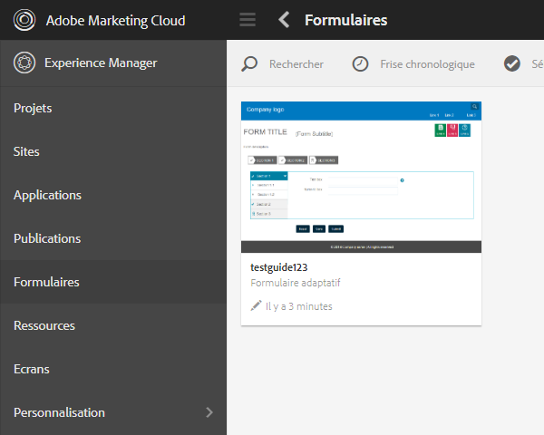

# Configurer le planificateur de synchronisation {#configuring-the-synchronization-scheduler}

Par défaut, le planificateur de synchronisation s’exécute toutes les 3 minutes pour synchroniser toutes les ressources modifiées et mises à jour dans le référentiel via LiveCycle Workbench 11. Les applications contenant des formulaires ou des ressources sont visibles dans l’interface utilisateur d’AEM Forms une fois le processus de synchronisation terminé.

## Modifier l’intervalle du planificateur de synchronisation {#change-interval-of-the-synchronization-scheduler}

Effectuez les étapes suivantes pour modifier l’intervalle du planificateur de synchronisation :

1. Connectez-vous à AEM Configuration Manager. L’URL de Configuration Manager est la suivante : `https://'[server]:[port]'/lc/system/console/configMgr`.

1. Recherchez et ouvrez le bundle **FormsManagerConfiguration**.

1. Choisissez une nouvelle valeur pour l’option de fréquence du **planificateur de synchronisation**.

   Les unités de fréquence se comptent en minutes. Par exemple, pour configurer l’exécution du planificateur toutes les 60 minutes, saisissez 60.

## Synchronisation des ressources {#synchronizing-assets}

Vous pouvez utiliser l’option **Synchroniser les ressources à partir du référentiel** pour synchroniser manuellement les ressources. Effectuez les opérations suivantes pour synchroniser manuellement les actifs :

1. Connectez-vous à AEM Forms. L’URL par défaut est `https://'[server]:[port]'/lc/aem/forms/`.

   

   **Figure :** *interface utilisateur d’AEM Forms*

1. Cliquez sur l’icône  dans la barre d’outils. Si vous ne disposez d’aucune ressource dans le dernier chemin configuré, la boîte de dialogue s’affiche comme ci-dessous. Cliquez sur **Démarrer** pour lancer la synchronisation.

   

   **Figure :** *boîte de dialogue de synchronisation*

## Correction de l’erreur de synchronisation {#troubleshooting-synchronization-error}

Vous pouvez créer de nouvelles applications dans le concepteur de workflow (LiveCycle Workbench).

Si une application que vous venez de créer et un dossier se trouvant sous /content/dam/formsanddocuments portent le même nom, une erreur « *Une ressource portant le même nom que cette application existe déjà au niveau racine.* » s’affiche. est consignée.

Pour résoudre le conflit, renommez l’application puis synchronisez manuellement les actifs.

**Figure :** *conflits dans la boîte de dialogue de synchronisation des ressources*
