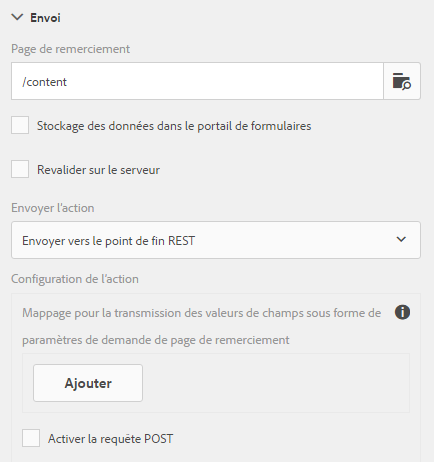

# Configuration d’une page de redirection{#configuring-redirect-page}

 Adobe recommande d’utiliser les [composants principaux](https://experienceleague.adobe.com/docs/experience-manager-core-components/using/adaptive-forms/introduction.html?lang=fr) de capture de données modernes et extensibles pour [créer de nouveaux formulaires adaptatifs](/help/forms/using/create-an-adaptive-form-core-components.md) ou [ajouter des formulaires adaptatifs à des pages AEM Sites](/help/forms/using/create-or-add-an-adaptive-form-to-aem-sites-page.md). Ces composants représentent une avancée significative dans la création de formulaires adaptatifs, ce qui garantit des expériences utilisateur impressionnantes. Cet article décrit l’ancienne approche de la création de formulaires adaptatifs à l’aide de composants de base. 

## Application {#applies-to}

Cette documentation s’applique à **AEM 6.5 LTS Forms**.

Pour consulter la documentation d’AEM as a Cloud Service, voir [AEM Forms sur Cloud Service](https://experienceleague.adobe.com/docs/experience-manager-cloud-service/content/forms/adaptive-forms-authoring/authoring-adaptive-forms-foundation-components/configure-submit-actions-and-metadata-submission/configuring-redirect-page.html?lang=fr).

Pour chaque formulaire, les auteurs peuvent configurer une page vers laquelle les utilisateurs seront redirigés après l’envoi du formulaire.

1. En mode d’édition, sélectionnez un composant, puis cliquez sur  > **Conteneur de formulaires adaptatifs**, puis cliquez sur .

1. Dans la barre latérale, cliquez sur **Envoi**.

1. Indiquez L’URL de la page de redirection sous Page de remerciement dans la section Envoyer.
1. Sous Action Envoyer, vous pouvez éventuellement configurer le paramètre à transmettre à la page de redirection pour l’action Envoyer vers le point d’entrée REST.

Configuration de la page de redirection

Les auteurs et autrices de formulaires peuvent utiliser les paramètres suivants qui sont transmis à la page de remerciement. Les paramètres `status` et `owner` sont transmis pour toutes les actions d’envoi disponibles. Outre ces deux paramètres, des paramètres supplémentaires sont transmis pour les actions d’envoi suivantes :

* **Action Stocker le contenu** (obsolète) : `contentPath`--le chemin d’accès du nœud dans le référentiel où sont stockées les données envoyées est transmis.

* **Action Stocker le PDF** (obsolète) : `contentPath`--des données envoyées et le chemin d’accès au nœud de stockage du fichier PDF dans le référentiel sont transmis.

* **Workflow Envoyer aux formulaires** : les paramètres de sortie renvoyés à partir du workflow des formulaires sont transmis.

* **Envoyer vers le point d’entrée REST** : les paramètres ajoutés pour la correspondance entre le champ et le paramètre sont transmis. Les paramètres `status` et `owner` ne sont pas transmis à cette action d’envoi. Pour en savoir plus, consultez [Configuration de l’action d’envoi Envoyer vers le point d’entrée REST](../../forms/using/configuring-submit-actions.md).
