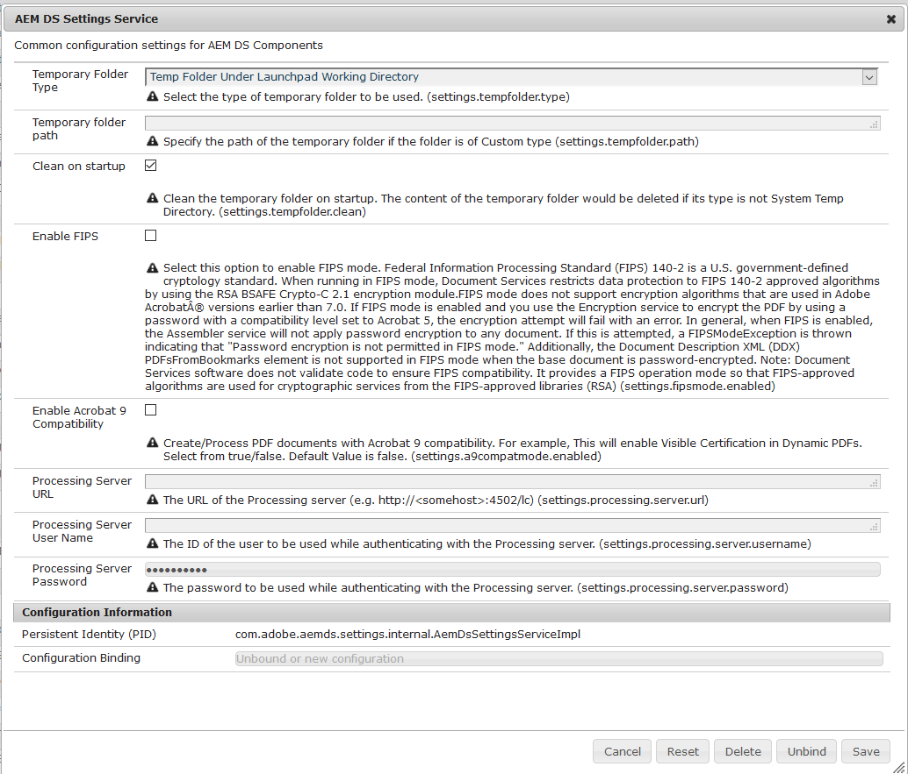

# Configuration des paramètres AEM DS{#configuring-aem-ds-settings}

Cet article décrit comment configurer le **Service de paramètres AEM DS**. Ce paramètre peut être utilisé dans plusieurs scénarios, par exemple :

* Dans Correspondence Management

  * Pour configurer AEM Forms Workflow
  * Lors de l’utilisation du portail Formulaires pour l’enregistrement à distance des brouillons/envois

* Dans les formulaires adaptatifs, par exemple lorsqu’un formulaire adaptatif est envoyé à partir de l’instance de publication

Vous trouverez ci-dessous les étapes de configuration des **[!UICONTROL Paramètres AEM DS]** :

1. Ouvrez Configuration Manager sur l’instance de publication à l’aide de l’URL :\
   *:port/system/console/configMgr*.

   

1. Dans la fenêtre **[!UICONTROL Configuration de la console web Adobe Experience Manager]**, recherchez et cliquez sur l’option **[!UICONTROL Paramètres AEM DS]**.

   

1. La fenêtre **[!UICONTROL Service Paramètres AEM DS]** affiche les paramètres de configuration communs pour les composants AEM DS.

   

1. Ajoutez les informations suivantes dans les champs respectifs :

   **[!UICONTROL URL du serveur de traitement]** : le serveur de traitement est le serveur sur lequel les formulaires ou le workflow AEM doivent être déclenchés. Il peut s’agir de l’URL de l’instance d’auteur AEM ou de l’autre URL du serveur (c’est-à-dire https://localhost:port/).

   **[!UICONTROL Nom d’utilisateur du serveur de traitement]** : nom d’utilisateur de l’utilisateur du workflow [basé sur l’URL du serveur utilisé].

   **[!UICONTROL Mot de passe du serveur de traitement]** : mot de passe de l’utilisateur ou de l’utilisatrice du workflow

   >[!NOTE]
   >
   >
   >    
   >    
   >    * Lors de l’utilisation de workflows Forms ou AEM, avant de soumettre un envoi à partir du serveur de publication, il est nécessaire de configurer le service de paramètres DS. Sinon, l’envoi du formulaire échouera.
   >    
   >
