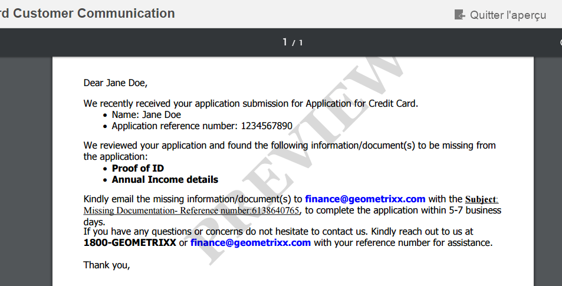

# Filigrane personnalisé dans l’aperçu de la lettre PDF{#custom-watermark-in-letter-pdf-preview}

## Présentation {#overview}

Dans l’interface utilisateur de création de correspondance, les agents utilisateurs et les agentes utilisatrices prévisualisent la correspondance dans la forme finale dans laquelle elle est envoyée en post-traitement, par exemple pour l’envoi par e-mail ou l’impression.

Pour empêcher toute utilisation non autorisée de ces données, les entreprises peuvent ajouter un filigrane à l’aperçu PDF. Le filigrane par défaut, « APERÇU », apparaît sur le PDF.

Pour activer le filigrane dans l’aperçu PDF, sélectionnez l’option **[!UICONTROL Appliquer le filigrane pendant l’aperçu]** dans **[!UICONTROL Configurations de Correspondence Management]** à l’adresse https://&#39;[server]:[port]&#39;/system/console/configMgr.



Pour personnaliser le texte et l’apparence du filigrane, procédez comme suit :

## Personnaliser le filigrane dans l’aperçu PDF dans l’interface utilisateur de création de correspondance {#customizewatermark-}

1. Accédez à `https://'[server]:[port]'/[ContextPath]/crx/de` et connectez-vous en tant qu’administrateur.
1. Dans le dossier des applications, créez un dossier nommé **[!UICONTROL previewwatermark]** dont le chemin d’accès/la structure est similaire au dossier previewwatermark situé dans le dossier libs :

   1. Cliquez avec le bouton droit sur le dossier **previewwatermark** à l’emplacement suivant et sélectionnez **Nœud de recouvrement** :

      `/libs/fd/cm/configFiles/previewwatermark`

   1. Assurez-vous que la boîte de dialogue du nœud de recouvrement possède les valeurs suivantes :

      **Chemin d’accès :** /libs/fd/cm/configFiles/previewwatermark

      **Emplacement du recouvrement :** /apps/

      **Correspondance des types de nœud :** vérifié.

      >[!NOTE]
      >
      >N’apportez aucune modification à la branche /libs. Toute modification que vous apportez peut être perdue, car cette branche est sujette à des modifications lorsque vous :
      >
      >    
      >    
      >    * Effectuez une mise à niveau sur votre instance.
      >    * Appliquez un correctif.
      >    * Installez un pack de fonctionnalités.
      >    
      >

   1. Cliquez sur **OK**, puis sur **Enregistrer tout**. Le dossier **[!UICONTROL previewwatermark]** est créé au niveau du chemin d’accès indiqué.

1. Copiez et collez le fichier ddx du dossier « /libs/fd/cm/configFiles/previewwatermark » vers le dossier « /apps/fd/cm/configFiles/previewwatermark » et cliquez sur **[!UICONTROL Enregistrer tout]**.
1. Apportez les modifications souhaitées dans le fichier ddx sous /apps/fd/cm/configFiles/previewwatermark/.

   ```xml
   <DDX xmlns="https://ns.adobe.com/DDX/1.0/">
    <PDF result="output.pdf">
     <PDF source="input.pdf"/>
           <Watermark opacity="15%" rotation="45">
            <StyledText>
                     <p font-family="Georgia" font-size="70pt" color="black" font-weight="bold">
                         PREVIEW
                    </p>
            </StyledText>
           </Watermark>
    </PDF>
   </DDX>
   ```

   Pour plus d’informations sur la personnalisation de l’apparence, du texte et de l’alignement du filigrane, consultez la section « Ajouter et supprimer des filigranes et des arrière-plans » dans le document [Guide de référence du service Assembler et de DDX](https://help.adobe.com/en_US/livecycle/11.0/ddxRef.pdf).

   >[!NOTE]
   >
   >Dans le fichier ddx, les références au résultat et à la source doivent rester identiques à output.pdf et input.pdf. Le nom du fichier ddx ne doit pas non plus être modifié.

1. Cliquez sur **Enregistrer tout**.
