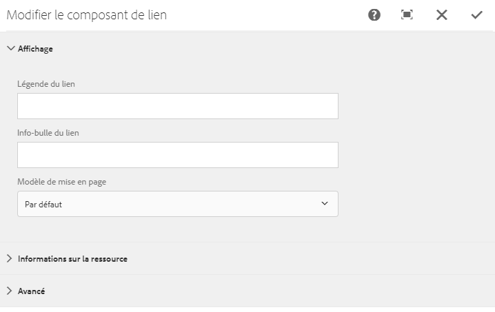

# Intégrer le composant Link dans une page{#embedding-link-component-in-a-page}

## Prérequis {#prerequisites}

Le composant Link est membre de la catégorie Document Services. Assurez-vous que la catégorie Document Services est visible dans le navigateur de composants d’AEM. Si la catégorie n’est pas répertoriée, suivez la procédure décrite à la section [Activation des composants d’un portail Formulaires](/help/forms/using/enabling-forms-portal-components.md).

## Composant Lien {#link-component}

Le composant Link permet aux créateurs et créatrices de portails de formulaires de créer un lien vers un formulaire adaptatif depuis n’importe quel point d’une page. Le composant Link est disponible dans la section Document Services du navigateur de composants.

Suivez les étapes ci-après pour ajouter un composant Link à la page :

1. Faites glisser le composant **Link** sur la page. Sélectionnez un composant, puis sélectionnez . La boîte de dialogue Modifier le composant de lien s’ouvre.

   

1. Dans l’onglet **Affichage**, spécifiez ce qui suit :

   * **Légende du lien** : texte ou légende du lien.
   * **Info-bulle du lien** : info-bulle du lien.
   * **Modèle de mise en page** : modèle de mise en page du composant Link.

1. Ouvrez l’onglet **Informations de ressource** et spécifiez le type de ressource. Une ressource peut être un **formulaire**. Selon le type de fichier sélectionné, les options ci-dessous s’affichent :

   * **Chemin d’accès à l’actif** : chemin d’accès au référentiel de stockage de l’actif.

   * **Type de rendu** : le format de rendu : PDF, HTML ou Auto. Le type de rendu Auto détecte l’environnement de l’utilisateur ou de l’utilisatrice et effectue le rendu du formulaire en conséquence, au format HTML ou PDF. Par exemple, si le formulaire est utilisé sur un appareil mobile, le type de rendu Auto effectue le rendu du formulaire au format HTML.
   * **URL d’envoi :** URL du serveur vers lequel sont envoyées les données du formulaire.
   * **Profil HTML** : profil de rendu du formulaire au format HTML.
   * **Profil PDF** : profil de rendu du formulaire au format PDF.

1. Ouvrez l’onglet **Avancé**. Vous pouvez spécifier des paramètres supplémentaires au format de paire clé-valeur. Lorsqu’un clic est effectué sur le lien, ces paramètres supplémentaires sont transmis avec le formulaire.

   Sélectionnez **Terminé** pour enregistrer la configuration.

## Méthodes recommandées pour l’utilisation du composant Link {#best-practices-for-using-link-component-br}

* Veillez à sélectionner PDF comme type de rendu si le chemin spécifié dans Chemin d’accès au formulaire pointe vers un document dont le format de rendu autorisé est PDF.
* L’URL d’envoi d’un formulaire peut être spécifiée à plusieurs emplacements et l’ordre de priorité s’établit comme suit :

  1. L’URL d’envoi intégrée dans le formulaire (dans le bouton d’envoi) a la priorité la plus élevée.
  1. L’URL d’envoi mentionnée dans Forms Manager a une priorité moyenne.
  1. La valeur Submit URL mentionnée dans Forms Portal a la priorité la plus faible.
