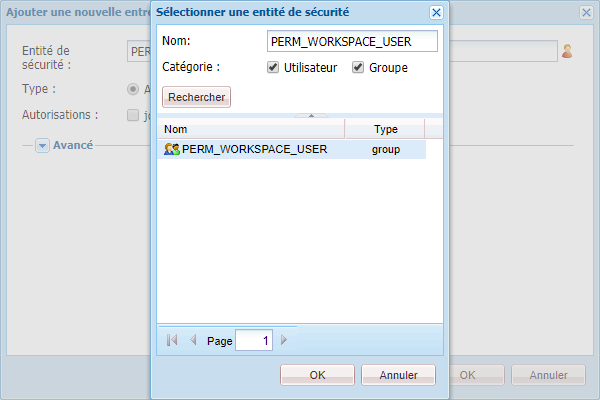

# Procédure générique de personnalisation de l’espace de travail AEM Forms {#generic-steps-for-aem-forms-workspace-customization}

Les étapes génériques pour effectuer toute personnalisation sont les suivantes :

1. Connectez-vous à CRXDE Lite en accédant à lʼadresse `https://'[server]:[port]'/lc/crx/de/index.jsp`.
1. Créez un dossier `sling:Folder` nommé `ws` dans `/apps`, s’il n’existe pas. Pour créer un dossier `sling:Folder`, cliquez avec le bouton droit sur le dossier `apps` et sélectionnez **[!UICONTROL Créer]** > **[!UICONTROL Créer un nœud]**. Indiquez le nom `ws`, sélectionnez le type `sling:Folder` et cliquez sur **[!UICONTROL OK]**. Cliquez sur **[!UICONTROL Enregistrer tout]**.
1. Naviguez jusqu’à `/apps/ws` et accédez à l’onglet **[!UICONTROL Contrôle d’accès]**.
1. Sélectionnez l’option **[!UICONTROL Référentiel]**. Dans la liste **[!UICONTROL Contrôle d’accès]**, cliquez sur **[!UICONTROL +]** pour ajouter une entrée. Cliquez de nouveau sur **[!UICONTROL +]**.
1. Recherchez et sélectionnez le principal de sécurité **PERM_WORKSPACE_USER**.

   

1. Octroyez le privilège `jcr:read` au principal de sécurité.
1. Cliquez sur **[!UICONTROL Enregistrer tout]**.
1. Copiez les fichiers `GET.jsp`, `index` et `html.jsp` du dossier `/libs/ws` vers le dossier `/apps/ws`.
1. Copiez le dossier `/libs/ws/locales` dans le dossier `/apps/ws`. Cliquez sur **[!UICONTROL Enregistrer tout]**.
1. Mettez à jour les références et les chemins d’accès relatifs dans le fichier `GET.jsp`, comme indiqué ci-dessous, puis cliquez sur **[!UICONTROL Enregistrer tout]**.

   ```javascript
   <meta http-equiv="refresh" content="0;URL='/lc/apps/ws/index.html'" />
   ```

1. Procédez comme suit pour des personnalisations CSS :

   1. Naviguez jusqu’au dossier `/apps/ws` et créez un dossier nommé `css`.

   1. Dans le dossier `css`, créez un fichier nommé `newStyle.css`.

   1. Ouvrez `/apps/ws/html`.jsp et changez

   ```javascript
   <link lang="en" rel="stylesheet" type="text/css" href="css/style.css" />
   <link lang="en" rel="stylesheet" type="text/css" href="css/jquery-ui.css"/>
   ```

   vers

   ```javascript
   <link lang="en" rel="stylesheet" type="text/css" href="../../libs/ws/css/style.css" />
   <link lang="en" rel="stylesheet" type="text/css" href="css/newStyle.css" />
   <link lang="en" rel="stylesheet" type="text/css" href="../../libs/ws/css/jquery-ui.css"/>
   ```

   >[!NOTE]
   >
   >Placez l’entrée du fichier CSS défini par l’utilisateur après l’entrée de style.css, comme indiqué ci-dessus.

1. Dans le fichier /apps/ws/html.jsp, changez à partir de

   ```jsp
   <script data-main="js/main" src="js/libs/require/require.js"></script>
   ```

   vers

   ```jsp
   <script data-main="js/main" src="../../libs/ws/js/libs/require/require.js"></script>
   ```

1. Procédez comme suit :

   1. Créez un dossier nommé `js` dans `/apps/ws`. Cliquez sur **[!UICONTROL Enregistrer tout]**.

   1. Créez un dossier nommé `libs` dans `/apps/ws/js`. Cliquez sur **[!UICONTROL Enregistrer tout]**.

   1. Copiez le dossier `/libs/ws/js/libs/jqueryui` vers le répertoire `/apps/ws/js/libs`. Cliquez sur **[!UICONTROL Enregistrer tout]**.

1. Procédez comme suit pour des personnalisations HTML :

   1. Sous `/apps/ws/js`, créez un dossier nommé `runtime`. Cliquez sur **[!UICONTROL Enregistrer tout]**.

   1. Sous `/apps/ws/js/runtime`, créez un dossier nommé `templates`. Cliquez sur **[!UICONTROL Enregistrer tout]**.

   1. Copiez `/libs/ws/js/main.js` dans `/apps/ws/js/main.js`.

   1. Copiez /libs/ws/js/registry.js dans `/apps/ws/js/registry.js`.

1. Cliquez sur **[!UICONTROL Enregistrer tout]**, effacez le cache et actualisez l’espace de travail AEM Forms.

   Accédez à l’URL `https://'[server]:[port]'/lc/ws` et connectez-vous à l’aide des informations d’identification administrator/password. Le navigateur vous redirige vers `https://'[server]:[port]'/lc/apps/ws/index.html`.
