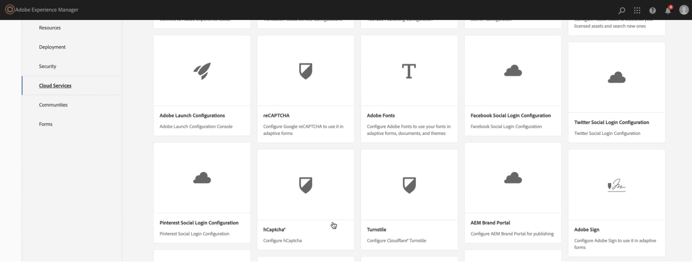

# Connecter votre environnement AEM Forms avec hCaptcha® {#connect-your-forms-environment-with-hcaptcha-service}

Cette fonctionnalité n’est pas activée par défaut. Vous pouvez écrire à partir de votre adresse officielle à aem-forms-ea@adobe.com pour demander l’accès à la fonctionnalité.

CAPTCHA (Completely Automated Public Turing test to tell Computers and Humans Apart, Test public de Turing complètement automatisé ayant pour but de différencier les personnes humaines des ordinateurs) est un programme couramment utilisé dans les transactions en ligne pour différencier les personnes humaines des programmes automatisés ou des robots. Il présente un test et évalue la réponse de l’utilisateur ou de l’utilisatrice pour déterminer s’il s’agit d’une personne humaine ou d’un robot qui interagit avec le site. Cela empêche l’utilisateur ou l’utilisatrice de continuer si le test échoue et permet de sécuriser les transactions en ligne en empêchant les robots d’envoyer du spam ou des éléments malveillants.

Outre hCaptcha®, AEM Forms 6.5 prend en charge les solutions CAPTCHA suivantes :

* [reCAPTCHA de Google](/help/forms/using/captcha-adaptive-forms.md)
* [Tourniquet Cloudflare](/help/forms/using/integrate-adaptive-forms-turnstile.md)

## Intégration d’un environnement AEM Forms à hCaptcha®

Le service hCaptcha® protège vos formulaires des robots, spams et violations automatisées. Il propose un test sous forme de widget de case à cocher et évalue la réponse de l’utilisateur ou de l’utilisatrice pour déterminer s’il s’agit d’une personne humaine ou d’un robot qui interagit avec le formulaire. Cela empêche l’utilisateur ou l’utilisatrice de continuer si le test échoue et permet de sécuriser les transactions en ligne en empêchant les robots d’envoyer du spam ou des activités malveillantes.

AEM 6.5 Adaptive Forms prend en charge hCaptcha&amp;reg. Vous pouvez l’utiliser pour présenter un défi de widget de case à cocher lors de l’envoi du formulaire.

<!-- -->

### Conditions préalables à l’intégration de l’environnement AEM Forms à hCaptcha® {#prerequisite}

Pour configurer hCaptcha® avec AEM Forms, vous devez obtenir la clé de site [hCaptcha® et la clé secrète](https://docs.hcaptcha.com/switch/#get-your-hcaptcha-sitekey-and-secret-key) à partir du site web hCaptcha®.

### Configuration de hCaptcha® {#steps-to-configure-hcaptcha}

Pour intégrer AEM Forms au service hCaptcha®, procédez comme suit :

1. Créez un conteneur de configuration sur votre environnement AEM Forms, qui contient les configurations cloud utilisées pour connecter AEM à des services externes. Pour créer un conteneur de configuration :
   1. Ouvrez votre environnement AEM Forms.
   1. Accédez à **[!UICONTROL Outils > Général > Navigateur de configuration]**.
   1. Dans l’explorateur de configurations, vous pouvez sélectionner un dossier existant ou en créer un nouveau :
      * Pour créer un dossier et activer les configurations cloud :
         1. Dans le navigateur de configuration, cliquez sur **[!UICONTROL Créer]**.
         1. Dans la boîte de dialogue Créer une configuration, spécifiez un nom et un titre, puis cochez la case **[!UICONTROL Configurations cloud]**.
         1. Cliquez sur **[!UICONTROL Créer]**.
      * Pour activer la configuration cloud d’un dossier existant :
         1. Dans l’explorateur de configurations, sélectionnez le dossier, puis sélectionnez **[!UICONTROL Propriétés]**.
         1. Dans la boîte de dialogue Propriétés de configuration, activez **[!UICONTROL Configurations cloud]**.
         1. Cliquez sur **[!UICONTROL Enregistrer et fermer]** pour enregistrer la configuration et fermer la boîte de dialogue.

1. Configurez vos services cloud :
   1. Sur votre instance d’auteur AEM, accédez à  > **[!UICONTROL Services cloud]** et cliquez sur **[!UICONTROL hCaptcha®]**.

      
   1. Sélectionnez un conteneur de configuration, créé ou mis à jour, comme décrit dans la section précédente. Sélectionnez **[!UICONTROL Créer]**.

      
   1. Spécifiez **[!UICONTROL Titre]**, <!--**[!UICONTROL Name]**--> **[!UICONTROL Clé du site]** et **[!UICONTROL Clé secrète]** pour le service hCaptcha® [obtenues dans la section Prérequis](#prerequisite).
   1. Cliquez sur **[!UICONTROL Créer]**.

      

   >[!NOTE]
   > Les utilisateurs n’ont pas besoin de modifier les [URL de validation JavaScript côté client](https://docs.hcaptcha.com/#add-the-hcaptcha-widget-to-your-webpage) et [URL de validation côté serveur](https://docs.hcaptcha.com/#verify-the-user-response-server-side), car elles sont déjà préremplies pour la validation hCaptcha®.

   Une fois le service hCAPTCHA configuré, il peut être utilisé dans votre formulaire adaptatif.

## Utilisation de hCaptcha® dans un formulaire adaptatif {#using-hCaptcha-in-aem-6.5}

1. Ouvrez votre environnement AEM Forms.
1. Accédez à **[!UICONTROL Forms]** > **[!UICONTROL Forms et documents]**.
1. Sélectionnez un formulaire adaptatif et cliquez sur **[!UICONTROL Propriétés]**.
1. Dans le **[!UICONTROL Conteneur de configurations]**, sélectionnez le Conteneur de configurations contenant la configuration cloud qui connecte AEM Forms à hCaptcha.
1. Cliquez sur **[!UICONTROL Enregistrer et fermer]**.

   Si vous ne disposez pas d’un conteneur de configuration pour hCaptcha, consultez la section [Connecter votre environnement AEM Forms à hCaptcha®](#configure-hcaptcha-steps-to-configure-hcaptcha) pour savoir comment créer un conteneur de configuration.

   

1. Sélectionnez un formulaire adaptatif et cliquez sur **[!UICONTROL Modifier]** pour ouvrir le formulaire dans l’éditeur.
1. À partir du navigateur de composant, faites glisser et déposez le composant **[!UICONTROL Captcha]** sur le formulaire adaptatif.
1. Sélectionnez le composant **[!UICONTROL Captcha]**, puis cliquez sur Propriétés  pour ouvrir la boîte de dialogue des propriétés. Spécifiez les propriétés suivantes :

   

   * **[!UICONTROL Titre] :** spécifiez le titre de votre composant Captcha.
   * **[!UICONTROL Message de validation] :** fournissez un message de validation pour votre validation Captcha lors de l’envoi du formulaire ou d’une action de l’utilisateur.
   * **[!UICONTROL Service Captcha] :** sélectionnez le service CAPTCHA pour l’envoi du formulaire, puis sélectionnez hCaptcha®.
   * **[!UICONTROL Paramètres de configuration] :** sélectionnez la configuration cloud configurée pour hCaptcha®.

     >[!NOTE]
     >Plusieurs configurations cloud peuvent être définies dans votre environnement dans un but similaire. Donc, choisissez le service avec soin. Si aucun service n’est répertorié, consultez [Connexion de votre environnement AEM Forms à hCaptcha®](#connect-your-forms-environment-with-hcaptcha-service) pour savoir comment créer un Cloud Service qui connecte votre environnement AEM Forms au service hCaptcha®.

   * **[!UICONTROL Message d’erreur] :** indiquez le message d’erreur à afficher à l’utilisateur ou à l’utilisatrice en cas d’échec de l’envoi du Captcha.
   * **[!UICONTROL Taille du Captcha] :** vous pouvez sélectionner la taille d’affichage de la boîte de dialogue de vérification préliminaire hCaptcha®. Utilisez l’option **[!UICONTROL Compact]** pour afficher un objet de petite taille, et l’option **[!UICONTROL Normal]** pour afficher une boîte de dialogue de test hCaptcha® de taille relativement importante, ou l’option **[!UICONTROL Invisible]** pour valider le hCaptcha® sans afficher explicitement le widget de case à cocher dans l’interface utilisateur.

1. Sélectionnez **[!UICONTROL Terminé]**.

Désormais, seuls les formulaires légitimes, dans lesquels le remplisseur de formulaire résout avec succès le problème posé par le service hCaptcha®, sont autorisés pour l’envoi du formulaire.

**hCaptcha® est une marque déposée d’Intuition Machines, Inc.**

## Questions fréquentes

* **Q : Puis-je utiliser plusieurs composants Captcha dans un formulaire adaptatif ?**
* **Réponse :** l’utilisation de plusieurs composants Captcha dans un formulaire adaptatif n’est pas prise en charge. En outre, il n’est pas recommandé d’utiliser un composant Captcha dans un fragment ou un panneau marqué pour le chargement différé.

## Voir également {#see-also}

* [Utiliser de CAPTCHA dans les formulaires adaptifs](/help/forms/using/captcha-adaptive-forms.md)
* [Utilisation de Captcha Turnstile dans les formulaires adaptatifs](/help/forms/using/integrate-adaptive-forms-turnstile.md)
