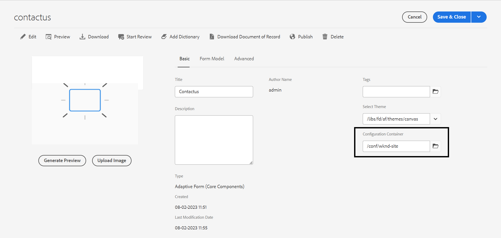

# Connecter votre environnement AEM Forms à Turnstile {#connect-your-forms-environment-with-turnstile-service}

Cette fonctionnalité n’est pas activée par défaut. Vous pouvez écrire à partir de votre adresse officielle à aem-forms-ea@adobe.com pour demander l’accès à la fonctionnalité.

CAPTCHA (Completely Automated Public Turing test to tell Computers and Humans Apart, Test public de Turing complètement automatisé ayant pour but de différencier les personnes humaines des ordinateurs) est un programme couramment utilisé dans les transactions en ligne pour différencier les personnes humaines des programmes automatisés ou des robots. Il présente un test et évalue la réponse de l’utilisateur ou de l’utilisatrice pour déterminer s’il s’agit d’une personne humaine ou d’un robot qui interagit avec le site. Cela empêche l’utilisateur ou l’utilisatrice de continuer si le test échoue et permet de sécuriser les transactions en ligne en empêchant les robots d’envoyer du spam ou des éléments malveillants.

AEM Forms prend en charge les solutions CAPTCHA suivantes :

* [Captcha Turnstile](/help/forms/using/integrate-adaptive-forms-turnstile.md)
* [reCAPTCHA de Google](/help/forms/using/captcha-adaptive-forms.md)
* [hCaptcha](/help/forms/using/integrate-adaptive-forms-hcaptcha.md)

<!-- -->

## Intégration de l’environnement AEM Forms à Captcha Turnstile

Le Captcha Turnstile de Cloudflare est une mesure de sécurité qui vise à protéger les formulaires et les sites contre les robots automatisés, les attaques malveillantes, les spams et le trafic automatisé indésirable. Il affiche une case à cocher lors de l’envoi de formulaires, ce qui permet de vérifier que l’action est effectuée par de vraies personnes, avant l’envoi effectif.

>[!VIDEO](https://video.tv.adobe.com/v/3440942?captions=fre_fr)

### Conditions préalables à l’intégration de l’environnement AEM Forms avec le Captcha Turnstile {#prerequisite}

Pour configurer Turnstile pour AEM Forms, vous devez obtenir la [clé de site Turnstile et clé secrète](https://developers.cloudflare.com/turnstile/get-started/) à partir du site Web Turnstile.

### Configurer le tourniquet {#steps-to-configure-hcaptcha}

Pour intégrer AEM Forms au service Turnstile, procédez comme suit :

1. Créez un conteneur de configuration sur votre environnement AEM Forms. Un conteneur de configurations contient les configurations cloud utilisées pour connecter AEM Forms à des services externes. Pour créer un conteneur de configuration :
   1. Ouvrez votre environnement AEM Forms.
   1. Accédez à **[!UICONTROL Outils > Général > Navigateur de configuration]**.
   1. Dans l’explorateur de configurations, sélectionnez un dossier existant ou créez-en un :
      * Pour créer un **dossier** et activer les configurations cloud :
         1. Dans le navigateur de configuration, cliquez sur **[!UICONTROL Créer]**.
         1. Dans la boîte de dialogue Créer une configuration, spécifiez un nom et un titre, puis cochez la case **[!UICONTROL Configurations cloud]**.
         1. Cliquez sur **[!UICONTROL Créer]**.
      * Pour activer la configuration cloud pour un dossier **existant** :
         1. Dans l’explorateur de configurations, sélectionnez le dossier et cliquez sur **[!UICONTROL Propriétés]**.
         1. Dans la boîte de dialogue Propriétés de configuration, activez **[!UICONTROL Configurations cloud]**.
         1. Cliquez sur **[!UICONTROL Enregistrer et fermer]** pour enregistrer la configuration.

1. Configurez vos services cloud :
   1. Sur votre instance d’auteur AEM, accédez à  > **[!UICONTROL Cloud Services]** et cliquez sur **[!UICONTROL Tourniquet]**.
      
   1. Sélectionnez un conteneur de configuration, créé ou mis à jour, comme décrit dans la section précédente. Cliquez sur **[!UICONTROL Créer]**.
      
   1. Spécifiez **[!UICONTROL Type de widget]** comme géré, non interactif ou invisible.
   1. Fournissez d’autres détails tels que **[!UICONTROL Titre]**, **[!UICONTROL Nom]**.
   1. Spécifiez **[!UICONTROL Clé du site]** et **[!UICONTROL Clé secrète]** pour le service Turnstile [obtenu dans les conditions préalables](#prerequisite).
   1. Cliquez sur **[!UICONTROL Créer]**.

      

   >[!NOTE]
   > Les utilisateurs n’ont pas besoin de modifier les URL de validation de JavaScript côté client et côté serveur, car elles sont déjà préremplies pour la validation Turnstile.

   Une fois le service Captcha de tourniquet configuré, il peut être utilisé dans votre formulaire adaptatif.

## Utiliser Turnstile dans un formulaire adaptatif {#using-turnstile-aem-6.5}

1. Ouvrez votre environnement AEM Forms.
1. Accédez à **[!UICONTROL Forms]** > **[!UICONTROL Forms et documents]**.
1. Sélectionnez un formulaire adaptatif, puis cliquez sur **[!UICONTROL Propriétés]**. Dans **[!UICONTROL Conteneur de configurations]**, sélectionnez le Conteneur de configurations contenant la configuration cloud qui connecte AEM Forms à Turnstile.
1. Cliquez sur **[!UICONTROL Enregistrer et fermer]**.

   Si vous ne disposez pas d’un conteneur de configuration pour configurer le service Captcha, consultez la section [Configurer le tourniquet](#configure-turnstile-steps-to-configure-hcaptcha) pour savoir comment créer un conteneur de configuration.

   

1. Sélectionnez un formulaire adaptatif, puis cliquez sur **[!UICONTROL Modifier]** pour ouvrir votre formulaire adaptatif dans l’éditeur.
1. À partir du navigateur de composant, faites glisser et déposez le composant **[!UICONTROL Captcha]** sur le formulaire adaptatif.
1. Sélectionnez le composant **[!UICONTROL Captcha]**, puis cliquez sur l’icône Propriétés . Cela ouvre la boîte de dialogue des propriétés. Spécifiez les propriétés suivantes :

   <!---->
   

   * **[!UICONTROL Titre] :** spécifiez le titre de votre composant Captcha. vous pouvez identifier facilement un composant de formulaire avec son titre unique à la fois dans le formulaire et dans l’éditeur de règles.
   * **[!UICONTROL Paramètres de configuration] :** sélectionnez une configuration cloud configurée pour le tourniquet.
   * **[!UICONTROL Message de validation] :** fournissez un message de validation pour valider le Captcha lors de l’envoi du formulaire ou d’une action de l’utilisateur.
   * **[!UICONTROL Service Captcha] :** sélectionnez le service CAPTCHA pour l’envoi du formulaire, puis sélectionnez Tourniquet®.
   * **[!UICONTROL Paramètres de configuration] :** sélectionnez la configuration cloud configurée pour le tourniquet®.
     >[!NOTE]
     >Plusieurs configurations cloud peuvent être définies dans votre environnement dans un but similaire. Donc, choisissez le service avec soin. Si aucun service n’est répertorié, voir [Connecter votre environnement AEM Forms à Turnstile](#connect-your-forms-environment-with-turnstile-service) pour savoir comment créer un Cloud Service qui connecte votre environnement AEM Forms à ce service.

   * **[!UICONTROL Message d’erreur] :** indiquez le message d’erreur à afficher à l’utilisateur ou à l’utilisatrice en cas d’échec de l’envoi du Captcha.
   * **Taille de Captcha :** vous pouvez sélectionner la taille d’affichage de la boîte de dialogue de vérification du hCaptcha®. Utilisez l’option **[!UICONTROL Compact]** pour afficher une boîte de dialogue de vérification préliminaire hCaptcha® de petite taille, et l’option **[!UICONTROL Normal]** pour afficher une boîte de dialogue de vérification préliminaire hCaptcha de taille relativement importante.

1. Sélectionnez **[!UICONTROL Terminé]**.

Désormais, seuls les formulaires légitimes, dans lesquels le remplisseur de formulaire résout avec succès le problème posé par le service Turnstile, sont autorisés pour l’envoi du formulaire.

## Questions fréquentes

* **Q : Puis-je utiliser plusieurs composants Captcha dans un formulaire adaptatif ?**
* **Réponse :** l’utilisation de plusieurs composants Captcha dans un formulaire adaptatif n’est pas prise en charge. En outre, il n’est pas recommandé d’utiliser un composant Captcha dans un fragment ou un panneau marqué pour le chargement différé.

## Voir également {#see-also}

* [Utiliser de CAPTCHA dans les formulaires adaptifs](/help/forms/using/captcha-adaptive-forms.md)
* [Utilisation de hCaptcha dans les formulaires adaptatifs](/help/forms/using/integrate-adaptive-forms-hcaptcha.md)
