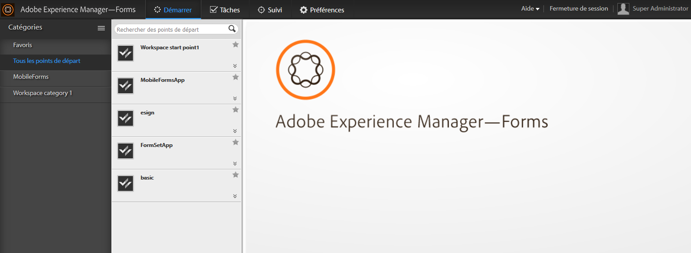

# Présentation de l’espace de travail AEM Forms{#introduction-to-aem-forms-workspace}

Forms Workflow améliore l’efficacité organisationnelle en automatisant et en fournissant une visibilité des processus métier critiques relatifs aux documents et aux formulaires. Grâce au module Process Management, vous pouvez créer des workflows complets simplifiés comprenant des personnes, des systèmes, du contenu et des règles métier, accessibles en ligne ou hors ligne.Le workflow Forms inclut l’espace de travail AEM Forms. L’espace de travail AEM Forms ajoute de nouvelles fonctionnalités pour étendre et intégrer l’espace de travail et le rendre plus convivial.

L’espace de travail AEM Forms est compatible avec davantage d’appareils et de facteurs de formulaire. Il permet de gérer les tâches sur les clients sans Flash Player® ni Adobe® Reader®. Il facilite le rendu de formulaires HTML en plus des formulaires PDF.

**Fonctionnalités essentielles** :

* Permettez aux personnes participant aux processus de travailler où qu’elles soient, grâce à des PDF forms dynamiques, des interfaces mobiles et des applications web.
* Intégrez facilement les composants d’espace de travail à vos applications web. Étant donné que l’espace de travail AEM Forms est un logiciel basé sur des composants, il peut être facilement personnalisé et réutilisé.
* Étendez les processus métier à la fois aux travailleurs et travailleuses mobiles en ligne et hors ligne à l’aide de l’application de l’espace de travail AEM Forms.
* Affichez les rapports pour  les retards, les files d’attente de travaux et les indicateurs de performances clés (KPI). Vous pouvez utiliser les API pour extraire des données à des fins d’analyse plus approfondie en utilisant des outils de création de rapports tiers.
