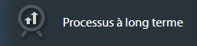
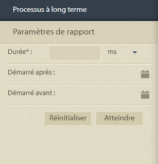
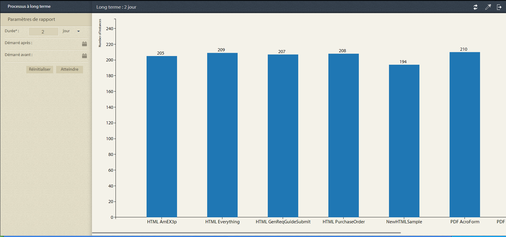
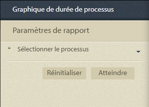
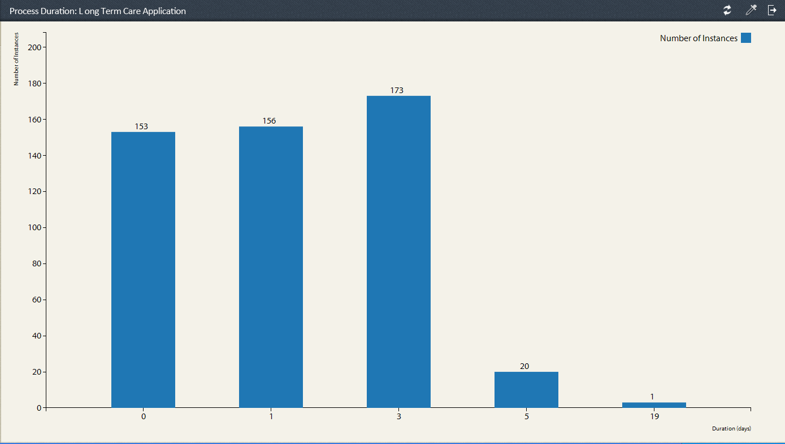
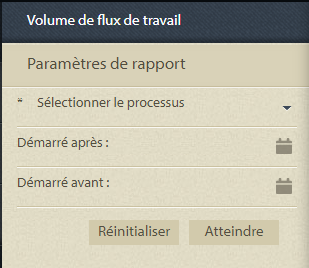
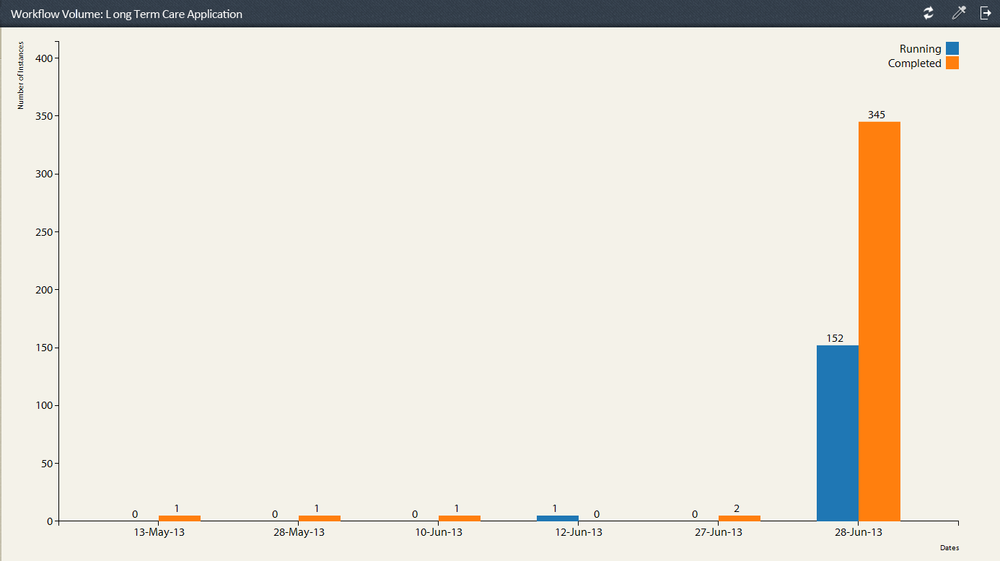

# Rapports prédéfinis dans Process Reporting {#pre-defined-reports-in-process-reporting}

## Rapports prédéfinis dans Process Reporting {#pre-defined-reports-in-process-reporting-1}

Process Reporting d’AEM Forms est fourni avec les rapports *prêts à l’emploi* suivants :

* **[Processus à long terme](#long-running-processes)** : rapport de tous les processus AEM Forms dont l’exécution a pris plus que le temps spécifié.
* **[Graphique de durée du processus](#process-duration-report)** : rapport d’un processus AEM Forms spécifié par la durée.
* **[Volume des workflows](#workflow-volume-report)** : rapport des instances en cours d’exécution et terminées d’un processus spécifié par date.

## Processus à long terme {#long-running-processes}

Le rapport Processus à long terme affiche les processus AEM Forms dont l’exécution a pris plus que le temps spécifié.

### Pour exécuter un rapport Processus à long terme {#to-execute-a-long-running-process-report}

1. Pour afficher la liste des rapports prédéfinis dans Process Reporting, sur l’arborescence **Process Reporting**, cliquez sur le nœud **Rapports**.
1. Cliquez sur le nœud du rapport **Processus à long terme**.

   

   Lorsque vous sélectionnez un rapport, le panneau **Paramètres des rapports** s’affiche à droite de l’arborescence.

   

   Paramètres:

   * **Durée** (*obligatoire*) : spécifiez une durée et une unité de temps. Affichez tous les processus AEM Forms dont l’exécution a duré plus que la durée spécifiée.
   * **Démarré après** (*facultatif*) : sélectionnez une date. Filtrez le rapport pour afficher les instances de processus démarrées après la date spécifiée.
   * **Démarré avant** (*facultatif*) : sélectionnez une date. Filtrez le rapport pour afficher les instances de processus qui ont démarré avant la date spécifiée.

1. Cliquez sur **Lancer** pour exécuter le rapport.

   Le rapport s’affiche dans le panneau **Rapport** à droite de la fenêtre **Process Reporting**.

   

   Utilisez les options situées dans le coin supérieur droit du panneau **Rapport** pour effectuer les opérations suivantes sur le rapport.

   * **Actualiser** : permet d’actualiser le rapport avec les dernières données stockées.
   * **Changer la couleur de la légende** : permet de sélectionner et de modifier la couleur de la légende du rapport.
   * **Exporter au format CSV** : permet d’exporter et de télécharger les données du rapport dans un fichier séparé par des virgules.

## Rapport Durée du processus  {#process-duration-report}

Le rapport Durée du processus affiche le nombre d’instances d’un processus Forms par nombre de jours d’exécution de chaque instance.

### Pour exécuter un rapport Durée du processus {#to-execute-a-process-duration-report}

1. Pour afficher les rapports prédéfinis dans Process Reporting, sur l’arborescence **Process Reporting**, cliquez sur le nœud **Rapports**.
1. Cliquez sur le nœud du rapport **Durée des processus**.

   

   Lorsque vous sélectionnez un rapport, le panneau **Paramètres des rapports** s’affiche à droite de l’arborescence.

   

   Paramètres:

   * **Sélectionnez un processus** (*obligatoire*) : sélectionnez un processus AEM Forms.

1. Cliquez sur **Lancer** pour exécuter le rapport.

   Le rapport s’affiche dans le panneau **Rapport** à droite de la fenêtre Process Reporting.

   

   Utilisez les options situées dans le coin supérieur droit du panneau **Rapport** pour effectuer les opérations suivantes sur le rapport.

   * **Actualiser** : permet d’actualiser le rapport avec les dernières données stockées.
   * **Changer la couleur de la légende** : permet de sélectionner et de modifier la couleur de la légende du rapport.
   * **Exporter au format CSV** : permet d’exporter et de télécharger les données du rapport dans un fichier séparé par des virgules.

## Rapport Volume des workflows {#workflow-volume-report}

Le rapport Volume des workflows affiche le nombre d’instances en cours d’exécution et terminées d’un processus AEM Forms par jour calendaire.

### Pour exécuter un rapport Volume des workflows {#to-execute-a-workflow-volume-report}

1. Pour afficher les rapports prédéfinis dans Process Reporting, sur la vue arborescente de **Process Reporting**, cliquez sur le nœud **Rapports**.
1. Cliquez sur le nœud rapport **Volume de workflow**.

   

   Lorsque vous sélectionnez un rapport, le panneau **Paramètres des rapports** s’affiche à droite de l’arborescence.

   

   Paramètres:

   * **Sélectionner un processus** (*obligatoire*) : sélectionnez un processus AEM Forms.

   * **Démarré après** (*facultatif*) : sélectionnez une date. Filtre le rapport afin d’afficher les instances de processus démarrées après la date spécifiée.

   * **Démarré avant** (*facultatif*) : sélectionnez une date. Filtre le rapport pour afficher les instances de processus qui ont démarré avant la date spécifiée.

1. Cliquez sur **Lancer** pour exécuter le rapport.

   Le rapport s’affiche dans le panneau **Rapport** à droite de la fenêtre **Process Reporting**.

   

   Utilisez les options situées dans le coin supérieur droit du panneau **Rapport** pour effectuer les opérations suivantes sur le rapport.

   * **Actualiser** : permet d’actualiser le rapport avec les dernières données stockées.
   * **Changer la couleur de la légende** : permet de sélectionner et de modifier la couleur de la légende du rapport.
   * **Exporter au format CSV** : permet d’exporter et de télécharger les données du rapport dans un fichier séparé par des virgules.
