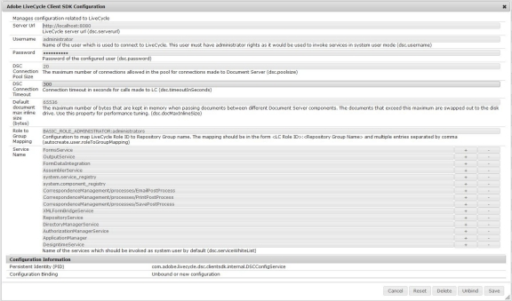
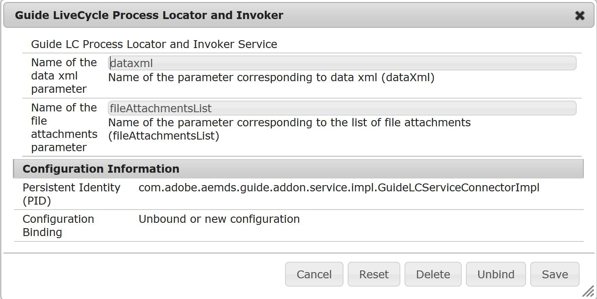

# Configuration d’AEM Forms pour envoyer des données de formulaire à un process AEM Forms sur JEE{#configuring-aem-forms-to-submit-form-data-to-an-aem-forms-on-jee-process}

Les formulaires adaptatifs prennent en charge l’envoi de données à un process AEM Forms sur JEE pour un traitement ultérieur. Il vous permet de déclencher un processus AEM Forms sur JEE avec les données disponibles à partir du formulaire envoyé. Effectuez les étapes suivantes pour permettre à votre instance AEM Forms d’envoyer un formulaire adaptatif au processus AEM Forms sur JEE :

## Configuration de votre serveur AEM Forms {#configure-your-aem-forms-server}

Effectuez les étapes suivantes afin de permettre à votre serveur AEM Forms d’envoyer des données à un serveur AEM Forms sur JEE :

1. Accédez à la configuration de console web AEM à l’adresse https://[*host*]:[*port*]/system/console/configMgr.

1. Recherchez et cliquez sur le composant **Configuration du SDK client d’Adobe LiveCycle**.
1. Cliquez pour modifier l’URL du serveur de configuration, le nom d’utilisateur et le mot de passe du serveur AEM Forms sur JEE.
1. Vérifiez les paramètres et cliquez sur **Enregistrer**.

## Associez les données aux champs de processus {#map-data-with-process-fields}

Après avoir configuré AEM Forms, mappez les données XML et les pièces jointes du formulaire envoyé aux champs du processus AEM Forms sur JEE. Procédez comme suit :

1. Dans la console de configuration web AEM, cliquez pour modifier la configuration du **localisateur et invocateur du processus Guide LiveCycle**
1. Spécifiez les paramètres suivants :

   * **Nom du paramètre de données XML** (obligatoire) : spécifiez le fichier de propriété XML du processus AEM Forms sur JEE qui doit traiter les données envoyées. La valeur par défaut est **dataxml**.

   * **Nom du paramètre de pièces jointes** (facultatif) : spécifiez la liste d’objets de document que le processus AEM Forms sur JEE doit traiter. La valeur par défaut est **fileAttachmentsList**.

1. Vérifiez les paramètres et cliquez sur **Enregistrer**.

Une fois configurée, l’action Envoi au processus de serveur de formulaires liste les processus du serveur AEM Forms sur JEE contenant le paramètre XML des données spécifié.
