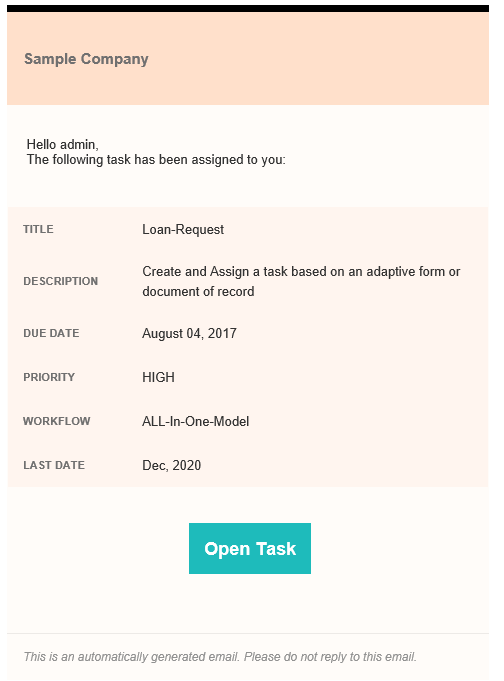
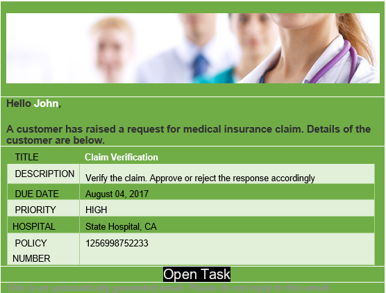

# Utilisation des modèles de courrier électronique personnalisés dans une étape Affecter une tâche{#use-custom-email-templates-in-an-assign-task-step}

Vous pouvez utiliser l’étape Affecter une tâche pour créer et affecter des tâches à un utilisateur ou une utilisatrice ou à un groupe. Lorsqu’une tâche est affectée à un utilisateur, une utilisatrice ou un groupe, une notification est envoyée par e-mail à la personne définie ou à chaque membre du groupe défini. Une notification par e-mail type contient le lien de la tâche affectée et des informations relatives à la tâche. L’image suivante affiche un exemple de notification par e-mail :

Vous pouvez personnaliser l’apparence et utiliser des métadonnées personnalisées dans une notification par e-mail. AEM Forms fournit un modèle de notifications par e-mail prêt à l’emploi. Vous pouvez personnaliser le modèle prêt à l’emploi ou créer un modèle entièrement nouveau.

Les modèles de notification par e-mail reposent sur des [e-mails HTML](https://en.wikipedia.org/wiki/HTML_email). Ces e-mails s’adaptent à différents clients de messagerie et tailles d’écran. De plus, le style de l’e-mail est défini dans le modèle.

L’image suivante affiche une notification électronique personnalisée :

## Personnaliser le modèle existant {#customize-the-existing-template}

En standard, AEM Forms fournit un modèle pour les notifications par e-mail. Le modèle contient la description du titre, l’échéance, la priorité, le nom du workflow et le lien de la tâche affectée. Vous pouvez personnaliser le modèle pour en modifier l’apparence. Procédez comme suit pour personnaliser le modèle :

1. Connectez-vous à CRXDE avec le compte administrateur.

1. Accédez à /libs/fd/dashboard/templates/email.

1. Ouvrez le fichier htmlEmailTemplate.txt. Il contient le modèle par défaut.

1. Remplacez le contenu du fichier htmlEmailTemplate.txt par un contenu personnalisé.

   Un modèle de notification électronique est un [courrier électronique HTML](https://en.wikipedia.org/wiki/HTML_email). Vous pouvez remplacer le code HTML existant par votre code personnalisé pour modifier l’aspect du modèle.

1. Enregistrez le fichier. Désormais, le modèle personnalisé est opérationnel.

## Créer un modèle d’e-mail {#create-an-email-template}

En standard, AEM Forms fournit un modèle pour les notifications par e-mail. Le modèle contient la description du titre, l’échéance, la priorité, le nom du workflow et le lien de la tâche affectée. Vous pouvez également ajouter un modèle d’e-mail personnalisé (votre propre modèle) pour les étapes Affecter une tâche. Effectuez les étapes suivantes pour ajouter un modèle d’e-mail personnalisé :

1. Connectez-vous à CRXDE avec le compte administrateur.

1. Accédez à /libs/fd/dashboard/templates/email.

1. Créez un fichier .txt. Par exemple, EmailOnTaskAssign.txt.

1. Ajoutez le code HTML personnalisé au fichier.

   Un modèle de notification électronique est un [courrier électronique HTML](https://en.wikipedia.org/wiki/HTML_email). Vous pouvez ajouter du code HTML personnalisé au fichier pour créer un modèle.

1. Enregistrez le fichier. Le modèle est prêt à être utilisé dans l’étape Affecter une tâche.

## Utiliser un modèle d’e-mail dans une étape Affecter une tâche {#use-an-email-template-in-an-assign-task-step}

L’étape Affecter une tâche, déjà prête à l’emploi, est configurée pour utiliser le modèle par défaut, htmlEmailTemplate.txt. Vous pouvez choisir d’utiliser un modèle personnalisé. Pour modifier le modèle :

1. Ouvrez l’étape Affecter une tâche.

1. Accédez à Personne désignée > Modèle de courrier électronique HTML.

1. Sélectionnez le modèle de courrier électronique HTML nouvellement créé.

1. Cliquez sur OK. Le modèle est modifié.

Une notification par e-mail utilise également des [métadonnées](../../forms/using/use-metadata-in-email-notifications.md). Par exemple, date d’échéance, priorité, nom du workflow, etc. Vous pouvez également configurer le modèle pour utiliser des [métadonnées personnalisées](../../forms/using/use-metadata-in-email-notifications.md#using-custom-metadata-in-an-email-notification).
