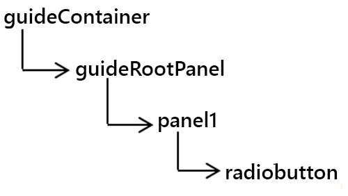
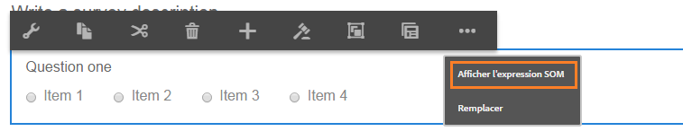
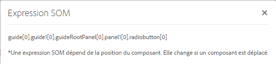

# Utiliser des expressions SOM dans des formulaires adaptatifs{#using-som-expressions-in-adaptive-forms}

Les formulaires adaptatifs sont modélisés comme des pages AEM, représentées par des structures de contenu JCR dans le référentiel AEM. L’élément clé de la structure de contenu est le nœud guideContainer. Sous guideContainer, il existe un rootPanel qui peut contenir un panneau et des champs imbriqués.

Vous pouvez utiliser un modèle d’objet de script (SOM) pour référencer des valeurs, des propriétés et des méthodes dans un modèle d’objet de document (DOM) particulier. Un DOM organise les objets et les propriétés de mémoire dans une hiérarchie d’arborescence. Une expression SOM référence des champs/éléments de dessin et des panneaux.

L’image suivante illustre une structure de nœud d’un formulaire adaptatif traduite lorsque vous ajoutez des composants à un formulaire. Par exemple, vous pouvez ajouter un panneau au panneau racine et un bouton radio au panneau transformé en DOM à l’exécution. L’expression SOM du champ de bouton radio du formulaire adaptatif est spécifiée comme `guide[0].guide1[0].guideRootPanel[0].panel1[0].radiobutton[0]`.

Arborescence DOM

Une expression SOM pour tout élément dans un formulaire adaptatif est précédée de `guide[0].guide1[0]`. La position d’un composant dans la hiérarchie de la structure de nœud est utilisée pour dériver son expression SOM.

Arborescence DOM à deux boutons radio

L’expression SOM change lorsque vous modifiez la position des boutons radio dans le formulaire adaptatif. En mode création, vous pouvez afficher l’expression SOM d’un champ ou d’un élément dans AEM Forms à l’aide de l’option Afficher l’expression SOM. L’option apparaît dans le panneau et lorsque vous cliquez avec le bouton droit sur le champ ou sur l’élément.

Extraction des expressions SOM dans un formulaire adaptatif

Dans les panneaux, vous pouvez accéder à la fonction depuis la barre d’outils du panneau. La fonction facilite la création de scripts par les auteurs de formulaires adaptatifs.

Extraction des expressions SOM à l’aide de la barre d’outils du panneau

Certaines API répertoriées dans [GuideBridge](https://helpx.adobe.com/fr/aem-forms/6/javascript-api/GuideBridge.html) utilisent l’expression SOM d’un élément. Par exemple, pour centrer l’attention sur un champ particulier d’un formulaire adaptatif, transmettez l’expression SOM correspondante à l’`getFocus`API dans le `guideBridge`.
