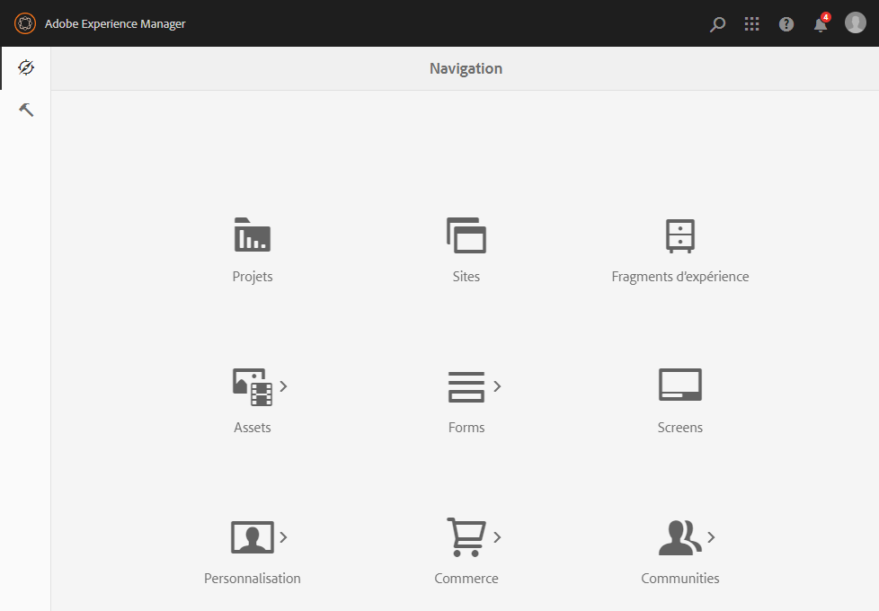

# Consoles d’administration{#admin-consoles}

Par défaut, la possibilité de basculer vers l’interface utilisateur classique au moyen des consoles d’administration est désactivée. Par conséquent, les icônes pop-up qui s’affichaient lorsque vous survoliez certaines icônes de console, permettant d’accéder à l’interface utilisateur classique, ne s’affichent plus.

Chaque console qui possède une version d’IU classique dans `/libs/cq/core/content/nav` peut être réactivée individuellement afin que l’option **IU classique** s’affiche à nouveau lors du survol du curseur sur l’icône de la console.

Dans cet exemple, nous réactivons l’IU classique pour la console Sites.

1. À l’aide de CRXDE Lite, recherchez le nœud correspondant à la console d’administration pour laquelle vous souhaitez réactiver l’IU classique. Il se trouve sous :

   `/libs/cq/core/content/nav`

   Par exemple :

   [`https://localhost:4502/crx/de/index.jsp#/libs/cq/core/content/nav`](https://localhost:4502/crx/de/index.jsp#/libs/cq/core/content/nav)

1. Sélectionnez le nœud correspondant à la console pour laquelle vous souhaitez réactiver l’IU classique. Dans cet exemple, vous réactivez l’IU classique pour la console Sites.

   `/libs/cq/core/content/nav/sites`

1. Créez un recouvrement à l’aide de l’option **Nœud de recouvrement** ; par exemple :

   * **Chemin** : `/apps/cq/core/content/nav/sites`
   * **Emplacement du recouvrement** : `/apps/`
   * **Faire correspondre les types de nœud** : actif (cochez la case)

1. Ajoutez la propriété booléenne suivante au nœud recouvert :

   `enableDesktopOnly = {Boolean}true`

1. L’option **IU classique** est à nouveau disponible sous la forme d’une option contextuelle dans la console d’administration.

   

Répétez ces étapes pour chaque console pour laquelle vous souhaitez réactiver l’accès à la version de l’UI classique.
