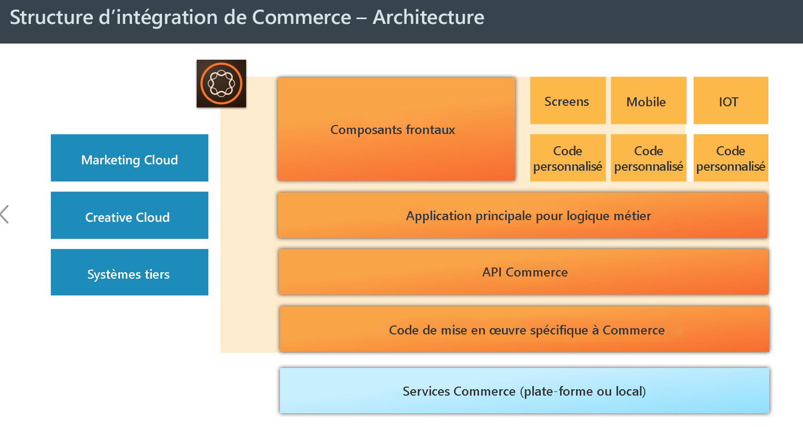

# AEM Commerce – Préparation au RGPD{#aem-commerce-gdpr-readiness}

>[!IMPORTANT]
>
>Le RGPD est utilisé comme exemple dans les sections ci-dessous, mais les détails couverts sont applicables à toutes les réglementations de protection des données et de confidentialité, comme le RGPD et le CCPA.

Le règlement général sur la protection des données (RGPD) de l’Union européenne sur les droits de confidentialité des données entre en vigueur en mai 2018. Consultez la [page consacrée au RGPD dans le centre de traitement des données personnelles d’Adobe](https://www.adobe.com/fr/privacy/general-data-protection-regulation.html).

>[!NOTE]
>
>Pour plus d’informations, consultez la section [Conformité d’AEM au RGPD](/help/managing/data-protection-and-privacy.md).

Grâce aux intégrations Commerce prêtes à l’emploi d’Adobe, AEM fait office de couche d’expérience, qui utilise des services et renvoie des données vers la plateforme commerciale du client ou de la cliente qui s’exécute en mode découplé.

Pour certaines plateformes commerciales, nous stockons des informations de profil (`/home/users`) et des jetons commerciaux (pour la connexion à la plateforme commerciale) dans AEM. Pour ces cas d’utilisation, consultez la section [Traiter les requêtes de RGPD pour la plateforme AEM](/help/sites-administering/handling-gdpr-requests-for-aem-platform.md).

## Traitement des requêtes de RGPD pour AEM Commerce {#handling-gdpr-requests-for-aem-commerce}

Pour l’intégration de Commerce Cloud Salesforce, AEM Commerce ne stocke aucune information relative au RGPD. Transférez la requête au [cloud Salesforce](https://documentation.b2c.commercecloud.salesforce.com/DOC1/index.jsp).

En ce qui concerne les intégrations Hybris et HCL WebSphere® Commerce, certaines données sont présentes dans AEM. Suivez les [instructions relatives au RGPD d’AEM Platform](/help/sites-administering/handling-gdpr-requests-for-aem-platform.md) et posez-vous les questions suivantes :

1. **Où mes données sont-elles stockées/utilisées ?** Informations de profil utilisateur mises en cache telles que le nom, l’identifiant de l’utilisateur commercial, le jeton, le mot de passe et l’adresse, comme indiqué depuis AEM.
1. **Avec qui dois-je partager les données couvertes par le RGPD ?** Toute mise à jour des données relatives au RGPD dans AEM Commerce n’est pas stockée (sauf les informations de profil pertinentes, comme mentionné ci-dessus), mais est renvoyée par proxy vers la plateforme commerciale.
1. **Comment supprimer mes données utilisateur** ? Supprimez le profil utilisateur dans AEM et supprimez la personne utilisatrice sur la plateforme commerciale.

>[!NOTE]
>
>Consultez le [wiki d’Hybris](https://wiki.hybris.com/) ou la [documentation de HCL WebSphere® Commerce](https://help.hcltechsw.com/commerce/index.html), si nécessaire.
