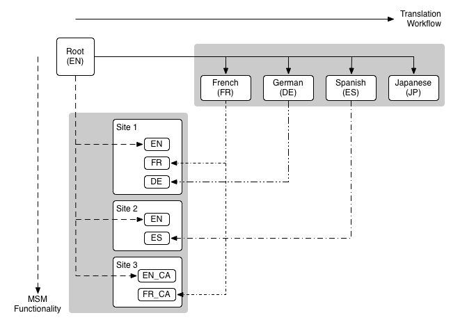

# Multi Site Manager et traduction {#msm-and-translation}

Les outils d’administration suivants sont disponibles pour gérer les sites et les pages web :

* Multi Site Manager (MSM) vous permet d’utiliser le même contenu de site à plusieurs endroits différents, tout en autorisant des variations :

   * [Réutilisation de contenu : Multi-Site Manager et Live Copy](/help/sites-administering/msm.md)

* La traduction vous permet d’automatiser la traduction du contenu des pages, des ressources et du contenu créé par l’utilisateur ou l’utilisatrice pour créer et tenir à jour des sites web multilingues :

   * [Traduction de contenu pour les sites multilingues](/help/sites-administering/translation.md)

* Ces deux fonctionnalités peuvent être combinées pour gérer les sites web qui sont à la fois [internationaux et multilingues](#multinational-and-multilingual-sites).

## Sites internationaux et multilingues {#multinational-and-multilingual-sites}

Vous pouvez créer efficacement du contenu pour les sites internationaux et multilingues par l’utilisation conjointe de Multi Site Manager et du workflow de traduction. Créez un site principal dans une langue, pour un pays spécifique, puis utilisez ce contenu comme base pour les autres sites, à l’aide de la traduction quand nécessaire :

* [Traduisez](/help/sites-administering/translation.md) le site de gabarit dans différentes langues.

* Utilisez [Multi Site Manager](/help/sites-administering/msm.md) pour effectuer les tâches suivantes :

   * Réutilisez le contenu du site principal et ses traductions afin de créer des sites pour d’autres pays et cultures.
   * Veillez à limiter l’utilisation de Multi Site Manager à du contenu dans une langue, par exemple, gabarit anglais -> branches de langue anglaise dans les sites de pays, gabarit français -> branches de langue française dans les sites de pays.
   * Si nécessaire, désolidarisez les éléments des Live Copies pour ajouter les détails de localisation.

Le diagramme suivant illustre la manière dont les principaux concepts sont en corrélation (mais n’affiche pas tous les niveaux/éléments impliqués) :

>[!NOTE]
>
>Dans ces scénarios et dans d’autres scénarios comparables, MSM ne gère pas les différentes versions de langues en tant que telles.
>
>* [MSM](/help/sites-administering/msm.md) gère le déploiement du contenu traduit d’un plan directeur (par exemple, un gabarit mondial) vers des Live Copies (par exemple, les sites locaux), dans les limites d’une langue.
>* Les fonctionnalités d’intégration de la [traduction](/help/sites-administering/translation.md) d’AEM, en association avec des services de gestion de traduction tiers, gèrent les langues et traduisent le contenu dans ces différentes langues.
>
>Pour les cas d’utilisation plus avancés, MSM peut également être utilisé dans les gabarits de langue.

>[!NOTE]
>
>Dans tous les cas, il est recommandé de lire les bonnes pratiques suivantes :
>
>* [Bonnes pratiques liées à MSM](/help/sites-administering/msm-best-practices.md), notamment :
>
>   * [Créer un site](/help/sites-administering/msm-best-practices.md#create-site)
>   * [MSM et sites web multilingues](/help/sites-administering/msm-best-practices.md#msm-and-multilingual-websites)
>
>* [Bonnes pratiques de traduction](/help/sites-administering/tc-bp.md)
