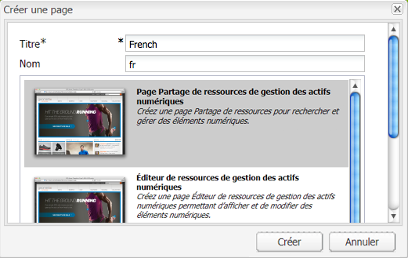
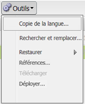
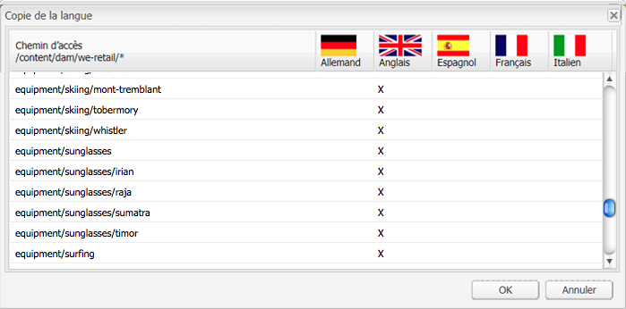
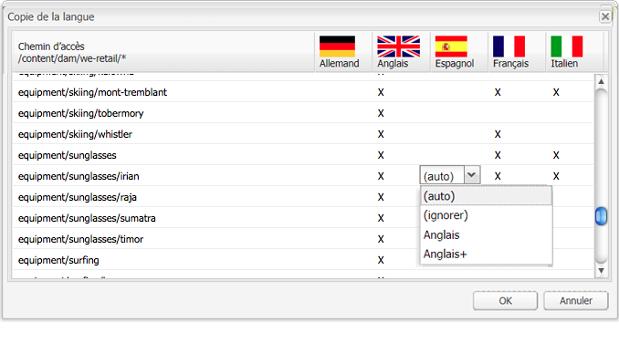

# Créer une racine de langue à l’aide de l’interface utilisateur classique{#creating-a-language-root-using-the-classic-ui}

La procédure ci-dessous utilise l’interface utilisateur classique pour créer la racine de langue d’un site. Pour plus d’informations, consultez [Création d’une racine de langue](/help/sites-administering/tc-prep.md#creating-a-language-root).

1. Dans la console Sites web, dans l’arborescence des sites web, sélectionnez la page racine du site. ([http://localhost:4502/siteadmin#](http://localhost:4502/siteadmin#))
1. Ajoutez une nouvelle page enfant qui représente la version de la langue du site :

   1. Cliquez sur Nouveau > Nouvelle page
   1. Dans la boîte de dialogue, spécifiez le titre et le nom. Le nom doit être au format `<language-code>` ou `<language-code>_<country-code>`, par exemple, en, en_US, en_us, en_GB, en_gb.

      * Le code de langue pris en charge est le code à deux lettres en minuscules, tel que défini par la norme ISO-639-1.
      * Le code de pays pris en charge est le code à deux lettres, en minuscules ou en majuscules, comme défini par la norme ISO 3166.

   1. Sélectionnez un modèle, puis cliquez sur Créer.

   

1. Dans la console Sites web, dans l’arborescence des sites web, sélectionnez la page racine du site.
1. Dans le menu Outils, sélectionnez Copie linguistique.

   

   La boîte de dialogue Copie linguistique affiche un tableau des versions linguistiques et des pages web disponibles. Un x dans une colonne de langue signifie que la page est disponible dans cette langue.

   

1. Pour copier une page existante ou une arborescence de pages d’une version de langue, sélectionnez la cellule de la page en question dans la colonne de langue. Cliquez sur la flèche et sélectionnez le type de copie à créer.

   Dans l&#39;exemple suivant, la page equipment/sunglasses/irian est copiée dans la version en français.

   

   | Type de copie linguistique | Description |
   |---|---|
   | auto | Utilise le comportement des pages parentes. |
   | ignore | Ne crée pas de copie de cette page et de ses enfants. |
   | `<language>+` (par exemple, Français+) | Copie la page et tous ses enfants de cette langue. |
   | `<language>` (par exemple, français) | Copie uniquement la page à partir de cette langue. |

1. Cliquez sur OK pour fermer la boîte de dialogue.
1. Dans la boîte de dialogue suivante, cliquez sur Oui pour confirmer la copie.
