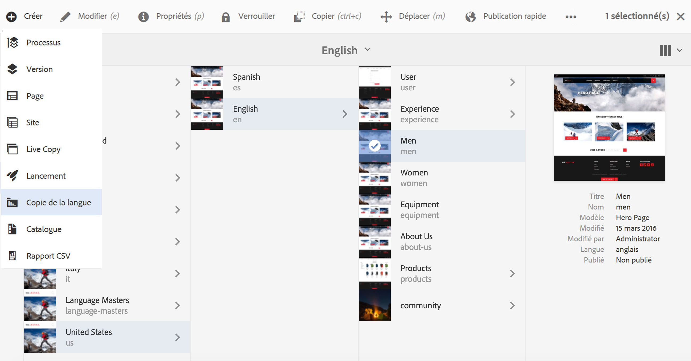
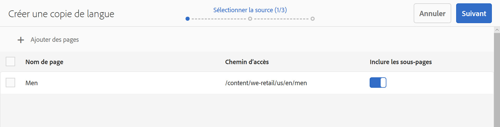
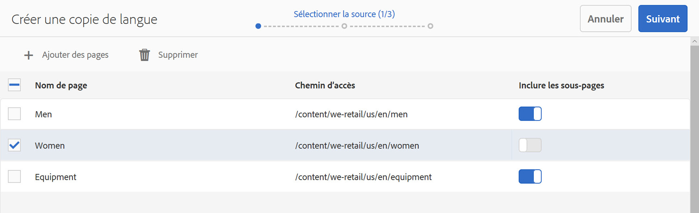
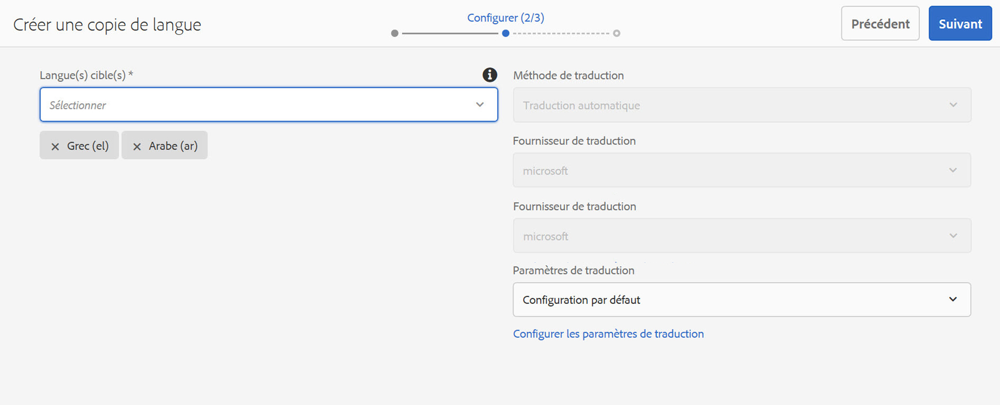
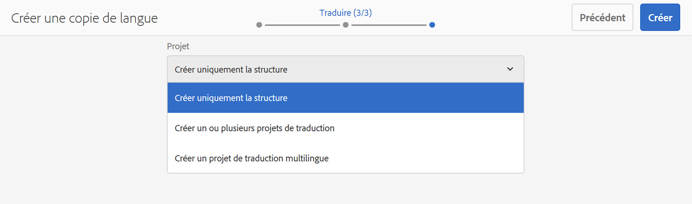
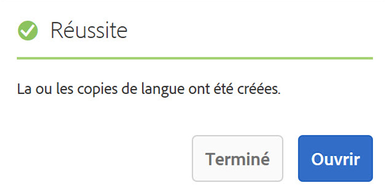

# Assistant Copie linguistique{#language-copy-wizard}

L’assistant Copie linguistique est une expérience guidée pour créer et gérer la structure du contenu multilingue. Il est désormais beaucoup plus simple et plus rapide de créer une copie linguistique.

>[!NOTE]
>
>L’utilisateur ou l’utilisatrice doit être membre du groupe projects-administrators pour créer la copie linguistique d’un site.

Pour accéder à cet assistant :

1. Dans Sites, sélectionnez une page, puis cliquez sur Créer.

   

1. Sélectionnez Copie linguistique pour ouvrir l’assistant.

   

1. L’étape **Sélectionner la source** de l’assistant vous permet d’ajouter/supprimer des pages. Vous avez également la possibilité d’inclure ou d’exclure les sous-pages.

   

1. Le bouton **Suivant** vous mène à l’étape **Configurer** de l’assistant. Ici, vous pouvez ajouter/supprimer des langues et sélectionner une méthode de traduction.

   

   >[!NOTE]
   >
   >Par défaut, il n’y a qu’un seul paramètre de traduction. Pour pouvoir sélectionner d’autres paramètres, vous devez d’abord configurer les configurations cloud. Voir [Configuration de la structure d’intégration de traduction](/help/sites-administering/tc-tic.md).

1. Le bouton **Suivant** vous mène à l’étape **Traduire** de l’assistant. Vous pouvez choisir entre la création de la structure uniquement, la création d’un projet de traduction ou l’ajout à un projet de traduction existant.

   >[!NOTE]
   >
   >Si vous avez sélectionné plusieurs langues à l’étape précédente, plusieurs projets de traduction seront créés.

   

1. Le bouton **Créer** ferme l’assistant.

   
