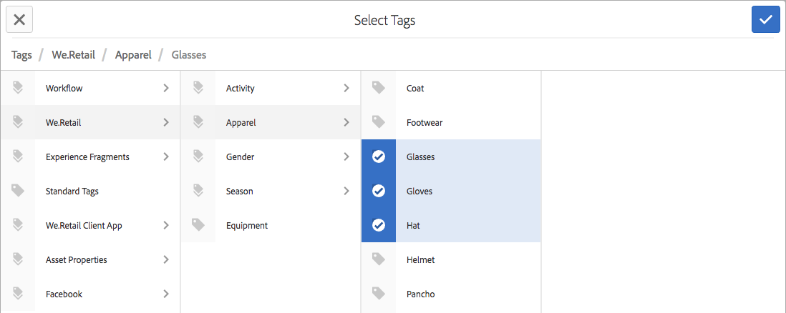

# Utilisation des balises {#using-tags}

Les balises sont une méthode rapide et facile pour classer le contenu dans un site web. Les balises peuvent être considérées comme des mots-clés ou des libellés pouvant être jointes à une page, à une ressource ou à un autre contenu pour permettre aux recherches de trouver ce contenu et le contenu associé.

* Voir [Administration des balises](/help/sites-administering/tags.md) pour plus d’informations sur la création et la gestion des balises et sur la façon de déterminer à quel contenu elles ont été appliquées.
* Voir [Balisage pour les développeurs et développeuses](/help/sites-developing/tags.md) pour plus d’informations sur le framework de balisage et sur l’inclusion et l’extension de balises dans les applications personnalisées.

## Dix raisons d’utiliser les balises {#ten-reasons-to-use-tagging}

1. **Organisation du contenu** : le balisage simplifie les activités des développeurs qui peuvent rapidement organiser le contenu, presque sans effort.
1. **Organisation des balises** : si les balises permettent d’organiser le contenu, les taxonomies/espaces de noms hiérarchiques permettent d’organiser les balises.
1. **Organisation avancée des balises** : dans la mesure où il est possible de créer des balises et des sous-balises, vous pouvez formuler des systèmes taxonomiques complets, couvrant des termes, des sous-termes, ainsi que leurs relations. Cela vous permet de créer une deuxième (ou une troisième) hiérarchie de contenu, parallèlement à la hiérarchie officielle.
1. **Balisage contrôlé** : le balisage peut être contrôlé en appliquant des autorisations aux balises ou aux espaces de noms pour contrôler la création et l’application de balises.
1. **Balisage flexible** : les balises se présentent sous de nombreuses formes et portent différents noms (balises, termes de taxonomie, catégories, libellés, etc.). Ils se distinguent par une grande souplesse au niveau de leur modèle de contenu et de leur mode d’exploitation ; par exemple, lors de la description des données démographiques cibles, de la classification et de l’évaluation du contenu, ou encore de la création d’une hiérarchie de contenu secondaire.
1. **Amélioration de la recherche** : dans AEM, le composant de recherche par défaut inclut les balises créées et les balises appliquées auxquelles des filtres peuvent être appliqués pour que seuls les résultats pertinents soient renvoyés.
1. **Optimisation pour les moteurs de recherche** : les balises appliquées sous forme de propriétés de page s’affichent automatiquement dans les métabalises de la page pour que les moteurs de recherche puissent les identifier.
1. **Utilisation simple** : les balises se créent facilement à partir d’un mot et en cliquant sur un bouton. Ensuite, un titre, une description et un nombre illimité de libellés peuvent être utilisés pour associer plus de termes à la balise.
1. **Cohérence** : le système de balisage est un composant central d’AEM. Il est utilisé par toutes les applications AEM pour catégoriser le contenu. En outre, l’API de balisage est mise à la disposition des développeurs pour leur permettre de créer des applications prenant en charge le balisage avec un accès aux mêmes taxonomies.
1. **Structuration et souplesse** : AEM est idéal pour travailler avec des informations structurées, grâce à l’imbrication des pages et des chemins d’accès. Il est tout aussi puissant lorsqu’il sagit de travailler avec des informations non structurées, grâce à la recherche de texte intégral intégrée. Le balisage combine les avantages de la structuration et de la flexibilité.

Lors de la conception de la structure du contenu d’un site et du schéma des métadonnées pour les ressources, il convient de tenir compte de l’approche légère et accessible qu’offre le balisage.

## Application de balises {#applying-tags}

Dans l’environnement de développement de contenu, les auteurs peuvent appliquer des balises en accédant aux propriétés de la page et en entrant une ou plusieurs balises dans le champ **Balises/Mots-clés**.

Pour appliquer les [balises prédéfinies](/help/sites-administering/tags.md), dans la fenêtre **Propriétés de la page**, utilisez le champ **Balises** et la fenêtre **Sélectionner les balises**. L’onglet **Balises standard** est l’espace de noms par défaut, ce qui signifie que le préfixe `namespace-string:` n’est pas ajouté à la taxonomie.

### Publication de balises {#publishing-tags}

Comme avec les pages, il est possible d’effectuer les opérations suivantes sur les balises et les espaces de noms :

**Activer**

* Activez individuellement des balises.

  A l’instar des pages, les nouvelles balises doivent être activées avant d’être disponibles dans l’environnement de publication.

>[!NOTE]
>
>Lorsque vous activez une page, une boîte de dialogue s’ouvre automatiquement pour vous permettre d’activer les balises inactivées qui en font partie.

**Désactiver**

* Désactivez les balises sélectionnées.
