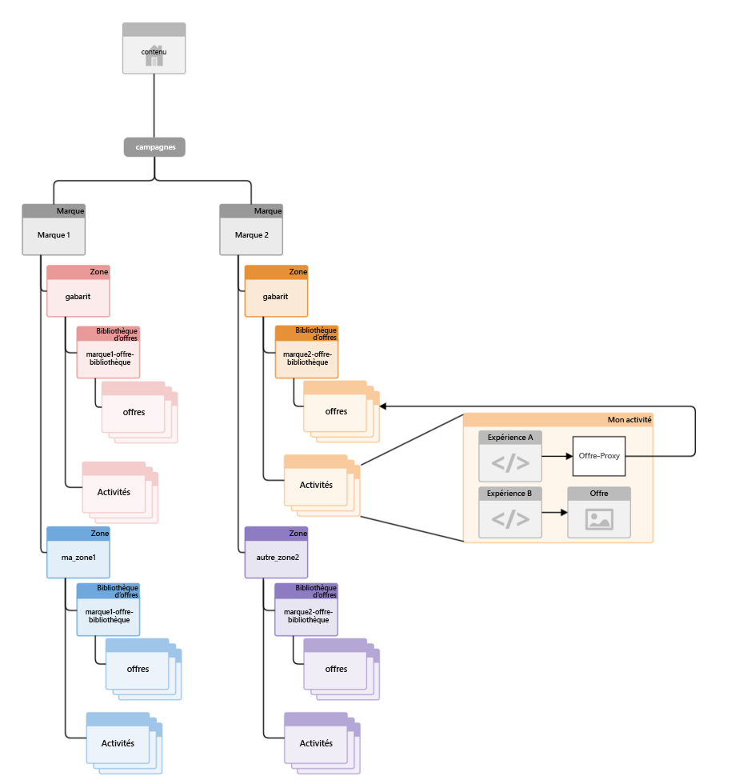
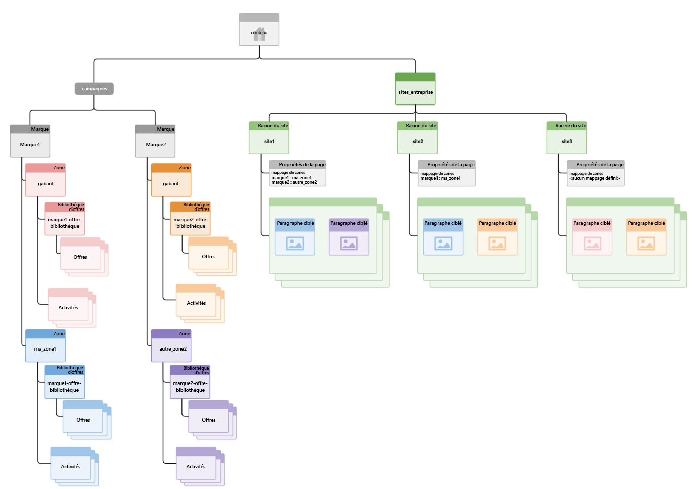

# Structuration de la gestion multisite du contenu ciblé{#how-multisite-management-for-targeted-content-is-structured}

Le diagramme suivant indique comment est structurée la prise en charge multisite du contenu ciblé.

Les zones apparaissent sous **/content/campaigns/&lt;marque>** et par défaut chaque marque comporte une zone maître, qui est créée automatiquement. Chaque zone contient son propre ensemble d’activités, d’expériences et d’offres.

Pour rechercher du contenu ciblé, les pages ou les sites peuvent correspondre à une zone. Si aucune zone n’est configurée, AEM revient à la zone principale pour cette marque spécifique.

Le diagramme suivant illustre le fonctionnement de la logique pour trois sites, nommés site1, site2 et site3.

* site1 recherche myarea1 pour brand1 et otherarea2 pour brand2 en fonction du mappage de la zone.
* site2 recherche myarea1 pour brand1 et la zone principale pour brand2 car seul le mappage de zone pour brand1 est défini.
* site3 recherche la zone principale pour brand1 et brand2 car aucun autre mappage de zone n’est défini pour ce site.
