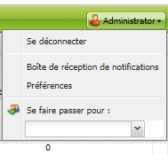
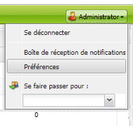
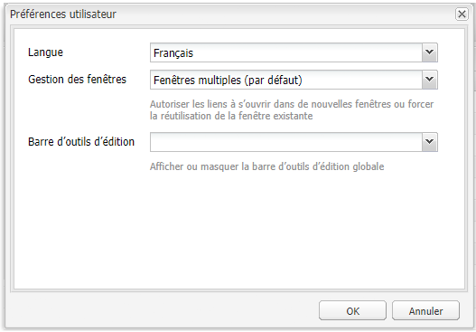

# Configuration de l’environnement du compte{#configuring-your-account-environment}

Adobe Experience Manager (AEM) vous procure les outils nécessaires pour configurer votre compte ainsi que certains aspects de l’environnement de création.

Les [paramètres du compte](#account-settings) et les [préférences utilisateur](#user-preferences) permettent de définir les options et préférences suivantes :

* **Barre d’outils d’édition**
Choisissez si vous souhaitez afficher la barre d’outils de modification globale. Cette barre d’outils, qui s’affiche en haut de la fenêtre du navigateur, comprend des boutons **Copier**, **Couper**, **Coller**, **Supprimer** utilisables avec les composants de paragraphe sur cette page :

  * Afficher lorsque cela s’avère nécessaire (paramètre par défaut)
  * Toujours afficher
  * Garder masqué

* **Se faire passer pour**
La fonctionnalité [Se faire passer pour](/help/sites-administering/security.md#impersonating-another-user) permet à un utilisateur de travailler au nom d’un autre.

* **Langue**
Langue à utiliser pour l’interface utilisateur de l’environnement de création. Sélectionnez la langue désirée dans la liste.

* **Gestion des fenêtres**
Sélectionnez l’une des options suivantes :

  * Fenêtres multiples (par défaut)
    Les pages s’ouvrent dans une nouvelle fenêtre.
  * Une seule fenêtre
    Les pages s’ouvrent dans la fenêtre active.

## Paramètres du compte {#account-settings}

L’icône utilisateur permet d’accéder aux options suivantes :

* Se déconnecter
* [Se faire passer pour](/help/sites-administering/security.md#impersonating-another-user)
* [Préférences utilisateur](#user-preferences)
* [Boîte de réception de notifications](/help/sites-classic-ui-authoring/author-env-inbox.md)

### Préférences utilisateur {#user-preferences}

Chaque utilisateur ou utilisatrice peut définir certaines propriétés pour lui-même ou pour elle-même. Cette option est disponible à partir de la boîte de dialogue **Préférences** dans le coin supérieur droit des consoles.

Cette boîte de dialogue présente les options suivantes :

