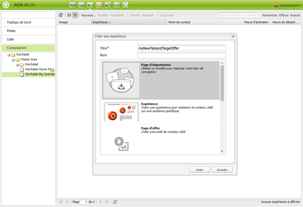

# Offres Target{#target-offers}

## Créer une expérience d’offre Test&amp;Target {#creating-a-test-target-offer-experience}

1. Sélectionnez votre nouvelle campagne dans le volet de gauche ou double-cliquez dans le volet de droite.
1. Sélectionnez la vue Liste à l’aide de l’icône :

   

1. Cliquez sur **Nouveau ...**
1. Vous pouvez indiquer le **Titre**, le **Nom** et le type d’expérience à créer ; dans ce cas, Offre Test&amp;Target.

   

1. Cliquez sur **Créer**.

   >[!NOTE]
   >
   >Les expériences Test&amp;Target ne sont actuellement pas répertoriées dans MCM. Elles sont accessibles à partir de la console **Sites web**, sous Campagnes.

## Intégration à Adobe Target {#integrating-with-adobe-target}

Consultez [Intégration à Adobe](/help/sites-administering/target.md) [Target](/help/sites-administering/target.md) pour obtenir des informations complètes.
