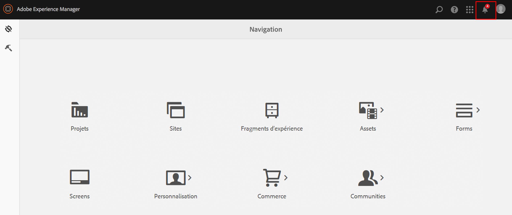
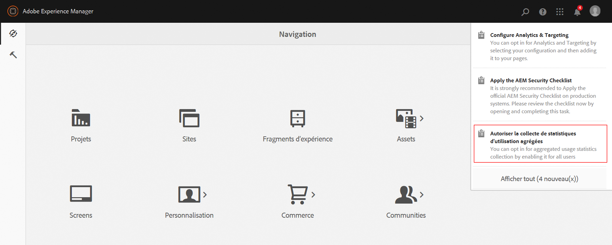
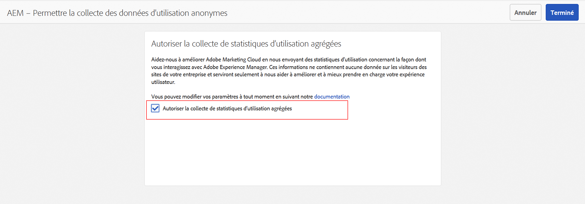
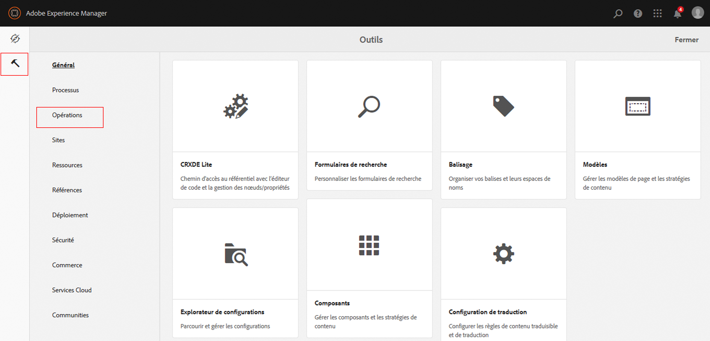
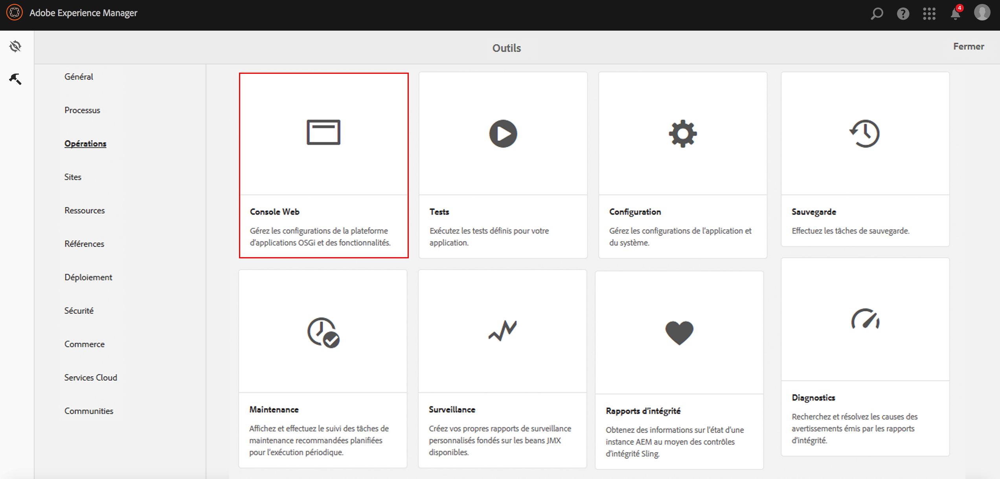
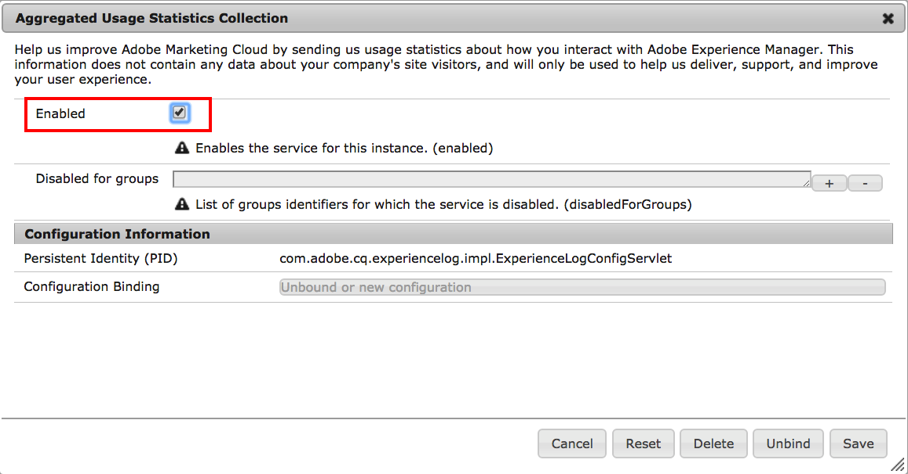

# Souscrire à la collecte de statistiques d’utilisation agrégées{#opting-into-aggregated-usage-statistics-collection}

## Présentation {#introduction}

Vous pouvez contribuer à améliorer Adobe Experience Cloud en envoyant des statistiques d’Adobe sur la manière dont vous interagissez avec Adobe Experience Manager (AEM). Ces informations ne contiennent aucune donnée sur les visiteurs et visiteuses du site de votre société et sont uniquement utilisées pour aider Adobe à fournir votre expérience client, à la prendre en charge et à l’améliorer.

Vous pouvez donner votre accord préalable pour la collecte de statistiques d’utilisation à l’aide de l’interface utilisateur tactile ou de la console web.

>[!NOTE]
>
>Il existe diverses réglementations en matière de protection des données et de confidentialité ; y compris et entre autres le RGPD et le CCPA. AEM Sites est prêt à aider les clients à respecter leurs obligations en matière de protection des données et de confidentialité. Cette page guide les clients à travers les procédures d’opt-in (ou d’opt-out) à la collecte de statistiques d’utilisation agrégées.
>
>Pour plus d’informations, consultez le [Centre de traitement des données personnelles d’Adobe](https://www.adobe.com/fr/privacy.html).

>[!NOTE]
>
>Vous pouvez vous exclure à tout moment à l’aide de la [console web]&#x200B;(/help/sites-deploying/opt-in-aggregated-usage-statistics.md#opt-in-by-using-the-web-console ou en ne sélectionnant pas l’option de souscription sur l’écran de souscription AEM.

## Souscription à l’aide de l’interface utilisateur tactile {#opt-in-by-using-the-touch-ui}

Lors du premier démarrage d’AEM, vous pouvez souscrire à l’aide de l’interface utilisateur tactile comme suit :

1. Sur l’écran de navigation AEM, cliquez sur l’icône **Boîte de réception** (cloche).

   

1. Dans la liste déroulante, cliquez sur **Activer la collecte de statistiques d’utilisation agrégées**.

   

1. Sur l’écran de souscription, cliquez sur l’option **[!UICONTROL Autoriser la collecte de statistiques d’utilisation agrégées]**.

   

1. Cliquez sur **Terminé**.

## Donner son accord préalable à l’aide de la console web {#opt-in-by-using-the-web-console}

Vous pouvez vous inscrire (ou vous exclure) à l’aide de la console web comme suit :

1. Sur l’écran de navigation AEM, cliquez sur **Outils**, puis sur **Opérations**.

   

1. Dans la fenêtre Opérations, cliquez sur **Console web**.

   

1. Recherchez **Collecte de statistiques d’utilisation agrégées**.
1. Cliquez sur l’icône **Modifier**.

   

1. Cochez la case **Activé**. Vous pouvez également désélectionner la case si vous souhaitez vous exclure de la collecte de statistiques d’utilisation.

   

1. Cliquez sur **Enregistrer**.
