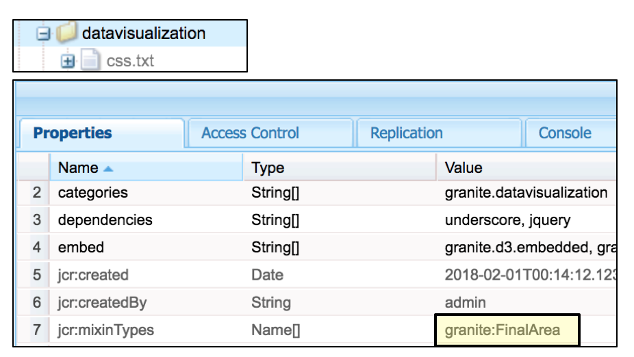
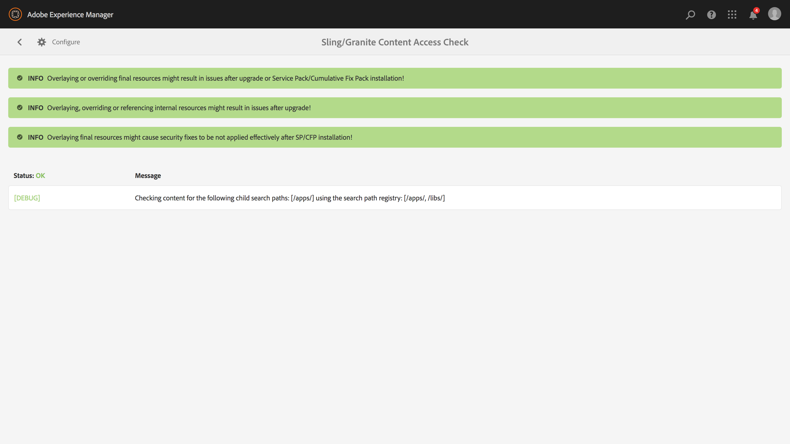

# Mises à niveau possibles{#sustainable-upgrades}

## Framework de personnalisation {#customization-framework}

### Architecture (Fonctionnelle/Infrastructure/Contenu/Application)  {#architecture-functional-infrastructure-content-application}

La fonctionnalité Framework de personnalisation est conçue pour aider à réduire les violations dans les zones non extensibles du code (comme les API) ou du contenu (comme les recouvrements) qui ne sont pas faciles à mettre à niveau.

Il existe deux composants du framework de personnalisation : la **surface de l’API** et la **classification du contenu**.

#### Surface de l’API {#api-surface}

Dans les versions précédentes d’Adobe Experience Manager (AEM), de nombreuses API étaient exposées via le Jar Uber. Certaines de ces API n’étaient pas destinées à être utilisées par les clientes et clients, mais étaient exposées pour prendre en charge la fonctionnalité AEM dans les lots. À l’avenir, les API Java™ seront accompagnées de la mention publique ou privée pour indiquer aux clientes et clients les API qui peuvent être utilisées en toute sécurité dans le contexte des mises à niveau. Voici d’autres observations :

* Les API Java™ accompagnées de la mention `Public` peuvent être utilisées et référencées par des lots d’implémentation personnalisés.

* Les API publiques sont rétrocompatibles avec l’installation d’un package de compatibilité.
* Le package de compatibilité contient un JAR Uber de compatibilité pour garantir la rétrocompatibilité.
* Les API Java™ accompagnées de la mention `Private` sont destinées aux seuls lots internes AEM. Elles ne peuvent pas être utilisées par des lots personnalisés.

>[!NOTE]
>
>Il ne faut pas confondre les concepts `Private` et `Public` employés dans ce contexte avec les notions de classes privées et publiques dans Java™.

#### Classifications de contenu {#content-classifications}

AEM utilise depuis longtemps le principe des recouvrements et de Sling Resource Merger pour permettre aux clientes et clients d’étendre et de personnaliser la fonctionnalité AEM. Les fonctionnalités prédéfinies qui alimentent les consoles et l&#39;interface utilisateur AEM sont stockées dans **/libs**. Les clientes et clients ne doivent jamais rien modifier en dessous de **/libs** mais pourraient ajouter du contenu supplémentaire en dessous de **/apps** pour recouvrir et étendre les fonctionnalités définies dans **/libs** (Voir Développement avec des recouvrements pour plus d’informations). Cela provoquait encore de nombreux problèmes lors de la mise à niveau d&#39;AEM car le contenu dans **/libs** pouvait changer, entraînant une interruption inattendue de la fonctionnalité de recouvrement. Les clients peuvent également étendre les composants AEM par le biais de l’héritage par le biais de `sling:resourceSuperType`, ou simplement référencer un composant dans **/libs** directement par le biais de sling:resourceType. Des problèmes de mise à niveau similaires peuvent se produire avec des cas d’utilisation de référence et de remplacement.

Pour permettre aux clientes et clients de comprendre plus facilement et de manière plus sécurisée les domaines de **/libs** qui peuvent être utilisés et recouverts en toute sécurité, le contenu dans **/libs** a été classé avec les mixins suivants :

* **Public (granite:PublicArea)** définit un nœud comme étant public afin qu’il puisse être recouvert, hérité ( `sling:resourceSuperType`) ou utilisé directement ( `sling:resourceType`). Les nœuds situés sous /libs marqués comme étant publics peuvent être mis à niveau en toute sécurité avec l’ajout d’un package de compatibilité. En règle générale, les utilisateurs et utilisatrices doivent uniquement utiliser les nœuds publics.

* **Abstrait (granite:AbstractArea)** - Définit un nœud comme abstrait. Les nœuds peuvent être recouverts ou hérités (`sling:resourceSupertype`), mais ils ne doivent pas être utilisés directement (`sling:resourceType`).

* **Final (granite:FinalArea)** - Définit un nœud comme final. Les nœuds classés en tant que finaux ne doivent idéalement pas être recouverts ni hérités. Les nœuds finaux peuvent être utilisés directement via `sling:resourceType`. Par défaut, les nœuds secondaires placés sous le nœud final sont considérés comme internes.

* ***Interne (granite:InternalArea)*** *- *Définit un nœud comme interne. Les nœuds classés dans la catégorie Interne ne peuvent pas être superposés, hérités, ni utilisés directement. Ces nœuds sont destinés uniquement à la fonctionnalité interne d’AEM

* **Aucune annotation** : les nœuds héritent d’une classification basée sur la hiérarchie de l’arborescence. La racine / est par défaut Public. **Les nœuds dont le parent est classé comme interne ou final doivent également être traités comme internes.**

>[!NOTE]
>
>Ces politiques ne sont appliquées qu’aux mécanismes basés sur le chemin de recherche Sling. D’autres zones de **/libs**, comme une bibliothèque côté client, peuvent se voir affecter la classification `Internal`. Cependant, elles peuvent toujours être utilisées avec l’inclusion clientlib standard. Il est important que les clientes et clients continuent à respecter la classification interne dans ces cas-là.

#### Indicateurs de type de contenu CRXDE Lite {#crxde-lite-content-type-indicators}

Les mixins appliqués dans CRXDE Lite affichent en grisé les nœuds de contenu et les arborescences ayant la classification `INTERNAL`. Pour la classification `FINAL`, seule l’icône est grisée. Les enfants de ces nœuds apparaissent également grisés. La fonctionnalité Nœud de recouvrement est désactivée dans ces deux cas.

**Public**

**Final**

**Interne**

**Contrôle de l’intégrité du contenu**

>[!NOTE]
>
>Depuis la version 6.5 d’AEM, Adobe recommande d’utiliser l’Outil de détection des motifs pour détecter les violations d’accès au contenu. Les rapports de l’Outil de détection des modèles sont plus détaillés, détectent plus de problèmes et réduisent la probabilité de faux positifs.
>
>Pour plus d’informations, consultez la section [Évaluation de la complexité de la mise à niveau à l’aide de l’Outil de détection des modèles](/help/sites-deploying/pattern-detector.md).

AEM 6.5 est fourni avec un contrôle d’intégrité permettant d’informer les clientes et clients si du contenu référencé ou recouvert serait utilisé d’une manière non conforme à la classification du contenu.

La **Vérification de l’accès au contenu Sling/Granite** est un nouveau contrôle d’intégrité qui surveille le référentiel afin de détecter si du code client accède, de manière non autorisée, à des nœuds protégés dans AEM.

Cela analyse le dossier **/apps** et prend généralement plusieurs secondes.

Pour accéder à ce nouveau contrôle d’intégrité, procédez comme suit :

1. Depuis l’écran d’accueil d’AEM, accédez à **Outils > Opérations > Rapports d&#39;intégrité**.
1. Cliquez sur **Vérification de l’accès au contenu Sling/Granite**.

   

Une fois l’analyse terminée, une liste d’avertissements s’affiche pour informer l’utilisateur final ou l’utilisatrice finale du nœud protégé qui est référencé de manière incorrecte :

Lorsque les problèmes ont été corrigés, le statut vert est rétabli :

Le contrôle d’intégrité affiche les informations collectées par un service en arrière-plan qui vérifie de manière asynchrone chaque utilisation d&#39;un recouvrement ou d’un type de ressource sur tous les chemins de recherche Sling. Si les mixins de contenu sont utilisés de manière incorrecte, une violation est signalée.
