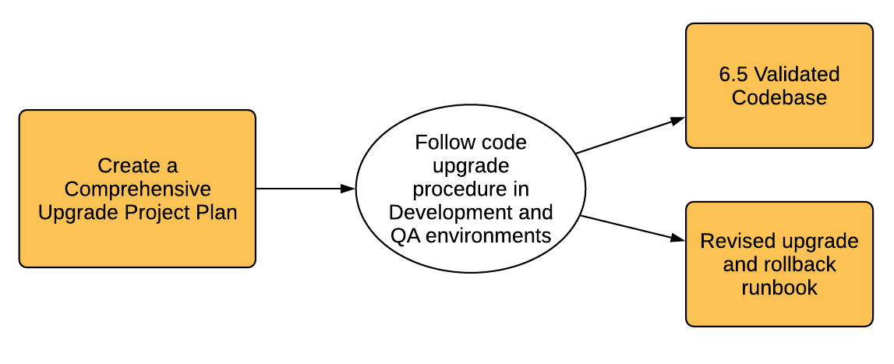

# Planification de la mise à niveau {#planning-your-upgrade}

## Présentation de la mise à niveau d’AEM {#aem-upgrade-overview}

AEM est souvent utilisé dans des déploiements à fort impact qui peuvent servir des millions d’utilisateurs et d’utilisatrices. En règle générale, certaines applications personnalisées sont déployées sur les instances, ce qui ajoute à la complexité. La mise à niveau d’un tel déploiement requiert une gestion méthodique.

Ce guide permet de définir des objectifs, des phases et des éléments livrables clairs lors de la planification de votre mise à niveau. Il se concentre sur l’exécution globale de la mise à niveau et les directives. Il donne un aperçu des étapes de mise à niveau et fait référence aux ressources techniques disponibles le cas échéant. Ce guide doit être utilisé avec les ressources techniques disponibles auxquelles il est fait référence dans le document.

Le processus de mise à niveau d’AEM nécessite une gestion attentive des phases de planification, d’analyse et d’exécution, avec des éléments livrables clés définis pour chaque phase.

>[!NOTE]
>
>La mise à niveau vers AEM 6.5 LTS est prise en charge à partir des 6 derniers Service Packs

Il est important de vous assurer que vous exécutez un système d’exploitation pris en charge, le runtime Java™, httpd et la version de Dispatcher. Pour plus d’informations, consultez le lien à déterminer : vers les exigences techniques d’AEM 6.5 LTS. La mise à niveau de ces composants doit être prise en compte dans votre plan de mise à niveau et doit avoir lieu avant la mise à niveau d’AEM.

<!-- Alexandru: drafting for now

## Upgrade Scope and Requirements {#upgrade-scope-requirements}

Below you will find a list of areas that are impacted in a typical AEM Upgrade project:

<table>
 <tbody>
  <tr>
   <td><strong>Component</strong></td>
   <td><strong>Impact</strong></td>
   <td><strong>Description</strong></td>
  </tr>
  <tr>
   <td>Operating System</td>
   <td>Uncertain, but subtle effects</td>
   <td>At the time of the AEM upgrade, it may be time to upgrade the operating system as well and this might have some impact.</td>
  </tr>
  <tr>
   <td>Java&trade; Runtime</td>
   <td>Moderate Impact</td>
   <td>AEM 6.3 requires JRE 1.7.x (64 bit) or later. JRE 1.8 is the only version currently supported by Oracle.</td>
  </tr>
  <tr>
   <td>Hardware</td>
   <td>Moderate Impact</td>
   <td>Online Revision Cleanup requires free  disk space equal to 25% of the repository's size and 15% free heap space  to complete successfully. You may need to upgrade your hardware to  ensure sufficient resources for Online Revision Cleanup to fully  run. Also, if upgrading from a version prior to AEM 6, there  may be additional storage requirements.</td>
  </tr>
  <tr>
   <td>Content Repository (CRX or Oak)</td>
   <td>High Impact</td>
   <td>Starting from version 6.1, AEM does not support CRX2, so a migration to  Oak (CRX3) is required if upgrading from an older version. AEM 6.3 has  implemented a new Segment Node Store that also requires a migration. The  crx2oak tool is used for this purpose.</td>
  </tr>
  <tr>
   <td>AEM Components/Content</td>
   <td>Moderate Impact</td>
   <td><code>/libs</code> and <code>/apps</code> are easily handled through the upgrade, but <code>/etc</code> usually requires some manual reapplication of customizations.</td>
  </tr>
  <tr>
   <td>AEM Services</td>
   <td>Low Impact</td>
   <td>Most AEM core services are tested for upgrade. This is an area of low impact.</td>
  </tr>
  <tr>
   <td>Custom Application Services</td>
   <td>Low to High Impact</td>
   <td>Depending on the application and customization, there may be  dependencies on JVM, operating system versions, and some indexing related  changes, as indexes are not generated automatically in Oak.</td>
  </tr>
  <tr>
   <td>Custom Application Content</td>
   <td>Low to High Impact</td>
   <td>Content that will not be handled through the upgrade can be backed up  before the upgrade takes place and then moved back into the repository.  Most content can be handled through the migration tool.</td>
  </tr>
 </tbody>
</table>

It is important to ensure that you are running a supported operating system, Java&trade; runtime, httpd, and Dispatcher version. For more information, see the [AEM 6.5 Technical Requirements page](/help/sites-deploying/technical-requirements.md). Upgrading these components must be accounted for in your project plan and should take place before upgrading AEM. -->

## Phases de mise à niveau {#upgrade-phases}

La planification et l’exécution d’une mise à niveau d’AEM demandent beaucoup de travail. En vue de clarifier les différents efforts de ce processus, Adobe a divisé les exercices de planification et d’exécution en plusieurs phases distinctes. Dans les sections ci-dessous, chaque phase génère un livrable qui est souvent utilisé par une phase ultérieure de la mise à niveau.

<!-- Alexandru:drafting for now

### Planning for Author Training {#planning-for-author-training}

With any new release, there are potential changes to the UI and user workflows that may be introduced. Also, new releases introduce new features that may be beneficial for the business to use. Adobe recommends reviewing the functional changes that have been introduced and organizing a plan to train your users on using them effectively.

New features in AEM 6.5 can be found in [the AEM section of adobe.com](/help/release-notes/release-notes.md). Make sure to note any changes to UIs or product features that are commonly used in your organization. As you look through the new features, also take note of any that can be of value to your organization. After looking through what has changed in AEM 6.5, develop a training plan for your authors. This could involve using freely available resources like the help feature videos or formal training offered through [Adobe Digital Learning Services](https://learning.adobe.com/). -->

### Création d’un plan de tests {#creating-a-test-plan}

La mise en œuvre d’AEM par chaque client ou cliente est unique et a été personnalisée pour répondre aux besoins de l’entreprise. Par conséquent, il est important de déterminer toutes les personnalisations qui ont été apportées au système afin qu’elles puissent être incluses dans un plan de tests. Ce plan de tests alimente le processus d’assurance qualité qu’Adobe exécute sur l’instance mise à niveau.

L’environnement de production exact doit être dupliqué et les tests doivent y être effectués après la mise à niveau afin de s’assurer que toutes les applications et le code personnalisé s’exécutent toujours selon vos besoins. Réglez toutes vos personnalisations et exécutez les tests de performances, de chargement et de sécurité. Lors de l’organisation de votre plan de tests, veillez à couvrir toutes les personnalisations apportées au système en plus des interfaces utilisateur et des workflows prêts à l’emploi utilisés dans vos opérations quotidiennes. Il peut s’agir de services et servlets OSGI personnalisés, d’intégrations à Adobe Experience Cloud, d’intégrations à des tiers par le biais de connecteurs pour AEM, d’intégrations tierces personnalisées, de composants et de modèles personnalisés, de recouvrements de l’interface utilisateur personnalisés dans AEM et de workflows personnalisés. En outre, les requêtes personnalisées doivent toujours être testées pour s’assurer que leurs index continuent à fonctionner efficacement après la mise à niveau.

### Évaluation de la complexité de la mise à niveau {#assessing-upgrade-complexity}

En raison de la grande variété dans la quantité et la nature des personnalisations que la clientèle d’Adobe applique à ses environnements AEM, il est important de prendre le temps de déterminer le niveau d’effort global attendu lors de votre mise à niveau. Analyzer pour AEM peut vous aider à évaluer la complexité de la mise à niveau.

Le LTS AEM Analyer pour AEM 6.5 doit vous donner une estimation assez précise de ce à quoi vous devez vous attendre la plupart du temps lors d’une mise à niveau. Cependant, pour les personnalisations et déploiements plus complexes comportant des modifications incompatibles, vous pouvez mettre à niveau une instance de développement vers AEM 6.5 LTS conformément aux instructions de la section [Exécution d’une mise à niveau statique](/help/sites-deploying/in-place-upgrade.md). Une fois l’opération terminée, effectuez un test de vérification de haut niveau dans cet environnement. L’objectif de cet exercice n’est pas de terminer l’inventaire exhaustif des cas de test et de produire un inventaire formel des défauts, mais de nous donner une estimation approximative de la quantité de travail qui sera nécessaire pour mettre à niveau le code pour la compatibilité LTS 6.5. Associé à l’analyseur AEM et aux modifications architecturales qui ont été déterminées dans la section précédente, un devis approximatif peut être fourni à l’équipe de gestion de projet pour planifier la mise à niveau.

### Création du runbook de mise à niveau et de restauration {#building-the-upgrade-and-rollback-runbook}

Bien qu’Adobe ait documenté le processus de mise à niveau d’une instance AEM, la configuration réseau, l’architecture de déploiement et les personnalisations de chaque cliente ou client nécessitent d’affiner et de personnaliser cette approche. C’est pourquoi Adobe vous encourage à consulter toute la documentation fournie et à l’utiliser pour informer un runbook spécifique à la mise à niveau qui décrit les procédures de mise à niveau et de restauration spécifiques que vous suivrez dans votre environnement.

<!--Alexandru:drafting for now

 -->

Adobe vous présente les procédures de restauration et de mise à niveau dans la section [Procédure de mise à niveau](/help/sites-deploying/upgrade-procedure.md), ainsi que les instructions à suivre pour appliquer la mise à niveau lorsque vous effectuez une [mise à niveau sur place](/help/sites-deploying/in-place-upgrade.md). Ces instructions doivent être examinées et prises en compte avec l’architecture de votre système, les personnalisations et la tolérance aux temps d’arrêt afin de déterminer les procédures de basculement et de restauration appropriées que vous exécuterez lors de la mise à niveau. Toute modification de l’architecture ou de la taille du serveur doit être incluse lors de la rédaction de votre runbook personnalisé.

### Développement d’un plan de mise à niveau {#developing-an-upgrade-plan}

Les résultats des exercices précédents peuvent être utilisés pour créer un plan de mise à niveau couvrant les délais prévus pour vos efforts de test ou de développement, votre formation et l’exécution réelle de la mise à niveau.

<!--Alexandru: drafting for now

 -->

Un plan de projet complet doit comprendre les éléments suivants :

* La finalisation du développement et des plans de tests
* La mise à niveau du développement et des environnements de contrôle qualité
* Mise à jour de la base de code personnalisé pour AEM 6.5 LTS
* Un test de contrôle qualité et une période de mise au point
* Une mise à niveau de l’environnement d’évaluation
* Des tests d’intégration, de performances et de chargement
* La certification de l’environnement
* La mise en production

### Exécution du développement et de l’assurance qualité {#performing-development-and-qa}

Adobe a fourni des procédures pour que [Mise à niveau du code et personnalisations](/help/sites-deploying/upgrading-code-and-customizations.md) soit compatible avec AEM 6.5 LTS. Pendant l’exécution de ce processus itératif, le runbook doit être modifié selon les besoins.

<!--Alexandru: drafting for now

 -->

Le processus de développement et de test est généralement itératif. À mesure que des problèmes qui nécessitent des ajustements au processus de mise à niveau sont découverts, veillez à les ajouter à votre runbook de mise à niveau personnalisé. Après plusieurs itérations de test et de correction, le codebase doit être entièrement validé et prêt à être déployé dans l’environnement d’évaluation.

### Tests finaux {#final-testing}

Adobe recommande un dernier cycle de tests une fois que le codebase a été certifié par l’équipe d’assurance qualité de votre entreprise. Ce cycle de tests implique la validation de votre runbook dans un environnement d’évaluation suivi de séries de tests d’acceptation par l’utilisateur ou l’utilisatrice, de performances et de sécurité.

<!--Alexandru: drafting for now

 -->

Cette étape est essentielle, car c’est la seule fois où vous pouvez valider les étapes du runbook par rapport à un environnement de type production. Une fois l’environnement mis à niveau, il est important de laisser aux utilisateurs et utilisatrices finaux le temps de se connecter et de parcourir les activités qu’ils effectuent lors de l’utilisation du système dans leurs activités quotidiennes. La recherche et la correction de problèmes dans ces domaines avant la mise en production peuvent aider à éviter des pannes de production coûteuses.

### Exécuter la mise à niveau {#performing-the-upgrade}

Une fois que l’approbation finale a été reçue de toutes les parties prenantes, il est temps de l’exécuter sur les procédures définies du runbook. Les étapes de mise à niveau et de restauration ont été présentées dans la [procédure de mise à niveau](/help/sites-deploying/upgrade-procedure.md) et les étapes d’installation lors de la réalisation d’une [mise à niveau statique](/help/sites-deploying/in-place-upgrade.md). Cela sert de point de référence.

Adobe a fourni quelques étapes dans les instructions de mise à niveau pour la validation de l’environnement. Il s’agit notamment de vérifications de base, comme l’analyse des journaux de mise à niveau et la vérification que tous les bundles OSGi ont correctement démarré. Adobe recommande toutefois de procéder également à la validation avec vos propres cas de test en fonction de vos processus métier. Adobe recommande également de vérifier la planification du nettoyage des révisions en ligne AEM et les routines associées afin de s’assurer qu’elles se produisent pendant une période calme pour votre entreprise. Ces routines sont essentielles à la performance à long terme d’AEM.