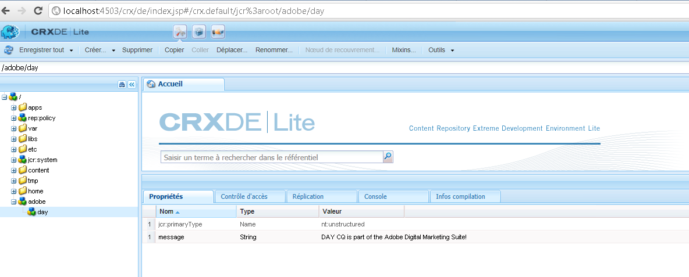

# Comment accéder au JCR AEM par programmation{#how-to-programmatically-access-the-aem-jcr}

Vous pouvez modifier par programme les nœuds et les propriétés situés dans le référentiel Adobe CQ, qui fait partie d’Adobe Experience Cloud. Pour accéder au référentiel CQ, vous utilisez l’API Java™ Content Repository (JCR). Vous pouvez utiliser l’API Java™ JCR pour créer, remplacer, mettre à jour et supprimer du contenu (CRUD) situé dans le référentiel Adobe CQ. Pour plus d’informations sur l’API JCR Java™, consultez [https://jackrabbit.apache.org/jcr/jcr-api.html](https://jackrabbit.apache.org/jcr/jcr-api.html).

>[!NOTE]
>
>Cet article de développement modifie le JCR d’Adobe CQ à partir d’une application Java™ externe. En revanche, vous pouvez modifier le JCR à partir d’un bundle OSGi à l’aide de l’API JCR. Pour plus d’informations, consultez [Conservation de données CQ dans Java™ Content Repository](https://experienceleague.adobe.com/docs/experience-manager-learn/getting-started-wknd-tutorial-develop/overview.html?lang=fr).

>[!NOTE]
>
>Pour utiliser l’API JCR, ajoutez le fichier `jackrabbit-standalone-2.4.0.jar` au chemin d’accès vers la classe de votre application Java™. Ce fichier JAR est disponible sur la page web de l’API Java™ JCR à l’adresse suivante : [https://jackrabbit.apache.org/jcr/jcr-api.html](https://jackrabbit.apache.org/jcr/jcr-api.html).

>[!NOTE]
>
>Pour savoir comment interroger le JCR d’Adobe CQ à l’aide de l’API de requête JCR, consultez[ Interrogation des données Adobe Experience Manager à l’aide de l’API JCR](https://helpx.adobe.com/fr/experience-manager/using/querying-experience-manager-data-using1.html).

## Créer une instance de référentiel {#create-a-repository-instance}

Cet article de développement fait appel à une méthode statique appartenant à la classe `org.apache.jackrabbit.commons.JcrUtils` pour se connecter à un référentiel et établir une connexion. Il existe cependant d’autres modus operandi. Cette méthode se nomme `getRepository`. Dans ce cas, un paramètre de chaîne est utilisé, qui représente l’URL du serveur Adobe CQ. Par exemple, `http://localhost:4503/crx/server`.

La méthode `getRepository` renvoie une instance `Repository`, comme le montre l’exemple de code ci-dessous.

```java
//Create a connection to the AEM JCR repository running on local host
Repository repository = JcrUtils.getRepository("http://localhost:4503/crx/server");
```

## Création d’une instance de session {#create-a-session-instance}

L’instance `Repository` représente le référentiel CRX. Vous utilisez l’instance `Repository` pour établir une session avec le référentiel. Pour créer une session, appelez la méthode `login` de l’instance `Repository` et transmettez un objet `javax.jcr.SimpleCredentials`. La méthode `login` renvoie une instance `javax.jcr.Session`.

Pour créer un objet `SimpleCredentials`, vous allez utiliser son constructeur et transmettre les valeurs de chaîne suivantes :

* le nom d’utilisateur ou d’utilisatrice ;
* le mot de passe correspondant.

Lors de la transmission du deuxième paramètre, appelez la méthode `toCharArray` de l’objet String. Le code suivant montre comment appeler la méthode `login` qui renvoie une `javax.jcr.Sessioninstance`.

```java
//Create a Session instance
javax.jcr.Session session = repository.login( new SimpleCredentials("admin", "admin".toCharArray()));
```

## Création d’une instance de nœud {#create-a-node-instance}

Utilisez une instance `Session` pour créer une instance `javax.jcr.Node`. Une instance `Node` vous permet d’effectuer des opérations de nœud. Vous pouvez, par exemple, créer un nœud. Pour créer un nœud qui représente le nœud racine, appelez la méthode `getRootNode` de l’instance `Session`, comme illustré dans la ligne de code suivante.

```java
//Create a Node
Node root = session.getRootNode();
```

Une fois une instance `Node` créée, vous pouvez effectuer des tâches, comme créer un autre nœud et y ajouter une valeur. Par exemple, le code suivant crée deux nœuds et ajoute une valeur au deuxième nœud.

```java
// Store content
Node day = adobe.addNode("day");
day.setProperty("message", "Adobe CQ is part of the Adobe Digital Marketing Suite!");
```

## Récupérer les valeurs des nœuds {#retrieve-node-values}

Pour récupérer un nœud et sa valeur, appelez la méthode `getNode` de l’instance `Node` et transmettez une valeur de chaîne représentant le chemin d’accès complet au nœud. Considérez la structure de nœuds créée dans l’exemple de code précédent. Pour récupérer le nœud day, spécifiez adobe/day, comme indiqué dans le code suivant :

```java
// Retrieve content
Node node = root.getNode("adobe/day");
System.out.println(node.getPath());
System.out.println(node.getProperty("message").getString());
```

## Créer des nœuds dans le référentiel Adobe CQ {#create-nodes-in-the-adobe-cq-repository}

L’exemple de code Java™ suivant représente une classe Java™ qui se connecte à Adobe CQ, crée une instance `Session` et ajoute de nouveaux nœuds. Une valeur de données est affectée au nœud, puis la valeur du nœud et son chemin d’accès sont écrits sur la console. Lorsque vous en avez terminé avec l’instance Session, veillez à vous déconnecter.

```java
/*
 * This Java Quick Start uses the jackrabbit-standalone-2.4.0.jar
 * file. See the previous section for the location of this JAR file
 */

import javax.jcr.Repository;
import javax.jcr.Session;
import javax.jcr.SimpleCredentials;
import javax.jcr.Node;

import org.apache.jackrabbit.commons.JcrUtils;
import org.apache.jackrabbit.core.TransientRepository;

public class GetRepository {

public static void main(String[] args) throws Exception {

try {

    //Create a connection to the CQ repository running on local host
    Repository repository = JcrUtils.getRepository("http://localhost:4503/crx/server");

   //Create a Session
   javax.jcr.Session session = repository.login( new SimpleCredentials("admin", "admin".toCharArray()));

  //Create a node that represents the root node
  Node root = session.getRootNode();

  // Store content
  Node adobe = root.addNode("adobe");
  Node day = adobe.addNode("day");
  day.setProperty("message", "Adobe CQ is part of the Adobe Digital Marketing Suite!");

  // Retrieve content
  Node node = root.getNode("adobe/day");
  System.out.println(node.getPath());
  System.out.println(node.getProperty("message").getString());

  // Save the session changes and log out
  session.save();
  session.logout();
  }
 catch(Exception e){
  e.printStackTrace();
  }
 }
}
```

Après avoir exécuté l’exemple de code complet et créé les nœuds, vous pouvez afficher les nouveaux nœuds dans **[!UICONTROL CRXDE Lite]**, comme illustré ci-dessous.


