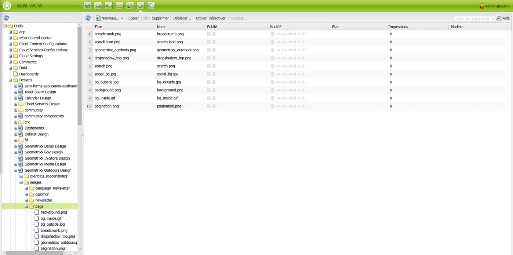
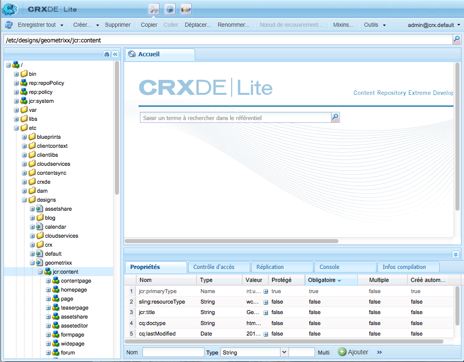

# Conceptions et Designer{#designs-and-the-designer}

>[!CAUTION]
>
>Cet article vous explique comment créer un site Web basé sur l’interface utilisateur (IU) classique. Adobe vous recommande de tirer parti des technologies AEM les plus récentes pour vos sites web. Vous en trouverez une description détaillée dans l’article [Prise en main du développement d’AEM Sites](/help/sites-developing/getting-started.md).

Le Designer permet de créer une conception pour votre site Web à l’aide de la méthode [IU classique](/help/sites-classic-ui-authoring/classicui.md) dans AEM.

>[!NOTE]
>
>Pour plus d’informations sur l’accessibilité web, consultez [AEM et directives d’accessibilité web](/help/managing/web-accessibility.md).

## Utiliser Designer {#using-the-designer}

Vous pouvez définir votre conception dans **Conceptions** de l’onglet **Outils** :



Ici, vous pouvez créer la structure requise pour stocker la conception, puis charger les feuilles de style en cascade (CSS) et les images requises.

Les conceptions sont stockées sous `/apps/<your-project>`. Le chemin d’accès à la conception à utiliser pour un site Web est spécifié à l’aide de la propriété `cq:designPath` du nœud `jcr:content`.



>[!NOTE]
>
>Toutes les modifications apportées à une page en mode de conception sont conservées sous le nœud de conception du site et sont automatiquement appliquées à toutes les pages qui ont la même conception.

## L’objet de votre création {#what-you-will-need}

Pour réaliser votre conception, vous aurez besoin des éléments suivants :

**CSS** - Les feuilles de style en cascade (CSS) définissent les formats de zones spécifiques sur vos pages.
**Images** - Toute image que vous utilisez pour des fonctions telles que des arrière-plans, des boutons, etc.

### Points à prendre en compte lors de la conception de votre site Web {#considerations-when-designing-your-website}

Lors du développement d’un site Web, il est vivement conseillé de stocker les images et les fichiers CSS sous `/apps/<your-project>`, de sorte que vous puissiez référencer vos ressources en fonction de la conception actuelle, comme il est décrit dans l’extrait de code ci-dessous.

```xml
<%= currentDesign.getPath() + "/static/img/icon.gif %>
```

L’exemple précédent présente plusieurs avantages :

* Les composants peuvent avoir une apparence différente selon que chaque site utilise un chemin de conception différent.
* La nouvelle conception du site Web peut simplement être effectuée en faisant pointer le chemin de conception vers un autre nœud à la racine du site, à savoir `design/v1` au lieu de `design/v2.`.

* `/etc/designs` et `/content` sont les seules URL externes vues par le navigateur. Vous êtes ainsi protégé de la curiosité d’un utilisateur externe désireux de connaître le contenu de votre arborescence `/apps`. Les avantages des URL ci-dessus aident également l’administrateur système à mieux configurer la sécurité, dans la mesure où vous limitez l’exposition des ressources à une poignée d’emplacements distincts.
