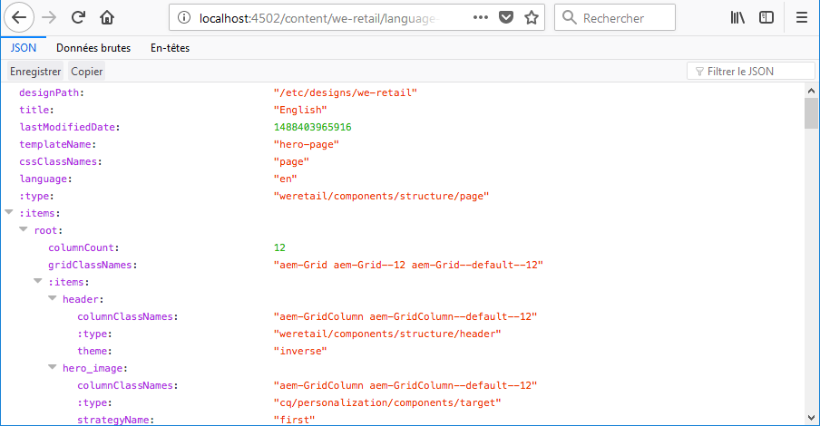
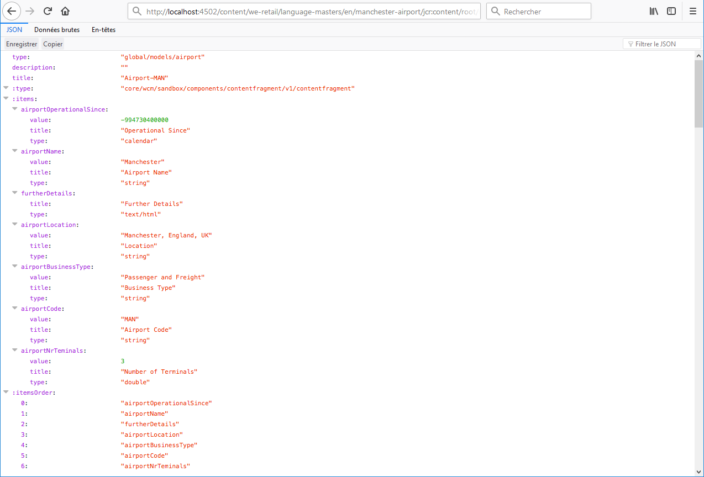

# Exportateur JSON pour Content Services{#json-exporter-for-content-services}

AEM Content Services est conçu pour généraliser la description et la diffusion de contenu dans/à partir d’AEM à des canaux autres que des pages web.

Il assure la diffusion du contenu aux canaux autres que les pages web AEM classiques, à l’aide de méthodes normalisées qui peuvent être utilisées par tous les clients. Ces canaux peuvent inclure :

* [des applications sur une seule page ;](spa-walkthrough.md)
* des applications mobiles natives ;
* d’autres canaux et points de contact externes à AEM.

Puisque les fragments de contenu utilisent du contenu structuré, vous pouvez fournir des services de contenu à l’aide de l’exportateur JSON pour diffuser le contenu de toute page AEM au format du modèle de données JSON. Ce contenu peut ensuite être utilisé dans vos propres applications.

>[!NOTE]
>
>La fonctionnalité décrite ici est disponible pour tous les composants principaux à compter de la [version 1.1.0 des composants principaux](https://experienceleague.adobe.com/docs/experience-manager-core-components/using/introduction.html?lang=fr).

## Exportateur JSON avec les composants principaux des fragments de contenu {#json-exporter-with-content-fragment-core-components}

Grâce à l’exportateur JSON AEM, vous pouvez diffuser le contenu des pages AEM au format du modèle de données JSON. Ce contenu peut ensuite être utilisé dans vos propres applications.

Avec AEM, la diffusion s’effectue à l’aide du sélecteur `model` et de l’extension `.json`.

`.model.json`

1. Par exemple, une URL telle que :

   ```shell
   http://localhost:4502/content/we-retail/language-masters/en.model.json
   ```

1. Diffuse du contenu tel que :

   

Vous pouvez également diffuser le contenu d’un fragment de contenu structuré en le ciblant spécifiquement.

Utilisez le chemin d’accès complet au fragment (au moyen de la fonction `jcr:content`) ; par exemple, avec un suffixe tel que :

`.../jcr:content/root/responsivegrid/contentfragment.model.json`

Votre page peut contenir un fragment de contenu unique ou plusieurs composants de différents types. Vous pouvez également utiliser des mécanismes tels que des composants de liste pour rechercher automatiquement du contenu pertinent.

* Par exemple, une URL telle que :

  ```shell
  http://localhost:4502/content/we-retail/language-masters/en/manchester-airport/jcr:content/root/responsivegrid/contentfragment.model.json
  ```

* Diffuse du contenu tel que :

  

  >[!NOTE]
  >
  >Vous pouvez [adapter vos propres composants](/help/sites-developing/json-exporter-components.md) pour accéder à ces données et les utiliser.

  >[!NOTE]
  >
  >Bien qu’il ne s’agisse pas d’une implémentation standard, [plusieurs sélecteurs sont pris en charge,](json-exporter-components.md#multiple-selectors) mais `model` doit être le premier.

### Informations supplémentaires {#further-information}

Voir également :

* API HTTP Assets

  * [API HTTP Assets](/help/assets/mac-api-assets.md)

* Modèles Sling :

  * [Modèles Sling - Association d’une classe de modèles à un type de ressource depuis la version 130](https://sling.apache.org/documentation/bundles/models.html#associating-a-model-class-with-a-resource-type-since-130)

* AEM avec JSON :

  * [Obtention d’informations sur la page au format JSON](/help/sites-developing/pageinfo.md)

## Documentation connexe {#related-documentation}

Pour plus d’informations, consultez les ressources suivantes :

* la [rubrique Fragments de contenu du guide de l’utilisateur Assets](/help/assets/content-fragments/content-fragments.md).

* [Modèles de fragment de contenu](/help/assets/content-fragments/content-fragments-models.md)
* [Création à l’aide de fragments de contenu](/help/sites-authoring/content-fragments.md)
* [Activation de l’exportateur JSON pour un composant](/help/sites-developing/json-exporter-components.md)

* [Composants principaux](https://experienceleague.adobe.com/docs/experience-manager-core-components/using/introduction.html?lang=fr) et [composant Fragment de contenu](https://experienceleague.adobe.com/docs/experience-manager-core-components/using/wcm-components/content-fragment-component.html?lang=fr)
