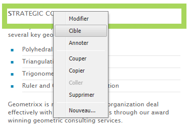
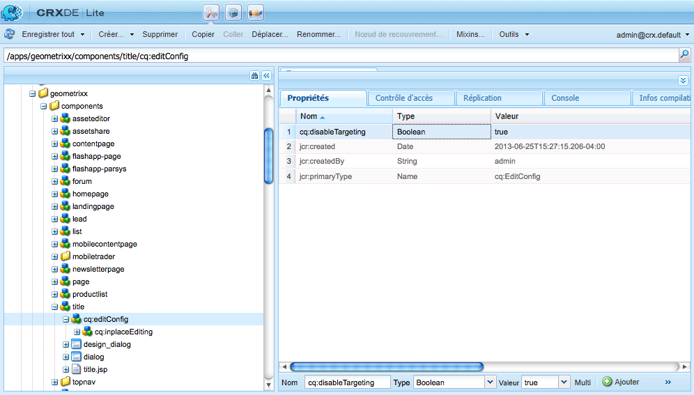
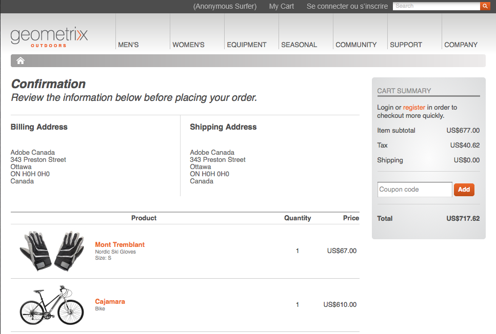

# Développer des composants pour du contenu ciblé {#developing-for-targeted-content}

Cette section décrit les sujets relatifs au développement de composants à utiliser avec le ciblage du contenu.

* Pour plus d’informations sur la connexion à Adobe Target, voir [Intégration à Adobe Target.](/help/sites-administering/target.md)
* Pour plus d’informations sur la création de contenu ciblé, voir [Création de contenu ciblé en mode Ciblage](/help/sites-authoring/content-targeting-touch.md).

>[!NOTE]
>
>Lorsque vous ciblez un composant dans l’instance de création AEM, le composant effectue une série d’appels côté serveur à Adobe Target pour enregistrer la campagne, configurer des offres et récupérer des segments Adobe Target (s’ils sont configurés). Aucun appel côté serveur n’est effectué depuis la publication AEM vers Adobe Target.

## Activation du ciblage avec Adobe Target sur vos pages {#enabling-targeting-with-adobe-target-on-your-pages}

Pour utiliser dans vos pages des composants ciblés qui interagissent avec Adobe Target, incluez du code côté client spécifique dans l’élément `<head>`.

>[!NOTE]
>
>Le mode Ciblage et le composant AEM Targeting classique utilisent l’intégration AEM Target basée sur [ContextHub](/help/sites-developing/contexthub.md) et les bibliothèques clientes `at.js` ou `mbox.js` (voir ci-dessous), qui n’est pas un mécanisme de diffusion [AEP Web SDK](https://github.com/adobe/alloy). Pour cette raison, le composant Ciblage classique ne s’affiche pas sur les pages qui chargent uniquement AEP Web SDK.
>
>Les sites qui utilisent AEP Web SDK doivent implémenter la diffusion de Target séparément par le biais du Web SDK (un flux de données configuré, le Web SDK via les balises ou l’option d’alliance, et le rendu frontal avec des `renderDecisions`/`applyPropositions` par rapport aux portées de décision de l’activité). AEM fournit ensuite les offres (fragments d’expérience ou fragments de contenu exportés vers Adobe Target) et les activités sont créées dans l’interface utilisateur d’Adobe Target.

### Section HEAD {#the-head-section}

Ajoutez les deux blocs de code suivants à la section `<head>` de votre page :

```html
<!--/* Include Context Hub */-->
<sly data-sly-resource="${'contexthub' @ resourceType='granite/contexthub/components/contexthub'}"/>
```

```html
<cq:include script="/libs/cq/cloudserviceconfigs/components/servicelibs/servicelibs.jsp"/>
```

Ce code ajoute les objets d’analyse JavaScript requis et charge les bibliothèques de service cloud associées au site web. Pour le service Target, les bibliothèques sont chargées via `/libs/cq/analytics/components/testandtarget/headlibs.jsp`.

L’ensemble de bibliothèques chargé dépend du type de bibliothèque cliente cible (`mbox.js` ou `at.js`) utilisé dans la configuration de Target :

**Pour le fichier mbox.js par défaut**

```html
<script type="text/javascript" src="/libs/cq/foundation/testandtarget/parameters.js"></script>
 <script type="text/javascript" src="/libs/cq/foundation/testandtarget/mbox.js"></script>
 <script type="text/javascript" src="/libs/cq/foundation/personalization/integrations/commons.js"></script>
 <script type="text/javascript" src="/libs/cq/foundation/testandtarget/util.js"></script>
 <script type="text/javascript" src="/libs/cq/foundation/testandtarget/init.js"></script>
```

**Pour le fichier mbox.js personnalisé**

```html
<script type="text/javascript" src="/etc/cloudservices/testandtarget/<CLIENT-CODE>/_jcr_content/public/mbox.js"></script>
        <script type="text/javascript" src="/libs/cq/foundation/testandtarget/parameters.js"></script>
 <script type="text/javascript" src="/libs/cq/foundation/personalization/integrations/commons.js"></script>
 <script type="text/javascript" src="/libs/cq/foundation/testandtarget/util.js"></script>
 <script type="text/javascript" src="/libs/cq/foundation/testandtarget/init.js"></script>
```

**Pour le fichier at.js**

```html
<script type="text/javascript" src="/libs/cq/foundation/testandtarget/parameters.js"></script>
 <script type="text/javascript" src="/libs/cq/foundation/testandtarget/atjs-integration.js"></script>
 <script type="text/javascript" src="/libs/cq/foundation/testandtarget/atjs.js"></script>
```

>[!NOTE]
>
>Seule la version de `at.js` fournie avec le produit est prise en charge. La version de `at.js` fournie avec le produit peut être obtenue dans le fichier `at.js` à l’emplacement :
>
>`/libs/cq/testandtarget/clientlibs/testandtarget/atjs/source/at.js`

**Pour le type at.js personnalisé**

```html
<script type="text/javascript" src="/etc/cloudservices/testandtarget/<CLIENT-CODE>/_jcr_content/public/at.js"></script>
    <script type="text/javascript" src="/libs/cq/foundation/testandtarget/parameters.js"></script>
 <script type="text/javascript" src="/libs/cq/foundation/testandtarget/atjs-integration.js"></script>
```

La fonctionnalité Target côté client est gérée par l’objet `CQ_Analytics.TestTarget`. Par conséquent, la page contient du code init comme dans l’exemple suivant :

```html
<script type="text/javascript">
            if ( !window.CQ_Analytics ) {
                window.CQ_Analytics = {};
            }
            if ( !CQ_Analytics.TestTarget ) {
                CQ_Analytics.TestTarget = {};
            }
            CQ_Analytics.TestTarget.clientCode = 'my_client_code';
        </script>
      ...

    <div class="cloudservice testandtarget">
  <script type="text/javascript">
  CQ_Analytics.TestTarget.maxProfileParams = 11;

  if (CQ_Analytics.CCM) {
   if (CQ_Analytics.CCM.areStoresInitialized) {
    CQ_Analytics.TestTarget.registerMboxUpdateCalls();
   } else {
    CQ_Analytics.CCM.addListener("storesinitialize", function (e) {
     CQ_Analytics.TestTarget.registerMboxUpdateCalls();
    });
   }
  } else {
   // client context not there, still register calls
   CQ_Analytics.TestTarget.registerMboxUpdateCalls();
  }
  </script>
 </div>
```

Le JSP ajoute les objets JavaScript d’analyse requis et les références aux bibliothèques JavaScript côté client. Le fichier `testandtarget.js` contient les fonctions mbox.js. Le HTML généré par le script est similaire à l’exemple suivant :

```html
<script type="text/javascript">
        if ( !window.CQ_Analytics ) {
            window.CQ_Analytics = {};
        }
        if ( !CQ_Analytics.TestTarget ) {
            CQ_Analytics.TestTarget = {};
        }
        CQ_Analytics.TestTarget.clientCode = 'MyClientCode';
</script>
<link rel="stylesheet" href="/etc/clientlibs/foundation/testandtarget/testandtarget.css" type="text/css">
<script type="text/javascript" src="/etc/clientlibs/foundation/testandtarget/testandtarget.js"></script>
<script type="text/javascript" src="/etc/clientlibs/foundation/testandtarget/init.js"></script>
```

#### Section de corps (début) {#the-body-section-start}

Ajoutez le code suivant immédiatement après la balise `<body>` pour ajouter les fonctionnalités ClientContext à la page :

```html
<cq:include path="clientcontext" resourceType="cq/personalization/components/clientcontext"/>
```

#### Section de corps (fin) {#the-body-section-end}

Ajoutez le code suivant juste avant la balise de fin `</body>` :

```html
<cq:include path="cloudservices" resourceType="cq/cloudserviceconfigs/components/servicecomponents"/>
```

Le script JSP de ce composant génère des appels vers l’API JavaScript Target et met en œuvre d’autres configurations requises. Le HTML généré par le script est similaire à l’exemple suivant :

```html
<div class="servicecomponents cloudservices">
  <div class="cloudservice testandtarget">
    <script type="text/javascript">
      CQ_Analytics.TestTarget.maxProfileParams = 11;
      CQ_Analytics.CCM.addListener("storesinitialize", function(e) {
        CQ_Analytics.TestTarget.registerMboxUpdateCalls();
      });
    </script>
    <div id="cq-analytics-texthint" style="background:white; padding:0 10px; display:none;">
      <h3 class="cq-texthint-placeholder">Component clientcontext is missing or misplaced.</h3>
    </div>
    <script type="text/javascript">
      $CQ(function(){
      if( CQ_Analytics &&
          CQ_Analytics.ClientContextMgr &&
          !CQ_Analytics.ClientContextMgr.isConfigLoaded )
        {
          $CQ("#cq-analytics-texthint").show();
        }
      });
    </script>
  </div>
</div>
```

### Utilisation d’un fichier de bibliothèque Target personnalisé {#using-a-custom-target-library-file}

>[!NOTE]
>
>Si vous n’utilisez pas DTM ni un autre système marketing cible, vous pouvez utiliser des fichiers de bibliothèque cible personnalisés.

>[!NOTE]
>
>Par défaut, les fichiers mbox sont masqués. La classe mboxDefault détermine ce comportement. Le masquage des mbox garantit que les visiteurs ne voient pas le contenu par défaut avant qu’il ne soit permuté. Toutefois, le masquage des mbox a un impact sur les performances perçues.

Le fichier `mbox.js` par défaut utilisé pour créer des mbox se trouve à l’emplacement `/etc/clientlibs/foundation/testandtarget/mbox/source/mbox.js`. Pour utiliser un fichier `mbox.js` personnalisé, ajoutez-le à la configuration cloud de Target. Pour ajouter le fichier, le fichier `mbox.js` doit être disponible sur le système de fichiers.

Par exemple, si vous souhaitez utiliser le service [Marketing Cloud ID](https://experienceleague.adobe.com/docs/id-service/using/home.html?lang=fr) vous devez télécharger `mbox.js` afin qu’il contienne la valeur correcte pour la variable `imsOrgID`, qui est basée sur votre client. Cette variable est requise pour l’intégration au service Marketing Cloud ID. Pour plus d’informations, consultez les sections [Adobe Analytics as a Reporting Source for Adobe Target](https://experienceleague.adobe.com/docs/target/using/integrate/a4t/a4t.html?lang=fr) et [Avant l’implémentation.](https://experienceleague.adobe.com/docs/target/using/integrate/a4t/before-implement.html?lang=fr)

>[!NOTE]
>
>Si une mbox personnalisée est définie dans une configuration Target, vous devez disposer d’un accès en lecture à `/etc/cloudservices` sur les serveurs de publication. Sans cet accès, le chargement de fichiers `mbox.js` sur le site Web de publication génère une erreur 404.

1. Accédez à la page **Outils** de CQ et sélectionnez ensuite **Services cloud**. ([](https://localhost:4502/libs/cq/core/content/tools/cloudservices.html))
1. Dans l’arborescence, sélectionnez Adobe Target, puis, dans la liste des configurations, double-cliquez sur votre configuration Target.
1. Sur la page de configuration, cliquez sur Modifier.
1. Pour la propriété mbox.js personnalisée, cliquez sur Parcourir et sélectionnez le fichier.
1. Pour appliquer les modifications, saisissez le mot de passe de votre compte Adobe Target, cliquez sur Reconnecter à Target, puis cliquez sur OK lorsque la connexion est établie. Cliquez ensuite sur OK dans la boîte de dialogue Modifier le composant.

Votre configuration Target comprend un fichier `mbox.js` personnalisé [le code requis dans la section HEAD](/help/sites-developing/target.md#p-the-head-section-p) de votre page ajoute le fichier au framework de la bibliothèque cliente au lieu d’une référence à la bibliothèque `testandtarget.js`.

## Désactivation de la commande Target pour les composants {#disabling-the-target-command-for-components}

La plupart des composants peuvent être convertis en composants ciblés à l’aide de la commande Cible du menu contextuel.



Pour supprimer la commande Cible du menu contextuel, ajoutez la propriété suivante au nœud `cq:editConfig` du composant :

* Nom : `cq:disableTargeting`
* Type : booléen
* Valeur : True

Par exemple, pour désactiver le ciblage pour les composants de titre des pages du site de démonstration Geometrixx, ajoutez la propriété au nœud `/apps/geometrixx/components/title/cq:editConfig` .



## Envoi des informations de confirmation de commande à Adobe Target {#sending-order-confirmation-information-to-adobe-target}

>[!NOTE]
>
>Si vous n’utilisez pas DTM, vous envoyez une confirmation de commande à Adobe Target.

Pour suivre les performances de votre site Web, envoyez à Adobe Target les informations relatives aux achats figurant sur la page de confirmation de commande. Voir [Création d’une mBox orderConfirmPage](https://developer.adobe.com/target/implement/client-side/atjs/how-to-deployatjs/implement-target-without-a-tag-manager/?lang=fr) et [mBox de confirmation de commande : ajoutez des paramètres personnalisés](https://experienceleaguecommunities.adobe.com/t5/adobe-target-questions/order-confirmation-mbox-add-custom-parameters/m-p/275779) pour plus d’informations. Adobe Target reconnaît les données de mbox comme des données de confirmation de commande lorsque le nom de votre mbox est `orderConfirmPage` et utilise les noms de paramètres spécifiques suivants :

* `productPurchasedId` : liste des identifiants qui identifient les produits achetés.
* `orderId` : ID de la commande.
* `orderTotal` : montant total de l’achat.

Le code de la page HTML rendue qui crée la mBox est similaire à l’exemple suivant :

```html
<script type="text/javascript">
     mboxCreate('orderConfirmPage',
     'productPurchasedId=product1 product2 product3',
     'orderId=order1234',
     'orderTotal=24.54');
</script>
```

Les valeurs de chaque paramètre sont différentes pour chaque commande. Par conséquent, vous avez besoin d’un composant qui génère le code en fonction des propriétés de l’achat. Le [framework d’intégration eCommerce](/help/commerce/cif/introduction.md) de CQ vous permet de réaliser une intégration dans votre catalogue de produits, et d’implémenter un panier d’achat et une page de passage en caisse.

L’exemple Geometrixx Outdoors affiche la page de confirmation suivante lorsqu’une personne achète des produits :



Le code suivant du script JSP d’un composant accède aux propriétés du panier, puis imprime le code de création de la mBox.

```java
<%--

  confirmationmbox component.

--%><%
%><%@include file="/libs/foundation/global.jsp"%><%
%><%@page session="false"
          import="com.adobe.cq.commerce.api.CommerceService,
                  com.adobe.cq.commerce.api.CommerceSession,
                  com.adobe.cq.commerce.common.PriceFilter,
                  com.adobe.cq.commerce.api.Product,
                  java.util.List, java.util.Iterator"%><%

/* obtain the CommerceSession object */
CommerceService commerceservice = resource.adaptTo(CommerceService.class);
CommerceSession session = commerceservice.login(slingRequest, slingResponse);

/* obtain the cart items */
List<CommerceSession.CartEntry> entries = session.getCartEntries();
Iterator<CommerceSession.CartEntry> cartiterator = entries.iterator();

/* iterate the items and get the product IDs */
String productIDs = new String();
while(cartiterator.hasNext()){
 CommerceSession.CartEntry entry = cartiterator.next();
 productIDs = productIDs + entry.getProduct().getSKU();
    if (cartiterator.hasNext()) productIDs = productIDs + ", ";
}

/* get the cart price and orderID */
String total = session.getCartPrice(new PriceFilter("CART", "PRE_TAX"));
String orderID = session.getOrderId();

%><div class="mboxDefault"></div>
<script type="text/javascript">
     mboxCreate('orderConfirmPage',
     'productPurchasedId=<%= productIDs %>',
     'orderId=<%= orderID %>',
     'orderTotal=<%= total %>');
</script>
```

Lorsque le composant est inclus dans la page de passage en caisse de l’exemple précédent, la source de la page inclut le script suivant qui crée la mBox :

```html
<div class="mboxDefault"></div>
<script type="text/javascript">

     mboxCreate('orderConfirmPage',
     'productPurchasedId=47638-S, 46587',
     'orderId=d03cb015-c30f-4bae-ab12-1d62b4d105ca',
     'orderTotal=US$677.00');

</script>
```

## Comprendre le composant Target {#understanding-the-target-component}

Le composant Target permet aux auteurs et autrices de créer des mBox dynamiques à partir des composants de contenu CQ. Voir [Ciblage de contenu](/help/sites-authoring/content-targeting-touch.md) pour plus d’informations. Le composant Target se trouve à l’emplacement `/libs/cq/personalization/components/target`.

Le script `target.jsp` accède aux propriétés de la page pour déterminer le moteur de ciblage à utiliser pour le composant, puis exécute le script approprié :

* Adobe Target : /`libs/cq/personalization/components/target/engine_tnt.jsp`
* [Adobe Target avec AT.JS](/help/sites-administering/target.md) : `/libs/cq/personalization/components/target/engine_atjs.jsp`
* [](/help/sites-authoring/target-adobe-campaign.md) : `/libs/cq/personalization/components/target/engine_cq_campaign.jsp`
* Règles côté client/ContextHub : `/libs/cq/personalization/components/target/engine_cq.jsp`

### Création de mBox {#the-creation-of-mboxes}

>[!NOTE]
>
>Par défaut, les mbox sont masquées. La classe `mboxDefault` détermine ce comportement. Le masquage des mbox garantit que les visiteurs ne voient pas le contenu par défaut avant qu’il ne soit permuté. Toutefois, le masquage des mbox a un impact sur les performances perçues.

Lorsqu’Adobe Target effectue le ciblage du contenu, le script `engine_tnt.jsp` crée des mbox qui contiennent le contenu de l’expérience ciblée :

* Ajout d’un élément `div` avec la classe `mboxDefault`, comme l’exige l’API Adobe Target

* Ajout du contenu de la mbox (le contenu de l’expérience ciblée) dans l’élément `div`

Le JavaScript qui crée la mbox est inséré après l’élément div `mboxDefault` :

* Le nom, l’ID et l’emplacement du fichier mbox sont basés sur le chemin du référentiel du composant.
* Le script obtient les noms et les valeurs des paramètres ClientContext.
* Des appels sont effectués vers les fonctions définies par le fichier mbox.js et d’autres bibliothèques clientes pour créer des fichiers mbox.

#### Bibliothèques clientes pour le ciblage du contenu {#client-libraries-for-content-targeting}

Voici les catégories de bibliothèques clientes disponibles :

* `testandtarget.mbox`
* `testandtarget.init`
* `testandtarget.util`
* `testandtarget.atjs`
* `testandtarget.atjs-integration`
