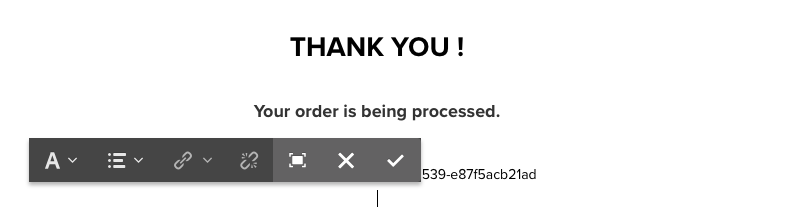

# Tester les composants principaux dans We.Retail{#trying-out-core-components-in-we-retail}

Les composants principaux sont des composants modernes et flexibles qui offrent une extensibilité facile et permettent une intégration simple à vos projets. Les composants principaux ont été créés selon plusieurs principes de conception majeurs tels que HTL, la convivialité prête à l’emploi, la configurabilité, le contrôle de version et l’extensibilité. Le site `We.Retail` repose sur des composants principaux.

## Faites un essai {#trying-it-out}

1. Démarrez Adobe Experience Manager (AEM) avec l’exemple de contenu `We.Retail` et ouvrez la [&#x200B; Console des composants &#x200B;](/help/sites-authoring/default-components-console.md).

   **Navigation globale > Outils > Composants**

1. En ouvrant le rail dans la console Composants, vous pouvez filtrer un groupe de composants particulier. Les composants principaux se trouvent dans

   * `.core-wcm` : composants principaux standard
   * `.core-wcm-form` : composants principaux d’envoi de formulaire

   Choisissez `.core-wcm`.

   

1. Tous les composants principaux utilisent le nom **v1** pour indiquer la première version de chaque composant. Il est prévu que des versions régulières soient publiées à l’avenir. Celles-ci sont compatibles avec AEM et permettent une mise à niveau facile pour que vous puissiez tirer parti des dernières fonctionnalités.
1. Cliquez sur **Texte (v1)**.

   Veillez à ce que le **Type de ressource** du composant soit `/apps/core/wcm/components/text/v1/text`. Les composants principaux sont disponibles sous `/apps/core/wcm/components` et versionnés par composant.

   

1. Cliquez sur l’onglet **Documentation** afin d’afficher la documentation du développeur ou de la développeuse pour le composant.

   

1. Revenez à la console Composants. Filtrez l’**`We.Retail`** du groupe et sélectionnez le composant **Texte**.
1. Vérifiez que le **Type de ressource** pointe comme prévu vers un composant sous `/apps/weretail`, mais que le **Type de super-ressource** repointe vers le composant principal `/apps/core/wcm/components/text/v1/text`.

   

1. Cliquez sur l’onglet **Utilisation en direct** pour voir les pages sur lesquelles ce composant est actuellement utilisé. Cliquez sur la première **page de remerciement** pour modifier la page.

   

1. Sur la page de remerciement, sélectionnez le composant de texte et, dans le menu de modification du composant, cliquez sur l’icône Annuler l’héritage.

   [`We.Retail` dispose d’une structure de site globalisée](/help/sites-developing/we-retail-globalized-site-structure.md) où le contenu est transmis du site de langue principale aux [&#x200B; Live Copies par le biais d’un mécanisme appelé héritage](/help/sites-administering/msm.md). Pour cette raison, l’héritage doit être annulé pour permettre à l’utilisateur de modifier manuellement le texte.

   

1. Cliquez sur **Oui** pour confirmer l’annulation.

   

1. Une fois que vous avez annulé l’héritage et sélectionné les composants de texte, bien d’autres options sont disponibles. Cliquez sur **Modifier**.

   

1. À présent, vous pouvez voir les options d’édition qui sont disponibles pour le composant de texte.

   

1. Dans le menu **Informations sur la page**, sélectionnez **Modifier le modèle**.
1. Dans l’éditeur de modèles de la page, cliquez sur l’icône **Politique** du composant Texte dans le **Conteneur de disposition** de la page.

   

1. Les composants principaux permettent à un créateur ou une créatrice de modèles de configurer les propriétés disponibles pour les créateurs et créatrices de pages. Ces propriétés incluent des fonctionnalités telles que les sources de collage autorisées, les options de mise en forme et les styles de paragraphe disponibles.

   Ces boîtes de dialogue de conception sont disponibles pour de nombreux composants principaux et fonctionnent main dans la main avec l’éditeur de modèles. Une fois activés, ils sont disponibles pour le créateur ou la créatrice via les éditeurs de composant.

   

## Voir également {#further-information}

Pour plus d’informations sur les composants principaux, consultez le guide de création [Composants principaux](https://experienceleague.adobe.com/fr/docs/experience-manager-core-components/using/introduction) pour obtenir un aperçu des fonctionnalités. Consultez le guide [Développement des composants principaux](https://experienceleague.adobe.com/fr/docs/experience-manager-core-components/using/developing/overview) pour obtenir une présentation technique.

Pour plus d’informations sur les composants principaux, consultez le document de création [Composants principaux](https://experienceleague.adobe.com/fr/docs/experience-manager-core-components/using/introduction) pour obtenir un aperçu des fonctionnalités des composants principaux, et le document destiné aux développeurs [Développement des composants principaux](https://experienceleague.adobe.com/fr/docs/experience-manager-core-components/using/developing/overview) pour obtenir des détails techniques.

Vous pouvez également vous renseigner sur les [modèles modifiables](/help/sites-developing/we-retail-editable-templates.md). Voir le document de création [Création de modèles de page](/help/sites-authoring/templates.md) ou la page de document de développement [Modèles - Modifiables](/help/sites-developing/page-templates-editable.md) pour obtenir des détails complets sur les modèles modifiables.
