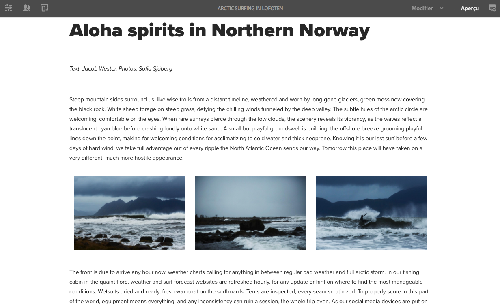
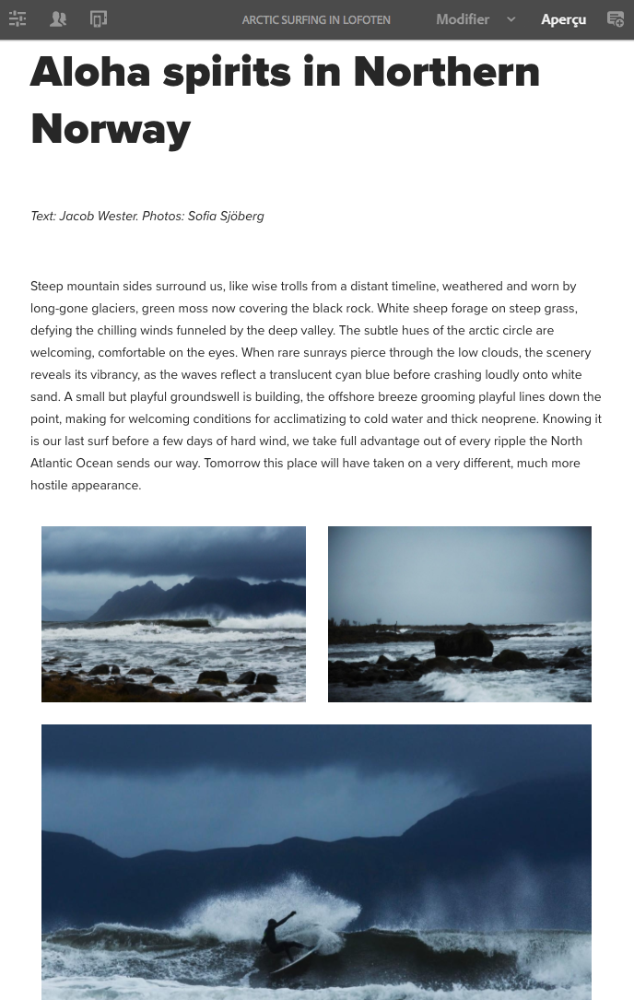
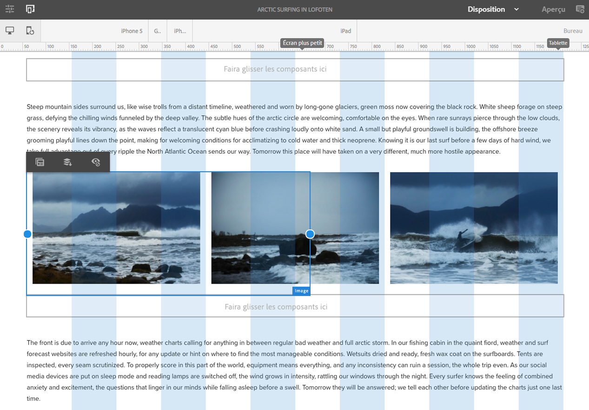
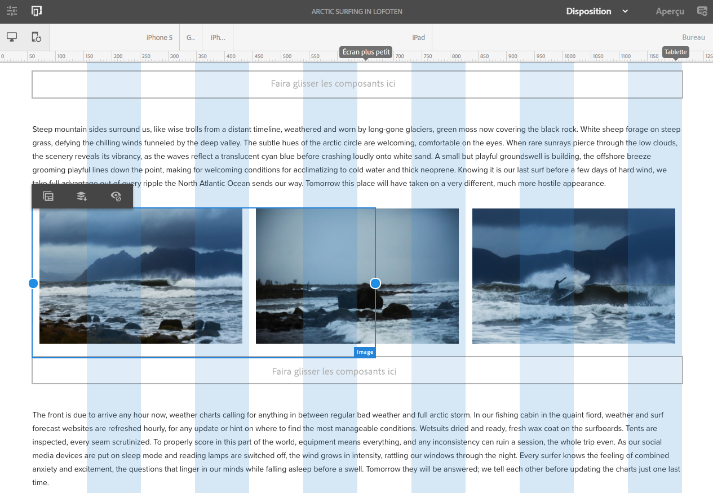

# Test d’une mise en page en responsive design dans We.Retail{#trying-out-responsive-layout-in-we-retail}

Toutes les pages We.Retail utilisent le composant conteneur de mise en page pour implémenter le responsive design. Le conteneur offre un système de paragraphe qui permet de positionner des composants sur une grille réactive. Cette grille peut réorganiser la disposition en fonction de la taille et du format de la fenêtre/l’appareil. Le composant est utilisé en mode **Disposition** de l’éditeur de page, ce qui permet de créer et de modifier une mise en page en mode responsive design, selon les caractéristiques de l’appareil.

## Essayer de le faire {#trying-it-out}

1. Modifiez la page Surf en Arctique dans la section Expériences de la branche principale de langue.

   http://localhost:4502/editor.html/content/we-retail/language-masters/en/experience/arctic-surfing-in-lofoten.html

1. Passez à **Aperçu** pour voir la page telle qu’elle serait affichée pour un internaute. Faites défiler jusqu’au contenu de l’article *Esprit Aloha dans le nord de la Norvège*.

   

1. Redimensionnez la fenêtre de votre navigateur et observez la mise en page s’adapter dynamiquement au redimensionnement.

   

1. Passez en mode Mise en page. La barre d’outils de l’émulateur s’affiche automatiquement, ce qui vous permet de planifier votre disposition par appareil ciblé.

   La sélection d’un composant affiche des options de flottement et de masquage dans le menu d’édition, ainsi que des poignées de redimensionnement pour le composant.

   

1. En saisissant et en faisant glisser la poignée de redimensionnement du composant, la grille de mise en page s’affiche automatiquement pour vous assister lors du redimensionnement.

   

## Informations supplémentaires {#further-information}

Pour plus d’informations, reportez-vous au document relatif à la création [Mise en page en responsive design](/help/sites-authoring/responsive-layout.md) ou au document d’administration [Configuration du conteneur de mise en pages et du mode Mise en page](/help/sites-administering/configuring-responsive-layout.md) pour obtenir des détails techniques complets.
