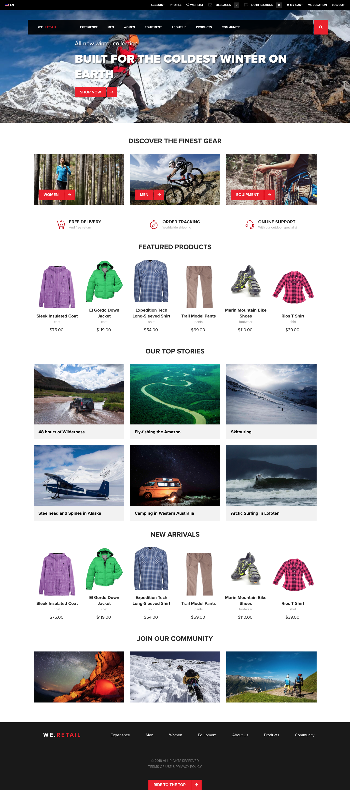

# Implémentation de référence `We.Retail`{#we-retail-reference-implementation}

## Présentation {#introduction}

Les pages `We.Retail` sont une implémentation de référence et un exemple de contenu qui illustre la méthode recommandée pour configurer une présence en ligne avec Adobe Experience Manager.

Le site `We.Retail` utilise les dernières technologies de Adobe Experience Manager (AEM), telles que HTL, les mises en page réactives, les modèles modifiables, les composants principaux, etc.

Bien que le site présente de la vente au détail verticale, la configuration du site peut être appliquée à n’importe quel marché vertical, et seules les fonctionnalités de catalogue de produits et de panier sont spécifiques au secteur de la vente au détail.

## Fonctions {#features}

En tant qu’implémentation de référence standard d’AEM, `We.Retail` présente certaines des fonctionnalités les plus puissantes d’AEM.

| **Fonctionnalité** | **Description** | **Cela vous intéresse ?** |
|---|---|---|
| [Structure de site globalisée](/help/sites-administering/tc-bp.md) | `We.Retail` comprend des pages de langue principale qui sont copiées en direct dans des sites spécifiques à un pays. | [Faites un essai !](/help/sites-developing/we-retail-globalized-site-structure.md) |
| [Disposition réactive](/help/sites-authoring/responsive-layout.md) | Toutes les pages comportent une disposition réactive qui s’adapte dynamiquement à la taille de l’écran et de l’appareil. | [Faites un essai !](/help/sites-developing/we-retail-responsive-layout.md) |
| [Modèles modifiables](/help/sites-developing/page-templates-editable.md) | Toutes les pages sont basées sur des modèles modifiables, ce qui permet aux personnes qui ne sont pas développeuses d’adapter et de personnaliser les modèles. | [Faites un essai !](/help/sites-developing/we-retail-editable-templates.md) |
| [HTML Template Language](https://experienceleague.adobe.com/fr/docs/experience-manager-htl/content/overview) | Tous les composants sont basés sur le langage HTL. |  |
| [Composants principaux](https://experienceleague.adobe.com/fr/docs/experience-manager-core-components/using/introduction) | Tous les composants sont basés sur les nouveaux composants principaux et sont plus faciles à utiliser, prêts à l’emploi et configurables par la personne qui les utilisent. | [Faites un essai !](/help/sites-developing/we-retail-core-components.md) |
| [Fragments de contenu](/help/assets/content-fragments/content-fragments.md) | La section Expériences `We.Retail` présente la puissance de la réutilisation de contenu au moyen de fragments de contenu. | [Faites un essai !](/help/sites-developing/we-retail-content-fragments.md) |
| [Fragments d’expérience](/help/sites-authoring/experience-fragments.md) | Un fragment d’expérience est un groupe d’un ou plusieurs composants comprenant un contenu et une disposition pouvant être référencés dans les pages. | [Faites un essai !](/help/sites-developing/we-retail-experience-fragments.md) |

## Commencer {#getting-started}

Le site `We.Retail` est fourni en tant qu’exemple de contenu AEM. Pour l’utiliser, il vous suffit de [démarrer AEM comme vous le feriez normalement](/help/sites-deploying/deploy.md#getting-started), et de vérifier que les exemples de contenu ne sont pas désactivés.

>[!CAUTION]
>
>N’installez pas `We.Retail` sur les instances d’exploitation. Ces dernières doivent être démarrées `nosamplecontent`[en mode d’exécution](/help/sites-deploying/configure-runmodes.md).

>[!CAUTION]
>
>Le site `We.Retail` repose sur la technologie AEM la plus récente et ne prend donc pas en charge la création dans l’IU [&#x200B; classique](/help/sites-classic-ui-authoring/classic-page-author-first-steps.md).

### Dernière version {#latest-version}

Bien que `We.Retail` soit distribué avec la version AEM, il se peut que des mises à jour soient apportées au contenu et à ses fonctionnalités après la publication. Il est donc possible de [télécharger la dernière version depuis GitHub](https://github.com/Adobe-Marketing-Cloud/aem-sample-we-retail/releases) puis de [télécharger](/help/sites-administering/package-manager.md#uploading-packages-from-your-file-system) et [installer](/help/sites-administering/package-manager.md#installing-packages) sous la forme d’un package sur votre instance AEM.

### Premières étapes {#first-steps}

1. Une fois AEM démarré (et/ou `We.Retail` installé), le **`We.Retail`** du site est disponible dans la [console Sites](/help/sites-authoring/basic-handling.md#global-navigation).
1. Par exemple, la page suivante peut être ouverte et doit ressembler à celle affichée dans l’[annexe](#appendix) ci-dessous :

   `https://<server name>:<port number>/editor.html/content/we-retail/language-masters/en.html`

## `We.Retail` et Geometrixx {#we-retail-geometrixx}

Geometrixx et ses multiples formes servaient d’exemples de contenu dans les versions précédentes d’AEM. Depuis la version 6.3, `We.Retail` est l’exemple de contenu fourni avec AEM et sert de nouvelle mise en œuvre de référence standard.

Le site `We.Retail` est techniquement plus robuste et exploite la technologie AEM la plus récente pour être plus flexible et évolutif, tout en présentant les fonctionnalités les plus récentes du produit.

### Comparaison des fonctionnalités {#feature-comparison}

Le tableau suivant donne un aperçu des principales fonctionnalités disponibles dans `We.Retail` par rapport à Geometrixx.

* **Disponible** signifie que des exemples de la fonctionnalité sont présents dans l’exemple de contenu.
* **Non disponible** signifie que l’exemple de contenu est dépourvu d’exemples de fonctionnalités, mais que la fonctionnalité peut toujours être disponible.

| **Fonctionnalité** | **`We.Retail`** | **Geometrixx** |
|---|---|---|
| Structure de site globalisée | Les pages de langue du Principal sont copiées en direct dans des sites spécifiques à un pays | Non disponible |
| Fragments de contenu | Disponible | Non disponible |
| Fragments d’expérience | Disponible | Non disponible |
| Mise en page réactive | Pour toutes les pages | Uniquement pour Geometrixx Media |
| Modèles modifiables | Pour toutes les pages | Non disponible |
| HTL | Tous les composants | Limité |
| Ciblage | Pour toutes les pages | Uniquement pour Geometrixx Outdoors |
| Manuscrits | Non disponible | Disponible |
| Visionneuse de carrousel, téléchargements et composants de graphiques | Non disponible | Disponible |
| Contrôle de colonne | Remplacé par le conteneur de disposition | Disponible |
| Forms | Non disponible | Disponible |
| Campaign | Aucun exemple d’email | Disponible |

>[!NOTE]
>
>Cette liste a pour objectif d’être la plus complète possible, mais ne doit pas être considérée comme exhaustive.

## Contribution {#contribute}

Le site `We.Retail` est publié en tant que projet open source et la dernière version du code source peut être téléchargée à partir de GitHub.

CODE SUR GITHUB

Vous pouvez trouver le code de cette page sur GitHub.

* [Ouvrez le projet aem-sample-we-retail sur GitHub](https://github.com/Adobe-Marketing-Cloud/aem-sample-we-retail).
* Téléchargez le projet sous la forme d’[un fichier ZIP](https://codeload.github.com/Adobe-Marketing-Cloud/aem-sample-we-retail/zip/refs/heads/master).

La dernière version peut également être [téléchargée directement](https://github.com/Adobe-Marketing-Cloud/aem-sample-we-retail/releases/tag/we.retail.reactor-4.0.0) en tant que package à installer.

Si vous rencontrez des problèmes, créez un [problème sur GitHub](https://github.com/Adobe-Marketing-Cloud/aem-sample-we-retail/issues).

N’hésitez pas à répliquer des ressources ou à contribuer avec des [requêtes d’extraction](https://github.com/Adobe-Marketing-Cloud/aem-sample-we-retail/pulls).

## Aperçu {#preview}

Aperçu de la page d’accueil de `We.Retail` :

